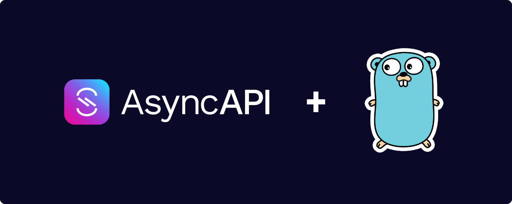

This first blog post is about an open-source tool that I'm currently writing
[here](https://github.com/lerenn/asyncapi-codegen).

## AsyncAPI, an initiative to rule them all

### What is AsyncAPI?

As a response to the lack of tools to define contracts between asynchronous
services, Fran Méndez started the project AsyncAPI as a set of tools heavily
inspired by OpenAPI initiative to define communication inside an Event-Driven
Architecture (EDA).

Like OpenAPI, you have a specification, in YAML or JSON, that can be used to
define the interfaces of asynchronous APIs. It can use any type of protocols and
brokers (NATS, Kafka, RabbitMQ, gRPC, etc) but also any format (JSON, Protobuf, etc).


*The AsyncAPI creator's dream*

After years of development, it grew, became an important project and joined the
Linux Foundation Projects with the goal to be industry standard for defining
asynchronous APIs.

### An AsyncAPI specification example

Here is what it can look like, from the [official documentation](https://www.asyncapi.com/):

```yaml
asyncapi: 2.6.0
info:
  title: Account Service
  version: 1.0.0
  description: This service is in charge of user signups
channels:
  user/signedup:
    subscribe:
      message:
        $ref: '#/components/messages/UserSignedUp'
components:
  messages:
    UserSignedUp:
      payload:
        type: object
        required:
          - displayName
          - email
        properties:
          displayName:
            type: string
            description: Name of the user
          email:
            type: string
            format: email
            description: Email of the user
```

Some elements may look familiar to you, like the components defining schemas or the
information part, as they are directly inspired from OpenAPI specifications.

Some are quite different: the first level `channels`
defines the channel that the user of the API can publish or subscribe to. You
can also find some `messages` definition in the `components` that describe
the messages that can be sent and/or received on the different channels.

You can then read this document as a possibility to subscribe to user signing up
events on the channel `user/signedup` where messages contains the `name` and `email`
of the user.

Messages payload can be displayed in JSON format:

```json
{
    "displayName": "Louis",
    "email": "louis@example.com"
}
```

If you are curious of the numerous possiblities, you can read the
[official reference](https://www.asyncapi.com/docs/reference).

## The code, the spec and the maintainability

Of course, It can be really cumbersome to maintain the source code associated to
the specification. That's why there is two ways of doing that:
* Generate the specification from the code
* Generate the code from the specification

You can already see where we are going, as this post is about code generation!

### An official tool for code generation... but with Javascript and NPM

For that, the project provides a [Javascript tool](https://github.com/asyncapi/generator)
to generate source code from specification in numerous languages: Python, Java,
Markdown, PHP, ... and even Go! All you have to do is install the corresponding
NPM packages and launch the right command tool.


*NPM and JS being like books: useful but heavy*

However, despite the great advantages of the Javascript ecosystem, a lot of
developers (including myself) are a bit reluctant to install NPM packages with
the really heavy stack that it implies. Especially for Go project where a specific
command exist to run Go programs (and other tools) directly from the official
Go command: `go generate`.

To use it, we only have to add some preprocessing instructions at the top of
some files:

```golang
//go:generate <insert here the shell command>

package mypkg
```

We could use directly the official tool with `go generate` but it would require
to have the Javascript tools installed and to download the NPM packages.

Ideally, we would need something in Go to run the `go run` command inside the
`go generate` preprocessing command. It would be the most portable way to generate
the code, as you would just have to have the Go stack installed. One language, one stack!

### The inspiration: a really popular Go tool, but for OpenAPI

During daytime, and especially work time, I used a great tool to generate code
from OpenAPI specification: [deepmap/oapi-codegen](https://github.com/deepmap/oapi-codegen).

This tool takes an openapi specification and generate all the code needed to
make any major Go HTTP server (Gin, Echo, Chi, etc) with the given specification.

On top of that, you can use the `//go:generate` preprocessing annotation to
automatically generate the source code.

```go
//go:generate go run github.com/deepmap/oapi-codegen/cmd/oapi-codegen@latest -package mypkg openapi.yaml > openapi.gen.go

package mypkg
```

At the time, I craved for this tool on AsyncAPI, and as it was not existant, I
decided to wrote it. And a few month later (and few PR also), `asyncapi-codegen`
was available!

## AsyncAPI-Codegen, hands on user signup

### Code architecture

This schema describe how the code generated by AsyncAPI Codegen will interact
between existing application, user and broker:


Here are the different part of the code that will be autogenerated:

* <span style="color:#d79b00">Provided (or custom) code for broker</span>: you
  can use one of the provided broker (NATS, Kafka), or provide you own by satisfying
  BrokerController interface.
* <span style="color:#ffda74">Generated code</span>: code generated
  by `asyncapi-codegen`.
* <span style="color:#b85450">Calling the generated code</span>: you
  need to write a few lines of code to call the generated code from your own code.
* <span style="color:#6c8ebf">App/User code</span>: this is the code of your existing
  application and/or user. As it is conform to AsyncAPI spec, you can use it
  on only one of the two side against the app/user on another language.

### Installing AsyncAPI-Codegen

Well let's take the example we had in the first part of this post, let's save
it in a `asyncapi.yaml` and generate the corresponding code.

First, we should install the tool:

```shell
# Install the tool
go install github.com/lerenn/asyncapi-codegen/cmd/asyncapi-codegen@latest
```

Then create the new golang project with the following lines:

```shell
# Create a new directory for the project and enter
mkdir $GOPATH/src/asyncapi-example
cd $GOPATH/src/asyncapi-example

# Create the go module files
go mod init

# Create the asyncapi yaml into the repository
touch asyncapi.yaml
# Then edit it to add the YAML content provided earlier
```

Then we can generate the code:

```shell
# Generate the code from the asyncapi file
# One for the application, one for the user and one for the common types
asyncapi-codegen -i ./asyncapi.yaml -p main -g application -o ./app.gen.go
asyncapi-codegen -i ./asyncapi.yaml -p main -g types -o ./types.gen.go
asyncapi-codegen -i ./asyncapi.yaml -p main -g user -o ./user.gen.go

# Install dependencies needed by the generated code
go get -u github.com/lerenn/asyncapi-codegen/pkg/extensions
```

### Deep dive into the generated code

#### Application generated code

Let's analyse what is present in `app.gen.go`:

```golang
// AppController is the structure that provides publishing capabilities to the
// developer and and connect the broker with the App.
type AppController struct

// NewAppController links the App to the broker.
func NewAppController(/* ... */) (*AppController, error)

// PublishUserSignedup will publish messages to 'user/signedup' channel.
func (c *AppController) PublishUserSignedup(/* ... */) error

// Close will clean up any existing resources on the controller.
func (c *AppController) Close(/* ... */)
```

We can see that we can create a new `AppController` based on a broker controller,
that will allow us to publish `UsersSignedUp` messages on the corresponding channel.

#### User generated code

Let's analyse what is present in `user.gen.go`:

```golang
// UserController is the structure that provides publishing capabilities
// to the developer and and connect the broker with the User.
type UserController struct

// NewUserController links the User to the broker.
func NewUserController(/* ... */) (*UserController, error)

// SubscribeUserSignedup will subscribe to new messages
// from 'user/signedup' channel.
func (c *UserController) SubscribeUserSignedup(/* ... */) error

// UnsubscribeUserSignedup will unsubscribe messages from
// 'user/signedup' channel.
func (c *UserController) UnsubscribeUserSignedup(/* ... */)

// Close will clean up any existing resources on the controller.
func (c *UserController) Close(ctx context.Context)
```

Like the application controller, we can see that we can create a new
`UserController` based on a broker controller. It will allow us to subscribe
ti `UsersSignedUp` messages on the corresponding channel, and even to all
subscribable channels present in the specification (but not really interesting
so it is not shown).

### Use the generated code

Let's use the generated code to simulate a real system !

So we will need to have:

* A broker (for the sake of this example, we will use a NATS broker)
* An application emitting user signup events
* A user receiving user signup events

#### The broker

We will add some packages to use NATS directly in our code and launch a docker
container to have a running NATS:

```shell
# Get missing code for NATS
go get github.com/lerenn/asyncapi-codegen/pkg/extensions/brokers/nats

# Launch NATS with docker
docker run -d --name nats -p 4222:4222 nats
```

You can then create a file named `main.go` with the following code as a placeholder
for the application and user code:

```golang
package main

import (
	"github.com/lerenn/asyncapi-codegen/pkg/extensions"
	"github.com/lerenn/asyncapi-codegen/pkg/extensions/brokers/nats"
)

func app(brokerController extensions.BrokerController) {
	// Will be filled later
}

func user(brokerController extensions.BrokerController) {
	// Will be filled later
}

func main() {
	// Create a broker controller
	brokerController := nats.NewController("nats://localhost:4222")

	// Launch user listening
	user(brokerController)

	// Launch application that will periodically send events
	app(brokerController)
}
```

We can see here that we create a broker controller based on NATS. It could have
been any other available broker controller, as they fulfill the `extensions.BrokerController`
that `app()` and `user()` need.

At the time these lines are written, there is only NATS and Kafka, but you can
take inspiration from these ones to implement your own. In fact, the Kafka one
is a PR from a contributor that wanted to use this tool for it. Feel free to explore!

Then, there is the launch of the user and the start of the
application. We will see now what is needed in each function.

#### The application

Here is the code you will need in the application:

```golang
// Create the application controller
appController, err := NewAppController(brokerController)
if err != nil {
  panic(err)
}

// Publish users signing up events randomly
for {
  // Wait a certain time between 0 and 1 second
  d := time.Duration(rand.Int()%1000) * time.Millisecond
  time.Sleep(d)

  // Create a new message
  var msg UserSignedUpMessage

  // Set new message with user info
  userID := rand.Int() % 1000
  msg.Payload.DisplayName = fmt.Sprintf("User %d", userID)
  msg.Payload.Email = fmt.Sprintf("user%d@example.com", userID)

  // Send message
  appController.PublishUserSignedup(context.Background(), msg)
}
```

It repeatedly generates user sign-up messages with random user IDs, display
names, and email addresses. It introduces random delays between events and
publishes each event using the `appController`, created at the beginning with
the `brokerController`.

#### The user

And now, for the user part:

```golang
func user(brokerController extensions.BrokerController) {
	// Create the user controller
	userController, err := NewUserController(brokerController)
	if err != nil {
		panic(err)
	}

	// Create a callback that will listen
	fn := func(ctx context.Context, msg UserSignedUpMessage) {
		log.Printf(
			"A user has signed up [%s|%s]\n",
			msg.Payload.DisplayName,
			msg.Payload.Email,
		)
	}

	// Subscribe to messages
	userController.SubscribeUserSignedup(context.Background(), fn)
}
```

Here is what the code do:

1. It creates a user controller.
2. Defines a callback function (fn) to handle user sign-up events,
  logging the user's display name and email.
3. Subscribes to user sign-up messages using the user controller.
4. When a user signs up, the callback function logs their display name and email.

### Execute the code

Now that we have all the code, we can execute it:

```shell
# Run the code
go run .
```

Here is the output you should see:

```shell
2023/10/15 14:08:20 A user has signed up [User 341|user341@example.com]
2023/10/15 14:08:21 A user has signed up [User 422|user422@example.com]
2023/10/15 14:08:22 A user has signed up [User 691|user691@example.com]
2023/10/15 14:08:23 A user has signed up [User 880|user880@example.com]
2023/10/15 14:08:23 A user has signed up [User 923|user923@example.com]
2023/10/15 14:08:23 A user has signed up [User 849|user849@example.com]
```

If you use the NATS cli tool, you can also see the messages being sent:

```shell
nats sub ">"
[#1] Received on "user/signedup"
{"display_name":"User 517","email":"user517@example.com"}

[#2] Received on "user/signedup"
{"display_name":"User 22","email":"user22@example.com"}

[#3] Received on "user/signedup"
{"display_name":"User 70","email":"user70@example.com"}

[#4] Received on "user/signedup"
{"display_name":"User 297","email":"user297@example.com"}
```

You can see that the AsyncAPI specification is respected, as the messages are
sent and received with the same format.

## More on AsyncAPI Codegen

### Extensions

Sending and receiving messages is not the only thing you can do with the generated
code. You can also use the extensions to add more features to the generated code.

Here is the list of what can be done, linked to the `README.md`
(and later a link to specific blog posts):

* [Request/Response](https://github.com/lerenn/asyncapi-codegen#requestresponse-example):
  Send a message on a channel and wait for the answer on another.
* Multiples Brokers: [Kafka](https://github.com/lerenn/asyncapi-codegen#kafka),
  [NATS](https://github.com/lerenn/asyncapi-codegen#nats), or
  [Custom broker](https://github.com/lerenn/asyncapi-codegen#custom-broker)
* [Middlewares](https://github.com/lerenn/asyncapi-codegen#middlewares): manage
  the messages before sending or after receiving them.
* [Context](https://github.com/lerenn/asyncapi-codegen#context): use context
  keys set by middlewares or by the user to get info on messages
  (publishing/reception, channel name, etc).
* [Logging](https://github.com/lerenn/asyncapi-codegen#logging): log messages
  sent and received, but also internal generated code logs.
* [Versioning](https://github.com/lerenn/asyncapi-codegen#versioning): manage
  different versions of an AsyncAPI specification and plan migrations.
* [Annotations](https://github.com/lerenn/asyncapi-codegen#asyncapi-extensions):
  add annotations to your specification for more features to generated code.

### What's next?

Well there is a lot of things that can be done to improve the tool, and I'm
currently working on some of them:
* Add more brokers: RabbitMQ, gRPC, etc
* Add more middlewares: openetelemetry logging/tracing/metrics, etc
* Add more formats: Protobuf, etc

But I'm also open to any contribution, so feel free to open an issue or a PR
if you want to add something to the tool!
