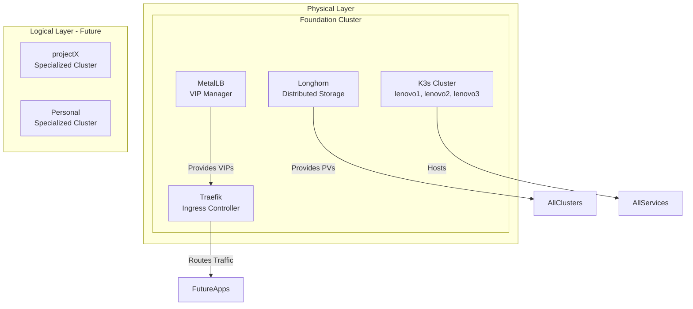

*This is the fourth post in our "Building a Kubernetes Homelab" series. Check out the [previous post](/posts/building-homelab-kubernetes-cluster/) to see how we deployed the physical K3s cluster with PXE boot and Butane configurations.*

## From Physical to Logical: Building the Foundation Layer

With the physical K3s cluster up and running across our three Lenovo nodes, it was time to deploy the essential infrastructure services that would form the foundation for everything else. These services needed to run at the physical cluster level—before we could deploy any specialized logical clusters.

The foundation layer consists of three critical components:

1. **MetalLB** - Load balancer for bare-metal Kubernetes
2. **Traefik** - Ingress controller for HTTP/HTTPS traffic
3. **Longhorn** - Distributed block storage for persistent volumes

Together, these three services provide the infrastructure layer that specialized clusters will consume.

## The Architecture: Foundation vs Specialized Clusters

Before diving into the implementation, let's clarify the architecture. This was a key design decision I made early on:



**Foundation Cluster**: The physical K3s cluster running the infrastructure services. These services are shared across all specialized clusters.

**Specialized Clusters**: Future logical clusters (like "projectX" for some project, "perso" for personal services) that will consume the foundation layer services.

This separation allows:

- Shared infrastructure across multiple logical clusters
- Clean separation of concerns
- Easier upgrades and maintenance
- Consistent patterns across all specialized clusters

## Challenge 1: Load Balancing Without a Cloud Provider

Kubernetes was designed for cloud environments where load balancers are a first-class primitive. In a bare-metal homelab, you don't have AWS ELB or Google Cloud Load Balancer. You need a way to expose services to the network.

### The Solution: MetalLB with Layer 2 Mode

MetalLB provides the "missing" load balancer for bare-metal Kubernetes. It operates in two modes:

1. **Layer 2 Mode** (what we used): Assigns IP addresses from a configured pool, advertises them via ARP
2. **BGP Mode**: Integrates with your network's BGP infrastructure

For a homelab, Layer 2 mode is simpler and perfectly adequate. MetalLB:

- Chooses one node as the "leader" to respond to ARP requests
- Automatically migrates the IP if that node fails
- Supports multiple IP pools for different services

### The VIP Design

I decided to use a single Virtual IP (VIP) as the entry point for all cluster services:

```text
192.168.X.254 → cluster.lab.x.y.z
```

This VIP becomes the single point of entry. All services get DNS CNAMEs that point to this VIP:

```text
longhorn.lab.x.y.z → CNAME → cluster.lab.x.y.z
(traefik dashboard would be the same)
```

DNS on the OpenWRT router handles the hostname routing, while MetalLB ensures the VIP is always reachable even if nodes fail.

### MetalLB Implementation

```yaml
# cluster/roles/metallb/defaults/main.yaml
metallb_namespace: metallb-system
metallb_version: v0.14.3
metallb_ip_pool_name: cluster-vip
metallb_ip_address: "{{ hostvars[groups['kubernetes_cluster'][0]].cluster_vip }}/32"
```

The MetalLB configuration creates an `IPAddressPool` and an `L2Advertisement`:

```yaml
apiVersion: metallb.io/v1beta1
kind: IPAddressPool
metadata:
  name: cluster-vip
  namespace: metallb-system
spec:
  addresses:
  - 192.168.X.254/32

---
apiVersion: metallb.io/v1beta1
kind: L2Advertisement
metadata:
  name: cluster-l2-advert
  namespace: metallb-system
spec:
  ipAddressPools:
  - cluster-vip
```

One critical issue we discovered: MetalLB's webhook service needs endpoints to be in the "ready" state before you can apply these configurations. The playbook needed a wait condition:

```yaml
- name: Wait for webhook service to have endpoints
  kubernetes.core.k8s_info:
    api_version: v1
    kind: Endpoints
    name: metallb-webhook-service
    namespace: "{{ metallb_namespace }}"
  register: webhook_endpoints
  until: >
    webhook_endpoints.resources | length > 0 
    and webhook_endpoints.resources[0].subsets | default([]) | length > 0
    and webhook_endpoints.resources[0].subsets[0].addresses | default([]) | length > 0
  retries: 60
  delay: 5
```

This waits for the endpoint to be in the `addresses` array (ready state) rather than `notReadyAddresses` (when the controller is starting).

## Challenge 2: Namespace Organization and the Traefik Saga

The original Traefik deployment used the `kube-system` namespace. This bothered me from a cleanliness perspective. I wanted dedicated namespaces for each infrastructure component:

- `metallb-system` - Load balancer
- `traefik-system` - Ingress controller  
- `longhorn-system` - Storage

After some consideration, I decided to migrate Traefik to its own namespace. This required:

1. Removing the existing Traefik deployment
2. Adding namespace creation to the Ansible playbook
3. Updating default variables
4. Redeploying with the new namespace

The migration went smoothly, and now each infrastructure component has clear ownership and isolation.

### Traefik Configuration

Traefik needed to use the MetalLB VIP and serve both HTTP and HTTPS:

```yaml
# cluster/roles/ingress/templates/values.yaml.j2
service:
  type: LoadBalancer
  spec:
    loadBalancerIP: {{ traefik_loadbalancer_ip }}

ports:
  web:
    port: 80
    expose: {}
  websecure:
    port: 443
    expose: {}
```

Note the `expose: {}` syntax—the newer Traefik Helm chart expects an object, not a boolean.

## Challenge 3: Distributed Storage with Longhorn

Longhorn provides distributed block storage for Kubernetes. Unlike cloud storage solutions that rely on external cloud storage APIs, Longhorn runs entirely within the cluster. It:

- Creates replicated volumes across nodes
- Handles node failures gracefully
- Provides storage classes for different use cases
- Includes a web UI for management

### Longhorn Configuration

Longhorn's configuration includes several important settings:

```yaml
# cluster/roles/longhorn/defaults/main.yaml
longhorn_namespace: longhorn-system
longhorn_version: v1.5.3
longhorn_data_path: /var/lib/longhorn
longhorn_replica_count: 3
longhorn_ingress_enabled: true
longhorn_ingress_host: longhorn.lab.x.y.z
longhorn_ingress_class: traefik
```

The Helm values file configures Longhorn's default settings:

```yaml
# cluster/roles/longhorn/templates/values.yaml.j2
defaultSettings:
  defaultDataPath: {{ longhorn_data_path }}
  defaultReplicaCount: {{ longhorn_replica_count }}
  guaranteedEngineManagerCPU: "250"
  guaranteedReplicaManagerCPU: "250"
  storageReservedPercentageForDefaultDisk: "5"
```

The key decisions here:

- **Replica count of 3**: With three nodes, storing three replicas means each node has one copy. This provides redundancy if one node fails.
- **Storage reserved percentage**: Set to 5% (instead of the default 30%) to maximize available storage for volumes. This is important because Longhorn reserves space for system operations and to prevent over-provisioning.
- **Ingress enabled**: Access Longhorn UI through Traefik at `longhorn.lab.x.y.z`
- **Data path**: Store Longhorn data on dedicated HDDs (separate from the OS SSDs on each node)

### Disk Tagging

Since our nodes have dedicated HDD disks for Longhorn storage (mounted at `/var/lib/longhorn`), we tag them with `longhorn-hdd-raw` to ensure they're reserved for Longhorn use. The Ansible playbook automatically applies these tags:

```yaml
# cluster/roles/longhorn/templates/node-disk-tags.yaml.j2
apiVersion: longhorn.io/v1beta2
kind: Node
metadata:
  name: {{ node_item.name }}
  namespace: {{ longhorn_namespace }}
spec:
  disks:
    "{{ node_item.disk_key }}":
      tags:
        - longhorn-hdd-raw
```

The tag uses a `longhorn-` prefix for clarity, making it explicit that these disks are reserved for Longhorn storage.

### Custom Storage Classes

Longhorn comes with a default storage class, but we created custom ones with disk selectors to ensure volumes are only created on our tagged HDD disks:

```yaml
# cluster/roles/longhorn/templates/storage-classes.yaml.j2
apiVersion: storage.k8s.io/v1
kind: StorageClass
metadata:
  name: longhorn-hdd-raw-delete
provisioner: driver.longhorn.io
allowVolumeExpansion: true
reclaimPolicy: Delete
volumeBindingMode: WaitForFirstConsumer
parameters:
  numberOfReplicas: "3"
  staleReplicaTimeout: "30"
  diskSelector: "longhorn-hdd-raw"
---
apiVersion: storage.k8s.io/v1
kind: StorageClass
metadata:
  name: longhorn-hdd-raw-retain
provisioner: driver.longhorn.io
allowVolumeExpansion: true
reclaimPolicy: Retain
volumeBindingMode: WaitForFirstConsumer
parameters:
  numberOfReplicas: "3"
  staleReplicaTimeout: "30"
  diskSelector: "longhorn-hdd-raw"
```

This setup ensures:

- **Disk isolation**: Volumes are only created on disks tagged with `longhorn-hdd-raw`
- **Reclaim policies**: Two storage classes - one for Delete (default) and one for Retain (for important data)
- **Replica distribution**: Three replicas spread across the three nodes for redundancy

The `diskSelector` parameter ensures that Longhorn only schedules volume replicas on our dedicated HDD disks, preventing accidental use of system SSDs.

## Challenge 4: The Great Version Mismatch Mystery

Everything was going smoothly until we noticed instability: pods restarting, services not responding. Investigation revealed a critical issue:

```text
lenovo1: v1.28.5+k3s1
lenovo2: v1.33.5+k3s1  ← The problem
lenovo3: v1.28.5+k3s1
```

Somehow, lenovo2 was running a version 5 major versions ahead of the other nodes! This created severe compatibility issues:

- MetalLB speakers couldn't communicate on port 7946 (member discovery)
- Traefik pods were crashing
- API compatibility mismatches throughout the cluster

### The Root Cause: Manual Intervention

After examining logs and timestamps, we discovered that the K3s installer was manually re-run without specifying a version. The installer defaults to the latest version, resulting in the mismatch.

This incident highlighted the need for:

1. **Version pinning** in inventory configuration
2. **Automated upgrades** via Ansible
3. **Rolling upgrade strategy** to maintain cluster health

### The Solution: Rolling Upgrade Playbook

We created an Ansible playbook to safely upgrade K3s with:

- **Serial execution**: Only one node at a time
- **Cordon and drain**: Move workloads before upgrading
- **Health checks**: Wait for nodes to be ready before proceeding
- **Automatic uncordon**: Restore scheduling after successful upgrade

```yaml
# machines/playbooks/upgrade-k3s.yaml
- name: Rolling K3s Upgrade
  hosts: kubernetes_cluster
  serial: 1  # One node at a time
  vars:
    target_version: "{{ k3s_version }}"
    
  tasks:
    - name: Cordon node
      command: kubectl cordon {{ node_name }}
      
    - name: Drain node
      command: kubectl drain {{ node_name }} --ignore-daemonsets --force
      
    - name: Upgrade K3s
      shell: curl -sfL https://get.k3s.io | INSTALL_K3S_VERSION="{{ target_version }}" sh -
      
    - name: Wait for node ready
      command: kubectl get node {{ node_name }} -o jsonpath='{.status.conditions[?(@.type=="Ready")].status}'
      until: node_status.stdout == "True"
      retries: 60
      delay: 5
      
    - name: Uncordon node
      command: kubectl uncordon {{ node_name }}
```

This playbook ensures zero-downtime upgrades while maintaining cluster health.

## DNS Configuration: The Final Piece

With services deployed, we needed DNS resolution. The OpenWRT router's DNSmasq configuration includes:

```bash
# A record for the cluster VIP
config domain
  option name 'cluster.lab.x.y.z'
  option ip '192.168.X.254'

# CNAME for each service
config cname
  option cname 'longhorn.lab.x.y.z'
  option target 'cluster.lab.x.y.z'
```

This allows accessing services by their friendly hostnames while only managing one actual IP address.

## The Ansible Structure

All foundation cluster infrastructure is organized in `cluster/`:

```text
cluster/
├── playbooks/
│   └── deploy.yaml          # Main playbook
├── roles/
│   ├── metallb/
│   │   ├── defaults/main.yaml
│   │   ├── tasks/main.yaml
│   │   └── templates/config.yaml.j2
│   ├── ingress/
│   │   ├── defaults/main.yaml
│   │   ├── tasks/main.yaml
│   │   └── templates/values.yaml.j2
│   └── longhorn/
│       ├── defaults/main.yaml
│       ├── tasks/main.yaml
│       └── templates/
│           ├── values.yaml.j2
│           ├── storage-classes.yaml.j2
│           └── node-disk-tags.yaml.j2
└── data/                    # Generated files (gitignored)
    ├── metallb-config.yaml
    ├── traefik-values.yaml
    ├── longhorn-values.yaml
    ├── storage-classes.yaml
    └── node-disk-tags.yaml
```

Each role follows a consistent pattern:

1. Add Helm repository
2. Create namespace
3. Template values/configuration
4. Deploy via Helm
5. Wait for readiness
6. Apply custom resources (StorageClasses, etc.)

## Python Installation: A Necessary Evil

One unexpected requirement: Fedora CoreOS doesn't include Python by default (it's a minimal immutable OS). This caused issues with Ansible's `gather_facts` module.

The solution: Add a Python installation service to the Butane configurations:

```yaml
# In all .bu.j2 files
- path: /etc/systemd/system/python-install.service
  mode: 0644
  contents:
    inline: |
      [Unit]
      Description=Install Python for Ansible
      After=network-online.target
      Before=k3s-install.service
      
      [Service]
      Type=oneshot
      ExecStart=/usr/bin/rpm-ostree install python3
      
      [Install]
      WantedBy=multi-user.target
```

This installs Python3 on first boot and persists through Zincati (Fedora CoreOS automatic updates).

## Makefile Integration

The deployment is integrated into the main Makefile:

```makefile
# Foundation Cluster Commands
.PHONY: cluster/deploy
cluster/deploy: machines/kubeconfig
    @echo "📦 Deploying foundation cluster infrastructure..."
    ansible-playbook -i inventory.yaml cluster/playbooks/deploy.yaml
```

Running `make cluster/deploy`:

1. Ensures kubeconfig exists
2. Creates required directories
3. Runs all three roles in sequence
4. Deploys the complete foundation layer

## What We Achieved

With the foundation layer deployed, we now have:

✅ **Load Balancing**: MetalLB managing VIP distribution
✅ **Ingress**: Traefik routing HTTP/HTTPS traffic
✅ **Storage**: Longhorn providing persistent volumes
✅ **DNS**: CNAME-based routing for all services
✅ **Automation**: Complete Ansible-driven deployment
✅ **Monitoring**: All services accessible via friendly hostnames
✅ **Redundancy**: Services distributed across three nodes

## The Road Ahead

The foundation is now solid. The next steps will be:

1. **Longhorn Access**: Configure ingress to access Longhorn UI
2. **Testing**: Verify VIP failover and service resilience
3. **Specialized Clusters**: Deploy first logical cluster (projectX or perso)
4. **Service Migration**: Move existing services to Kubernetes
5. **Monitoring Stack**: Deploy Prometheus and Grafana

## Lessons Learned

This phase taught me several important lessons:

1. **Webhooks Matter**: Always wait for webhook endpoints to be ready before applying CRDs
2. **Namespace Organization**: Dedicated namespaces improve clarity and maintainability
3. **Version Consistency**: Never manually upgrade without proper procedures
4. **Layer Order**: Infrastructure services must be stable before deploying workload
5. **DNS Design**: CNAME aliasing is cleaner than managing multiple A records
6. **Automation First**: Infrastructure changes should always go through Ansible

## Conclusion

The foundation cluster infrastructure is now deployed and stable. We have a solid base for building specialized clusters on top. The combination of MetalLB, Traefik, and Longhorn provides all the essential primitives that specialized clusters will consume.

In the next post, we'll explore how to use this foundation to deploy specialized logical clusters, potentially using technologies like KCP (Kubernetes Control Plane) or vCluster to create isolated, workload-specific environments.

---

*Check out the [previous post](/posts/building-homelab-kubernetes-cluster/) to see how we built the physical cluster, or read the [first post](/posts/building-homelab-introduction/) for the complete journey from the beginning.*
