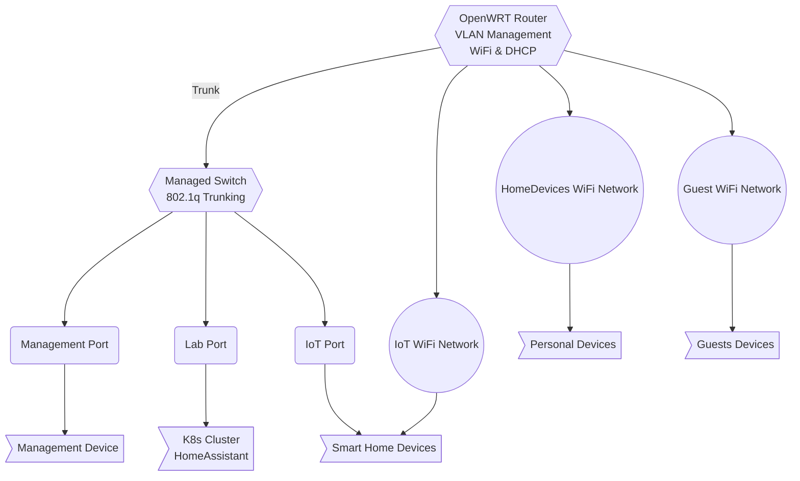

## The Journey Begins: From Chaos to Order

I've always been fascinated by infrastructure and automation. What started as a 
simple gaming PC running Fedora Linux with a few VMs has evolved into a 
full-scale homelab project. This series of blog posts documents my journey from 
a basic setup to a properly segmented, Kubernetes-based infrastructure.

## Current Setup: A Gaming PC with VMs

My current setup is humble but functional:

- **Gaming PC (Tower)**: Fedora Linux host with 3 VMs via QEMU/Libvirt
  - **GamingVM**: Windows with GPU passthrough for gaming
  - **LabVM**: Fedora Linux for development tools and LLM workloads
  - **K8s VM**: Talos Linux for Kubernetes experimentation

- **Raspberry Pi Fleet**:
  - **Old Pi**: Converting a 15-year-old laser printer into a WiFi printer
  - **Pi 5**: HomeAssistant for smart home automation (Philips Hue, 
    electrical sockets, A/C, surveillance cameras)

- **Remote Access**: VPN solution for external connectivity

Everything was managed through Ansible scripts, but there was a fundamental problem: **everything lived on the same network**.

## The Problem: Security and Isolation

Having IoT devices (surveillance cameras, smart plugs, A/C units) on the same 
network as my development infrastructure was a security nightmare. These devices 
are often:
- Running outdated firmware
- Have unknown security vulnerabilities
- Can't be easily updated or monitored
- Could potentially be used as entry points to the rest of the network

I needed proper network segmentation, but I don't want to rely on my ISP router 
for this as I may move or change my ISP provider.

## The Vision: Kubernetes-First Homelab

The goal is clear: migrate to a Kubernetes-based homelab where services run as 
containers rather than VMs. This will provide:
- Better resource utilization
- Easier service management
- Modern deployment patterns
- Scalability and flexibility

To support this vision, I have invested in:
- **3x Mini PCs**: Specified for Kubernetes cluster deployment
- Perfect as a starting point for a Talos Linux Kubernetes cluster

## The Network Challenge: VLAN Segmentation

Before deploying Kubernetes, I need to solve the network segmentation problem. 
The solution involves:

### Hardware Acquisition
- **OpenWRT Router**: For VLAN management and network segmentation
- **Managed Switch**: For 802.1q VLAN trunking and port assignment

### Planned Network Architecture
The OpenWRT router will create all VLANs and send traffic to the managed switch via 
port 1 (trunk). The switch will then assign appropriate VLANs to different ports:

## The Implementation Plan

This series will document the implementation of:

1. **Network Infrastructure Setup** (This post)
   - Router and switch configuration
   - VLAN creation and assignment
   - Basic connectivity testing

2. **Ansible Automation**
   - Network device management
   - Service deployment automation
   - Configuration drift prevention

3. **Kubernetes Cluster Deployment**
   - Talos Linux installation
   - Cluster configuration
   - Service mesh setup

4. **Service Migration**
   - HomeAssistant to Kubernetes
   - Gaming VM to KubeVirt
   - Monitoring and logging

5. **Security Hardening**
   - Network policies
   - Firewall rules
   - Access controls

## Why Document This Journey?

This isn't just about building a homelab—it's about:
- **Learning**: Understanding network segmentation and security
- **Automation**: Infrastructure as Code with Ansible
- **Modern Practices**: Kubernetes-native service deployment
- **Security**: Proper isolation and access controls
- **Sharing**: Helping other engineers avoid common pitfalls

## What's Next?

In the next post, we'll dive into the actual network configuration, starting 
with the OpenWRT router setup and VLAN creation. We'll cover the challenges 
of working with OpenWRT, router limitations, and how to properly configure 
the managed switch for VLAN trunking.

This will be a real-time documentation of the implementation process, complete 
with Ansible playbooks, configuration files, and the inevitable troubleshooting 
that comes with network infrastructure projects!

## Next Steps

Ready to dive into the technical implementation? Check out the next post in this series:

**[Building a Kubernetes Homelab: From Default ISP Network to VLAN-Segmented](/posts/from-default-isp-to-vlan-segmented/)**

In the next post, we'll cover the detailed implementation of VLAN segmentation, including OpenWRT configuration, managed switch setup, and network security policies.

---

*This is the first post in a series about building a secure, Kubernetes-based 
homelab. Follow along as we transform a basic setup into a production-ready 
infrastructure with proper network segmentation and automation.*