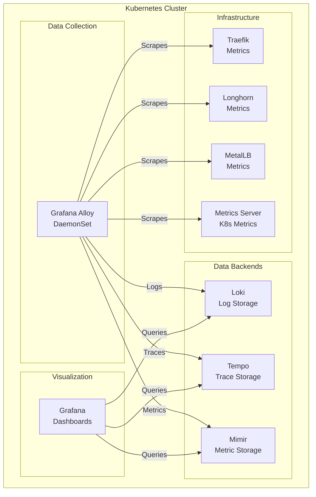

*This is the fifth post in our "Building a Kubernetes Homelab" series. Check out the [previous post](/posts/building-homelab-foundation-cluster/) to see how we deployed MetalLB, Traefik, and Longhorn as the foundation layer.*

## From Infrastructure to Observability

With the foundation cluster infrastructure in place—MetalLB providing load balancing, Traefik handling ingress, and Longhorn offering distributed storage—the cluster was functional but blind. I had no visibility into what was happening inside. Pods could crash, nodes could fail, services could degrade, and I'd have no idea until something broke catastrophically.

It was time to add observability. Not just basic monitoring, but a comprehensive observability stack that would give me insights into logs, metrics, and traces—the three pillars of observability.

## Why LGTM: The Observability Stack Choice

After researching various observability solutions, I settled on the LGTM stack:

- **Loki** - Log aggregation, similar to Prometheus but for logs
- **Grafana** - Visualization and dashboards (the "G" in LGTM)
- **Tempo** - Distributed tracing backend
- **Mimir** - Long-term metrics storage (Prometheus-compatible)

This stack is designed to work together seamlessly, with Grafana as the unified interface for querying logs, metrics, and traces. Plus, it's all open source and integrates perfectly with Kubernetes.

The missing piece was data collection. That's where **Grafana Alloy** comes in—it's the next-generation agent that can collect logs, metrics, and traces and forward them to the LGTM stack. It replaced Grafana Agent and provides a more modern, unified approach to data collection.

## The Architecture: Observability at Scale

The observability architecture follows a clear pattern:



**Grafana Alloy** runs as a DaemonSet on every node, collecting data from various sources:

- Kubernetes pod logs
- Node metrics (kubelet, cAdvisor)
- Service discovery for pods and services
- Infrastructure component metrics (Traefik, Longhorn, MetalLB)

**Data Backends** store the collected data:

- **Loki** stores logs with efficient compression
- **Tempo** stores distributed traces
- **Mimir** stores metrics with long-term retention

**Grafana** provides the unified interface for querying and visualizing all observability data.

## Storage Strategy: Delete vs Retain

One of the key decisions was how to handle storage for different types of data:

- **Logs, Metrics, Traces** (`lg-hdd-raw-x1-delete`): These are time-series data that can be regenerated. If we lose historical data, we can start fresh. Single replica is sufficient for a homelab, and Delete reclaim policy means we don't waste storage on old data.

- **Grafana Dashboards/Configs** (`lg-hdd-raw-x3-retain`): These are configuration data that must persist. Three replicas provide redundancy, and Retain policy ensures we never accidentally lose our dashboards and configurations.

This storage strategy balances cost (single replica for ephemeral data) with reliability (triple replica for critical configs).

## Challenge 1: Enabling Metrics in Existing Roles

Before deploying the LGTM stack, I needed to ensure that existing infrastructure components were exposing metrics. This required modifications to three roles:

### Traefik Metrics

**File:** `cluster/roles/ingress/templates/values.yaml.j2`

I added Prometheus metrics configuration to Traefik:

```yaml
metrics:
  prometheus:
    enabled: true
    port: 8080
    path: /metrics
```

Traefik exposes metrics on port 8080 at `/metrics`, which Grafana Alloy can scrape.

### Longhorn Metrics

Longhorn manager exposes metrics by default on port 9500. I verified this was working and didn't need any changes—the metrics endpoint was already available at `longhorn-manager.longhorn-system.svc.cluster.local:9500`.

### MetalLB Metrics

MetalLB exposes metrics by default on port 7472 for both the controller and speaker components. Again, no changes were needed—the endpoints were already available.

## Challenge 2: Metrics Server Deployment

K3s ships with metrics-server disabled by default. I needed to deploy it separately to expose Kubernetes resource metrics (CPU, memory) for pods and nodes.

**File:** `cluster/roles/metrics-server/defaults/main.yaml`

```yaml
---
# Metrics-server role default variables

metrics_server_namespace: metrics-server-system
metrics_server_version: 0.7.0
```

**File:** `cluster/roles/metrics-server/tasks/main.yaml`

The metrics-server role follows the same pattern as other roles:

1. Add Helm repository
2. Create namespace
3. Template values
4. Deploy via Helm

The key configuration is in `values.yaml.j2`:

```yaml
args:
  - --kubelet-insecure-tls
  - --kubelet-preferred-address-types=InternalIP,ExternalIP,Hostname
```

The `--kubelet-insecure-tls` flag is necessary for K3s, which uses self-signed certificates.

## Challenge 3: LGTM Stack Deployment

The LGTM role is the most complex, deploying five components in sequence:

### Component Configuration

**File:** `cluster/roles/lgtm/defaults/main.yaml`

```yaml
lgtm_namespace: lgtm-system

# Component versions (latest stable as of January 2025)
# These are Helm chart versions, not app versions
loki_version: "6.46.0"
grafana_version: "10.1.4"
tempo_version: "1.24.0"
mimir_version: "6.0.1"
alloy_version: "1.4.0"

# Storage classes
lgtm_data_storage_class: lg-hdd-raw-x1-delete
grafana_storage_class: lg-hdd-raw-x1-delete

# Grafana configuration
grafana_hostname: grafana.lab.x.y.z
grafana_ingress_class: traefik
# Grafana admin password should be set in cluster/secrets.yaml (git-crypt encrypted)
# This is a fallback default - will be overridden by cluster/secrets.yaml if it exists
grafana_admin_password: admin

# Mimir multi-tenancy configuration
# Each cluster should have its own orgId using descriptive names:
# - Foundation cluster: "foundation" (default)
# - Cryptellation cluster: "cryptellation"
# - Perso cluster: "perso"
#
# Each cluster deploys its own Alloy collector, which sends metrics to Mimir
# with the cluster-specific orgId via the X-Scope-OrgID header.
#
# To override for other clusters, set mimir_org_id in:
# - Inventory vars (per cluster/group)
# - Playbook vars
# - Command line: -e "mimir_org_id=cryptellation"
mimir_org_id: "foundation"

# Storage sizes (conservative for homelab)
loki_storage_size: 50Gi
tempo_storage_size: 50Gi
mimir_storage_size: 50Gi
grafana_storage_size: 10Gi

# Retention periods (data rotation)
loki_retention_period: 168h  # 7 days
tempo_retention_period: 360h  # 15 days
mimir_retention_period: 720h  # 30 days
```

The Grafana admin password is stored in `host_vars/cluster.yaml` (git-crypted for security).

### Deployment Order

The components are deployed in a specific order:

1. **Loki** - Log storage backend
2. **Tempo** - Trace storage backend
3. **Mimir** - Metrics storage backend
4. **Grafana Alloy** - Data collection (needs backends to be ready)
5. **Grafana** - Visualization (needs backends and data sources configured)

We rely on Kubernetes reconciliation—no explicit wait conditions. Components will retry connections automatically until their dependencies are ready.

### Loki Configuration

**File:** `cluster/roles/lgtm/templates/loki-values.yaml.j2`

Loki runs in distributed mode with separate backend and write components. The configuration includes:

```yaml
loki:
  auth_enabled: false
  
  storage:
    bucketNames:
      chunks: chunks
      ruler: ruler
      admin: admin
  
  schemaConfig:
    configs:
      - from: "2024-01-01"
        store: tsdb
        object_store: filesystem
        schema: v13
        index:
          prefix: index_
          period: 24h

gateway:
  enabled: true

storage:
  type: filesystem
  filesystem:
    directory: /loki/chunks

limits_config:
  retention_period: {{ loki_retention_period }}

persistence:
  enabled: true
  storageClassName: {{ lgtm_data_storage_class }}
  size: {{ loki_storage_size }}

# Backend persistence for distributed mode
backend:
  persistence:
    enabled: true
    volumeClaimsEnabled: true
    storageClass: {{ lgtm_data_storage_class }}
    size: {{ loki_storage_size }}

# Write persistence for distributed mode
write:
  persistence:
    enabled: true
    volumeClaimsEnabled: true
    storageClass: {{ lgtm_data_storage_class }}
    size: {{ loki_storage_size }}

resources:
  requests:
    cpu: 100m
    memory: 128Mi
  limits:
    cpu: 500m
    memory: 512Mi
```

Key points:

- **Schema Config**: Required for Loki to define storage schema and index configuration
- **Distributed Mode**: Uses separate backend and write StatefulSets for scalability
- **Persistence**: Both backend and write components need `volumeClaimsEnabled: true` and use `storageClass` (not `storageClassName`) for StatefulSet volumeClaimTemplates
- **Gateway**: Provides a unified entry point for log ingestion

### Tempo Configuration

**File:** `cluster/roles/lgtm/templates/tempo-values.yaml.j2`

```yaml
tempo:
  storage:
    trace:  # Note: 'trace' not 'traces' - this is the correct field name
      backend: local
      local:
        path: /var/tempo/traces
  
  compactor:
    compaction:
      retention: {{ tempo_retention_period }}
  
  resources:
    requests:
      cpu: 100m
      memory: 128Mi
    limits:
      cpu: 500m
      memory: 512Mi

persistence:
  enabled: true
  storageClassName: {{ lgtm_data_storage_class }}
  size: {{ tempo_storage_size }}
```

Tempo runs in single mode with local filesystem storage. For a homelab, this is simpler than distributed mode and perfectly adequate.

**Important**: The storage field is `trace` (singular), not `traces` (plural). This is a common mistake that causes configuration validation errors.

### Mimir Configuration

**File:** `cluster/roles/lgtm/templates/mimir-values.yaml.j2`

Mimir runs in distributed mode with multiple components (distributor, ingester, querier, queryFrontend, compactor, storeGateway). Each component that needs storage requires its own persistence configuration:

```yaml
# Configure Mimir for single mode (1 replica of each component)
distributor:
  replicas: 1

ingester:
  replicas: 1
  persistentVolume:  # Note: 'persistentVolume' not 'persistence'
    enabled: true
    storageClass: {{ lgtm_data_storage_class }}  # Note: 'storageClass' not 'storageClassName'
    size: {{ mimir_storage_size }}

querier:
  replicas: 1

queryFrontend:
  replicas: 1

compactor:
  replicas: 1
  persistentVolume:
    enabled: true
    storageClass: {{ lgtm_data_storage_class }}
    size: {{ mimir_storage_size }}

store_gateway:  # Note: snake_case, not camelCase
  replicas: 1
  persistentVolume:
    enabled: true
    storageClass: {{ lgtm_data_storage_class }}
    size: {{ mimir_storage_size }}

# Disable MinIO - we use filesystem storage
minio:
  enabled: false

# Disable Kafka - not needed for single mode
kafka:
  enabled: false

# Disable rollout operator - webhooks cause TLS certificate issues
# The rollout operator is mainly for zero-downtime rollouts in distributed mode
rolloutOperator:
  enabled: false

mimir:
  structuredConfig:
    target: all
    # Multi-tenancy is enabled by default in Mimir
    # Each cluster should use its own orgId via X-Scope-OrgID header:
    # - Foundation cluster: "foundation"
    # - Cryptellation cluster: "cryptellation"  
    # - Perso cluster: "perso"
    # Enable tenant federation to allow querying across multiple tenants
    tenant_federation:
      enabled: true
    blocks_storage:
      backend: filesystem
      filesystem:
        dir: /data/blocks
      tsdb:
        dir: /data/tsdb
    common:
      storage:
        filesystem:
          dir: /data/blocks
    ingest_storage:
      enabled: false
    ingester:
      # Enable Push gRPC method when ingest_storage is disabled
      # This is required for Mimir v3.0.0+
      push_grpc_method_enabled: true
    ruler_storage:
      backend: filesystem
      filesystem:
        dir: /data/ruler-storage
    alertmanager:
      data_dir: /data/alertmanager
    compactor:
      data_dir: /data/compactor
    ruler:
      rule_path: /data/ruler-rules

# Alertmanager persistence configuration
alertmanager:
  persistentVolume:
    enabled: true
    storageClass: {{ lgtm_data_storage_class }}
    size: {{ mimir_storage_size }}

resources:
  requests:
    cpu: 200m
    memory: 256Mi
  limits:
    cpu: 1000m
    memory: 1Gi
```

Critical configuration points:

- **persistentVolume vs persistence**: Mimir uses `persistentVolume` (not `persistence`) for StatefulSet components
- **storageClass vs storageClassName**: Use `storageClass` (not `storageClassName`) for StatefulSet volumeClaimTemplates
- **store_gateway naming**: Must use snake_case `store_gateway`, not camelCase `storeGateway`
- **Storage path separation**: All components (blocks_storage, tsdb, ruler_storage, alertmanager, compactor, ruler) must use different paths under `/data` to avoid conflicts
- **Ingester Push gRPC**: When `ingest_storage.enabled: false`, must set `ingester.push_grpc_method_enabled: true` for Mimir v3.0.0+
- **Rollout operator**: Disabled to avoid webhook TLS certificate issues in homelab environments
- **Multi-tenancy**: Enabled by default, with tenant federation enabled to allow querying across multiple tenants

### Grafana Alloy Configuration

**File:** `cluster/roles/lgtm/templates/alloy-values.yaml.j2`

Grafana Alloy configuration is the most complex, defining comprehensive scraping with multi-tenancy support:

```yaml
alloy:
  configMap:
    create: true
    content: |
      logging {
        level  = "debug"
        format = "logfmt"
      }

      // Prometheus remote write to Mimir
      // Using cluster-specific orgId for multi-tenancy
      prometheus.remote_write "mimir" {
        endpoint {
          url = "http://mimir-distributor:8080/api/v1/push"
          headers = {
            "X-Scope-OrgID" = "{{ mimir_org_id }}",
          }
        }
      }

      // Static service scraping
      prometheus.scrape "traefik" {
        targets = [{
          __address__ = "traefik.traefik-system.svc.cluster.local:8080",
        }]
        forward_to = [prometheus.remote_write.mimir.receiver]
      }

      prometheus.scrape "longhorn" {
        targets = [{
          __address__ = "longhorn-manager.longhorn-system.svc.cluster.local:9500",
        }]
        forward_to = [prometheus.remote_write.mimir.receiver]
      }

      prometheus.scrape "metallb_controller" {
        targets = [{
          __address__ = "metallb-controller.metallb-system.svc.cluster.local:7472",
        }]
        forward_to = [prometheus.remote_write.mimir.receiver]
      }

      // Discover Kubernetes nodes for kubelet scraping
      discovery.kubernetes "kubelet_nodes" {
        role = "node"
      }

      // Relabel to set correct address for kubelet scraping
      // Filter to only scrape the node where this Alloy pod is running
      discovery.relabel "kubelet_local" {
        targets = discovery.kubernetes.kubelet_nodes.targets
        
        // Only keep targets for the node where this pod is running
        rule {
          source_labels = ["__meta_kubernetes_node_name"]
          regex         = env("NODE_NAME")
          action        = "keep"
        }
        
        // Set the scrape address to node IP:10250
        rule {
          source_labels = ["__meta_kubernetes_node_address_InternalIP"]
          target_label  = "__address__"
          replacement   = "${1}:10250"
        }
        
        rule {
          target_label = "__scheme__"
          replacement  = "https"
        }
        
        rule {
          target_label = "__metrics_path__"
          replacement  = "/metrics/cadvisor"
        }
      }

      // Scrape cAdvisor metrics from kubelets (each pod scrapes only its local node)
      prometheus.scrape "kubelet_cadvisor" {
        targets    = discovery.relabel.kubelet_local.output
        forward_to = [prometheus.remote_write.mimir.receiver]
        scrape_interval = "15s"
        scrape_timeout = "10s"
        bearer_token_file = "/var/run/secrets/kubernetes.io/serviceaccount/token"
        scheme = "https"
        tls_config {
          insecure_skip_verify = true
        }
      }

      // Self-monitoring
      prometheus.exporter.self "alloy" {
      }

      prometheus.scrape "alloy" {
        targets    = prometheus.exporter.self.alloy.targets
        forward_to = [prometheus.remote_write.mimir.receiver]
      }

      // Loki log collection
      loki.source.file "kubectl_logs" {
        targets = [
          {
            __path__ = "/var/log/pods/*/*/*.log",
            job      = "kubernetes/pods",
          },
        ]
        forward_to = [loki.write.loki.receiver]
      }

      loki.write "loki" {
        endpoint {
          url = "http://loki-gateway:80/loki/api/v1/push"
          headers = {
            "X-Scope-OrgID" = "{{ mimir_org_id }}",
          }
        }
      }

      // OpenTelemetry traces
      otelcol.receiver.otlp "tempo" {
        grpc {
          endpoint = "0.0.0.0:4317"
        }
        http {
          endpoint = "0.0.0.0:4318"
        }
        output {
          traces = [otelcol.exporter.otlp.tempo.input]
        }
      }

      otelcol.exporter.otlp "tempo" {
        client {
          endpoint = "tempo:4317"
        }
      }

  extraEnv:
    - name: NODE_NAME
      valueFrom:
        fieldRef:
          fieldPath: spec.nodeName
    - name: NODE_IP
      valueFrom:
        fieldRef:
          fieldPath: status.hostIP
```

This configuration:

- **Multi-tenancy**: Sends metrics and logs with `X-Scope-OrgID` header set to `{{ mimir_org_id }}` (defaults to "foundation")
- **Node-local scraping**: Each Alloy pod only scrapes its local node's kubelet to avoid out-of-order samples and reduce network traffic
- **Kubernetes node discovery**: Uses `discovery.kubernetes` to discover nodes, then filters to only the pod's local node using `env("NODE_NAME")`
- **cAdvisor metrics**: Scrapes container metrics from kubelet's `/metrics/cadvisor` endpoint
- **Infrastructure metrics**: Scrapes Traefik, Longhorn, and MetalLB metrics
- **Log collection**: Collects all pod logs from `/var/log/pods`
- **Distributed tracing**: Receives OpenTelemetry traces on ports 4317 (gRPC) and 4318 (HTTP)
- **Self-monitoring**: Monitors Alloy's own metrics

Key improvements:

- **Mimir remote write URL**: Changed from `mimir-gateway:8080/prometheus/api/v1/push` to `mimir-distributor:8080/api/v1/push` (distributor is the correct endpoint for ingestion)
- **Node filtering**: Prevents duplicate metrics and out-of-order sample errors by ensuring each Alloy pod only scrapes its local node
- **Multi-tenancy headers**: All data sent to Mimir and Loki includes the cluster-specific orgId

### Grafana Configuration

**File:** `cluster/roles/lgtm/templates/grafana-values.yaml.j2`

```yaml
admin:
  existingSecret: grafana-admin-secret
  passwordKey: admin-password

persistence:
  enabled: true
  storageClassName: {{ grafana_storage_class }}
  size: {{ grafana_storage_size }}

ingress:
  enabled: true
  ingressClassName: {{ grafana_ingress_class }}
  hosts:
    - {{ grafana_hostname }}
  annotations:
    traefik.ingress.kubernetes.io/router.entrypoints: web

datasources:
  datasources.yaml:
    apiVersion: 1
    datasources:
      - name: Loki
        type: loki
        access: proxy
        url: http://loki-gateway:80
        uid: loki-{{ mimir_org_id }}
        isDefault: true
        editable: true
        jsonData:
          # Add X-Scope-OrgID header for Loki multi-tenancy
          httpHeaderName1: "X-Scope-OrgID"
        secureJsonData:
          # Set the orgId value for this cluster's datasource
          httpHeaderValue1: "{{ mimir_org_id }}"
      - name: Tempo
        type: tempo
        access: proxy
        url: http://tempo:3100
        uid: tempo-{{ mimir_org_id }}
        editable: true
        # Note: Tempo may not support X-Scope-OrgID directly via OTLP
        # But we configure it for consistency with the multi-tenant setup
        jsonData:
          httpHeaderName1: "X-Scope-OrgID"
        secureJsonData:
          httpHeaderValue1: "{{ mimir_org_id }}"
      - name: Mimir
        type: prometheus
        access: proxy
        url: http://mimir-gateway:80/prometheus
        uid: mimir-{{ mimir_org_id }}
        editable: true
        jsonData:
          httpMethod: POST
          # Add X-Scope-OrgID header for Mimir multi-tenancy
          httpHeaderName1: "X-Scope-OrgID"
        secureJsonData:
          # Set the orgId value for this cluster's datasource
          httpHeaderValue1: "{{ mimir_org_id }}"
        version: 1
        withCredentials: false
        isDefault: false

dashboardProviders:
  dashboardproviders.yaml:
    apiVersion: 1
    providers:
      - name: 'default'
        orgId: 1
        folder: ''
        type: file
        disableDeletion: false
        updateIntervalSeconds: 10
        allowUiUpdates: false
        options:
          path: /var/lib/grafana/dashboards

extraConfigmapMounts:
  - name: grafana-dashboards
    mountPath: /var/lib/grafana/dashboards
    configMap: grafana-dashboards
    readOnly: true

resources:
  requests:
    cpu: 100m
    memory: 128Mi
  limits:
    cpu: 500m
    memory: 512Mi
```

Key points:

- **Admin password**: Comes from Kubernetes Secret (created from `cluster/secrets.yaml`)
- **Storage**: Uses `lg-hdd-raw-x1-delete` storage class for persistence (updated from x3-retain)
- **Ingress**: Configured for `grafana.lab.x.y.z`
- **Multi-tenancy**: All datasources include `X-Scope-OrgID` header with cluster-specific orgId
- **Datasource UIDs**: Include orgId in UID (e.g., `mimir-foundation`, `loki-foundation`) for proper identification
- **Dashboard provisioning**: ConfigMaps can be mounted to automatically provision dashboards
- **Loki default**: Loki is set as the default data source for log queries

## Challenge 4: Multi-Tenancy Configuration

As the homelab grows to include multiple Kubernetes clusters (foundation, cryptellation, perso), we need a way to isolate data per cluster while still using a single Mimir instance. This is where multi-tenancy comes in.

### Multi-Tenancy Architecture

Mimir, Loki, and Tempo all support multi-tenancy via the `X-Scope-OrgID` HTTP header. Each cluster can use its own descriptive orgId (e.g., "foundation", "cryptellation", "perso") to isolate data while sharing the same backend infrastructure.

**Benefits:**

- **Data Isolation**: Each cluster's metrics and logs are isolated by orgId
- **Single Backend**: One Mimir/Loki/Tempo instance can serve multiple clusters
- **Tenant Federation**: With tenant federation enabled, you can query across multiple tenants when needed
- **Cost Efficiency**: No need to deploy separate instances per cluster

### Configuration

**File:** `cluster/roles/lgtm/defaults/main.yaml`

```yaml
# Mimir multi-tenancy configuration
# Each cluster should have its own orgId using descriptive names:
# - Foundation cluster: "foundation" (default)
# - Cryptellation cluster: "cryptellation"
# - Perso cluster: "perso"
mimir_org_id: "foundation"
```

The `mimir_org_id` variable can be overridden per cluster via:

- Inventory vars (per cluster/group)
- Playbook vars
- Command line: `-e "mimir_org_id=cryptellation"`

### Alloy Multi-Tenancy

Alloy sends all data (metrics and logs) with the `X-Scope-OrgID` header:

```yaml
prometheus.remote_write "mimir" {
  endpoint {
    url = "http://mimir-distributor:8080/api/v1/push"
    headers = {
      "X-Scope-OrgID" = "{{ mimir_org_id }}",
    }
  }
}

loki.write "loki" {
  endpoint {
    url = "http://loki-gateway:80/loki/api/v1/push"
    headers = {
      "X-Scope-OrgID" = "{{ mimir_org_id }}",
    }
  }
}
```

### Grafana Datasource Multi-Tenancy

Grafana datasources must also include the `X-Scope-OrgID` header when querying Mimir and Loki:

```yaml
datasources:
  - name: Mimir
    jsonData:
      httpHeaderName1: "X-Scope-OrgID"
    secureJsonData:
      httpHeaderValue1: "{{ mimir_org_id }}"
  - name: Loki
    jsonData:
      httpHeaderName1: "X-Scope-OrgID"
    secureJsonData:
      httpHeaderValue1: "{{ mimir_org_id }}"
```

This ensures Grafana queries the correct tenant's data when using the datasource.

### Tenant Federation

Mimir supports tenant federation, which allows querying across multiple tenants:

```yaml
mimir:
  structuredConfig:
    tenant_federation:
      enabled: true
```

With tenant federation enabled, you can query metrics from multiple clusters by specifying multiple orgIds in the `X-Scope-OrgID` header (comma-separated).

## Challenge 5: Storage Class Configuration Issues

One of the most challenging issues during deployment was getting persistent storage correctly configured for StatefulSets. The Helm charts use different structures for different components, and getting the storage class names right was critical.

### Longhorn Storage Class Fix

Longhorn 1.10.0 requires the `dataEngine: "v1"` parameter in StorageClass definitions for CSI storage capacity tracking to work correctly. Without this, Kubernetes cannot see available Longhorn storage, causing pods to remain in `Pending` state with "no persistent volumes available" errors.

**File:** `cluster/roles/longhorn/templates/storage-classes.yaml.j2`

```yaml
parameters:
  numberOfReplicas: "1"
  dataEngine: "v1"  # Required for Longhorn 1.10.0+ CSI capacity tracking
```

### Helm Chart Structure Differences

Different Helm charts use different field names for persistence configuration:

- **Loki**: Uses `backend.persistence.storageClass` and `write.persistence.storageClass` with `volumeClaimsEnabled: true`
- **Mimir**: Uses `component.persistentVolume.storageClass` (note: `persistentVolume`, not `persistence`)
- **Grafana**: Uses `persistence.storageClassName` (standard Deployment)
- **Tempo**: Uses `persistence.storageClassName` (standard StatefulSet)

The key difference is that StatefulSets use `volumeClaimTemplates` which cannot be patched after creation. If the storage class is wrong, you must delete the StatefulSet and its PVCs to recreate them with the correct configuration.

### Mimir Rollout Operator Webhook Issues

The Mimir rollout operator creates webhooks for zero-downtime rollouts, but these webhooks had TLS certificate issues in our homelab setup. The certificates were valid for `rollout-operator.lgtm-system.svc`, but the webhooks referenced `mimir-rollout-operator.lgtm-system.svc`, causing validation failures.

**Solution**: Disable the rollout operator for homelab use:

```yaml
rolloutOperator:
  enabled: false
```

This is safe for single-node deployments where zero-downtime rollouts are less critical.

## Challenge 6: Configuration Validation Errors

Several configuration validation errors required careful attention:

### Tempo Storage Configuration

The Tempo Helm chart expects `storage.trace` (singular), not `storage.traces` (plural). This caused validation errors on startup.

### Mimir Ingester Configuration

Mimir v3.0.0+ requires `ingester.push_grpc_method_enabled: true` when `ingest_storage.enabled: false`. Without this, ingester pods crash with:

```text
error validating config: cannot disable Push gRPC method in ingester, 
while ingest storage (-ingest-storage.enabled) is not enabled
```

### Mimir Storage Path Conflicts

Mimir requires all components to use non-overlapping filesystem paths. The initial configuration used `/var/mimir/data` for multiple components, causing conflicts. The solution is to use separate paths under `/data`:

```yaml
blocks_storage:
  filesystem:
    dir: /data/blocks
  tsdb:
    dir: /data/tsdb
common:
  storage:
    filesystem:
      dir: /data/blocks
ruler_storage:
  filesystem:
    dir: /data/ruler-storage
alertmanager:
  data_dir: /data/alertmanager
compactor:
  data_dir: /data/compactor
ruler:
  rule_path: /data/ruler-rules
```

Each component must have its own unique path to avoid "directory cannot overlap" errors.

### Grafana Datasource URL

The Mimir datasource URL must point to the gateway for queries:

```yaml
url: http://mimir-gateway:80/prometheus  # Not http://mimir:9009
```

However, for ingestion (remote write), Alloy must use the distributor:

```yaml
url = "http://mimir-distributor:8080/api/v1/push"  # Distributor for ingestion
```

The gateway is for queries, the distributor is for ingestion.

## Challenge 7: Kubernetes Reconciliation

One of the key design decisions was to rely on Kubernetes reconciliation instead of explicit wait conditions. This means:

- Components deploy in sequence but don't wait for dependencies
- Kubernetes automatically retries connections
- Grafana retries data source connections until backends are ready
- Alloy retries remote write connections until Mimir is ready

This approach is simpler and more resilient—if a component restarts, it will automatically reconnect.

## The Deployment

With all roles created and configured, deployment is straightforward:

```bash
make cluster/deploy
```

This runs the playbook that deploys:

1. MetalLB
2. Traefik (with metrics enabled)
3. Longhorn
4. Metrics Server
5. LGTM Stack (Loki, Tempo, Mimir, Alloy, Grafana)

After deployment, Grafana is accessible at `grafana.lab.x.y.z` with all data sources pre-configured.

**Note**: Ensure Grafana is added to the `cluster_services` list in your inventory and redeploy the router configuration to create the DNS CNAME record:

```yaml
cluster_services:
  - longhorn
  - grafana
```

Then redeploy router configuration:

```bash
make router/setup
```

## What We Achieved

With the LGTM stack deployed, we now have:

✅ **Comprehensive Log Collection**: All pod logs collected and stored in Loki
✅ **Metrics Collection**: Kubernetes metrics, node metrics, and infrastructure metrics collected and stored in Mimir
✅ **Distributed Tracing**: OpenTelemetry traces collected and stored in Tempo
✅ **Unified Visualization**: Grafana providing a single interface for logs, metrics, and traces
✅ **Infrastructure Monitoring**: Traefik, Longhorn, and MetalLB metrics exposed and scraped
✅ **Kubernetes Metrics**: Metrics server providing resource usage data
✅ **Node Failure Detection**: Alloy can detect node failures and alert via Grafana
✅ **Data Persistence**: Critical configs retained, ephemeral data deletable

## The Road Ahead

The observability stack is now complete. The next steps will be:

1. **Dashboards**: Create custom dashboards for cluster health, node status, and application metrics
2. **Alerting**: Configure Grafana alerting rules for node failures, pod crashes, and resource exhaustion
3. **Service Monitoring**: Add application-specific monitoring as services are deployed
4. **Trace Instrumentation**: Add OpenTelemetry instrumentation to applications for distributed tracing

## Lessons Learned

This phase taught me several important lessons:

1. **Storage Strategy Matters**: Different data types need different storage policies—ephemeral data can use single replica with Delete, while configs need triple replica with Retain

2. **Helm Chart Structure Varies**: Different Helm charts use different field names (`persistence` vs `persistentVolume`, `storageClass` vs `storageClassName`). Always check the chart's template files to understand the expected structure.

3. **StatefulSet Limitations**: StatefulSet `volumeClaimTemplates` cannot be patched. If storage configuration is wrong, you must delete the StatefulSet and its PVCs to recreate them correctly.

4. **Longhorn CSI Requirements**: Longhorn 1.10.0+ requires `dataEngine: "v1"` in StorageClass parameters for CSI storage capacity tracking. Without this, Kubernetes cannot see available storage.

5. **Component Naming Conventions**: Some charts use camelCase (`storeGateway`) while templates expect snake_case (`store_gateway`). Always verify the actual template structure.

6. **Version-Specific Configuration**: Newer versions may require additional configuration. For example, Mimir v3.0.0+ requires `push_grpc_method_enabled: true` when ingest storage is disabled.

7. **Webhook Complexity**: Webhooks can cause TLS certificate issues in homelab environments. Disable optional webhooks (like rollout operator) unless specifically needed.

8. **Storage Path Conflicts**: All Mimir components (blocks_storage, tsdb, ruler_storage, alertmanager, compactor, ruler) must use different filesystem paths under `/data` to avoid "directory cannot overlap" errors.

9. **Metrics Enablement**: Infrastructure components need metrics enabled—don't assume they're on by default

10. **Kubernetes Reconciliation**: Trust Kubernetes reconciliation—explicit waits are often unnecessary

11. **Alloy is Powerful**: Grafana Alloy provides a unified way to collect logs, metrics, and traces—much simpler than separate agents

12. **Pre-configured Data Sources**: Helm provisioning of Grafana data sources saves manual configuration

13. **Security First**: Store sensitive data (like Grafana passwords) in git-crypted files

14. **DNS Configuration**: Adding services to `cluster_services` in inventory automatically creates DNS CNAME records, but router configuration must be redeployed to take effect.

15. **Multi-Tenancy Design**: Use descriptive orgIds (e.g., "foundation", "cryptellation") instead of numeric IDs for better clarity and maintainability.

16. **Node-Local Scraping**: Each Alloy pod should only scrape its local node's kubelet to avoid duplicate metrics and out-of-order sample errors.

17. **Mimir Endpoints**: Use `mimir-distributor` for ingestion (remote write) and `mimir-gateway` for queries. The gateway is not the correct endpoint for ingestion.

18. **Grafana Custom Headers**: Grafana datasources support custom HTTP headers via `jsonData.httpHeaderName1` and `secureJsonData.httpHeaderValue1` for multi-tenancy support.

19. **Dashboard Provisioning**: Grafana can automatically provision dashboards from ConfigMaps mounted at `/var/lib/grafana/dashboards` using the `extraConfigmapMounts` feature.

## Conclusion

The LGTM observability stack is now deployed and providing comprehensive visibility into the cluster. We can monitor logs, metrics, and traces from a single interface, and the infrastructure is ready for application deployment.

In the next post, we'll explore how to use this observability stack to monitor applications and create custom dashboards for specific use cases.

---

*Check out the [previous post](/posts/building-homelab-foundation-cluster/) to see how we built the foundation infrastructure, or read the [first post](/posts/building-homelab-introduction/) for the complete journey from the beginning.*
