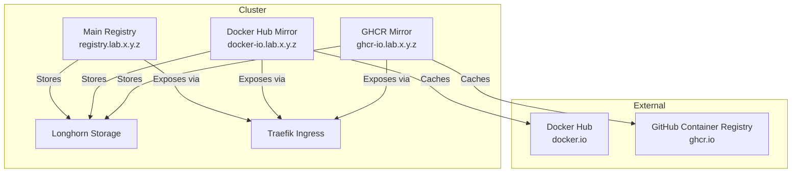

*This is the sixth post in our "Building a Kubernetes Homelab" series. Check out the [previous post](/posts/building-homelab-lgtm-stack/) to see how we deployed the observability stack.*

## The Need for Container Registries

With the cluster infrastructure in place—MetalLB, Traefik, Longhorn, and the LGTM observability stack—I had a solid, production-ready Kubernetes environment. But I needed a way to store custom container images and cache public images to avoid rate limiting and speed up pulls.

I needed:

- A **main registry** for storing custom-built images (e.g., custom applications, modified base images)
- **Mirror registries** for caching upstream sources (Docker Hub, GHCR) to avoid rate limits and improve pull speeds
- TLS-secured access via Traefik ingress
- Persistent storage using Longhorn
- Easy management via Ansible automation

Enter Docker Registry v2, a simple and reliable container registry that can serve both as a storage backend and as a proxy/mirror for upstream registries.

## What are Container Registries?

Container registries are storage and distribution systems for container images. In this setup, I deploy two types:

1. **Main Registry**: Stores custom-built images locally
   - Acts as a private registry for images built in the homelab
   - Uses persistent storage with `Retain` policy (data should persist)
   - Accessible at `registry.lab.x.y.z`

2. **Mirror Registries**: Cache upstream registries
   - Proxy requests to upstream registries (Docker Hub, GHCR)
   - Cache images locally to speed up subsequent pulls
   - Reduce rate limiting issues with public registries
   - Uses persistent storage with `Delete` policy (cache can be evicted)

Both types use Docker Registry v2 and are exposed via Traefik with TLS termination.

## Architecture: Registries in the Cluster



**Main Registry** stores custom images with persistent Longhorn storage.

**Mirror Registries** proxy and cache images from upstream registries, reducing external traffic and rate limiting.

**Traefik** handles TLS termination and routing to the appropriate registry service.

**Longhorn** provides persistent storage for both registry types.

## Implementation: Registries Ansible Role

Following the established pattern from other roles (CA, LGTM, etc.), I created an Ansible role for registries:

```text
cluster/roles/registries/
├── defaults/main.yaml                    # Default variables
├── tasks/
│   ├── install.yaml                     # Deploy registries and mirrors
│   ├── configure.yaml                   # Configuration tasks (currently empty)
│   └── uninstall.yaml                   # Cleanup tasks
└── templates/
    ├── container-image-registry-deployment.yaml.j2
    ├── container-image-registry-service.yaml.j2
    ├── container-image-registry-ingress.yaml.j2
    ├── container-image-registry-pvc.yaml.j2
    ├── container-image-mirror-deployment.yaml.j2
    ├── container-image-mirror-service.yaml.j2
    ├── container-image-mirror-ingress.yaml.j2
    ├── container-image-mirror-pvc.yaml.j2
    └── container-image-mirror-config.yaml.j2
```

### Key Variables

```yaml
registries_namespace: registry-system

# Main Registry
container_image_registry_name: registry
container_image_registry_image: registry:2
container_image_registry_port: 5000
container_image_registry_storage_class: lg-hdd-raw-x3
container_image_registry_storage_size: 2Gi
container_image_registry_ingress_host: registry.lab.x.y.z

# Mirrors (configured via inventory)
container_image_mirrors:
  - url: https://registry-1.docker.io
    registry: docker.io
    size: 2Gi
  - url: https://ghcr.io
    registry: ghcr.io
    size: 2Gi
```

### Main Registry Configuration

The main registry is a standard Docker Registry v2 deployment:

```yaml
apiVersion: apps/v1
kind: Deployment
metadata:
  name: registry
  namespace: registry-system
spec:
  replicas: 1
  template:
    spec:
      containers:
      - name: registry
        image: registry:2
        ports:
        - containerPort: 5000
        env:
        - name: REGISTRY_STORAGE_FILESYSTEM_ROOTDIRECTORY
          value: /var/lib/registry
        volumeMounts:
        - name: registry-storage
          mountPath: /var/lib/registry
      volumes:
      - name: registry-storage
        persistentVolumeClaim:
          claimName: registry-storage
```

The registry uses:

- **Persistent storage**: 2Gi Longhorn volume with `Retain` policy
- **TLS certificates**: Generated using existing CA role
- **Resource limits**: 100m CPU / 256Mi memory (requests), 500m CPU / 1Gi memory (limits)
- **Health checks**: Liveness and readiness probes on port 5000

### Mirror Registry Configuration

Mirror registries use Docker Registry v2 with proxy configuration:

```yaml
apiVersion: v1
kind: ConfigMap
metadata:
  name: docker-io-config
  namespace: registry-system
data:
  config.yml: |
    version: 0.1
    storage:
      filesystem:
        rootdirectory: /var/lib/registry
    http:
      addr: :5000
    proxy:
      remoteurl: https://registry-1.docker.io
      ttl: 168h
```

The mirror:

- Proxies requests to the upstream registry
- Caches images locally for 168 hours (7 days)
- Uses persistent storage with `Delete` policy (cache can be evicted)

## TLS Certificates

All registries use TLS certificates generated by the CA role. The certificates are loaded as Kubernetes secrets:

```yaml
apiVersion: v1
kind: Secret
metadata:
  name: registry-tls
  namespace: registry-system
type: kubernetes.io/tls
data:
  tls.crt: <certificate chain>
  tls.key: <private key>
```

TLS is terminated at Traefik, so the registries accept HTTP connections from Traefik. This simplifies configuration while maintaining end-to-end encryption for clients.

## Traefik Ingress Configuration

Each registry is exposed via Traefik ingress with TLS:

```yaml
apiVersion: networking.k8s.io/v1
kind: Ingress
metadata:
  name: registry
  namespace: registry-system
  annotations:
    traefik.ingress.kubernetes.io/router.entrypoints: websecure
spec:
  ingressClassName: traefik
  tls:
  - hosts:
    - registry.lab.x.y.z
    secretName: registry-tls
  rules:
  - host: registry.lab.x.y.z
    http:
      paths:
      - path: /
        pathType: Prefix
        backend:
          service:
            name: registry
            port:
              number: 5000
```

The ingress:

- Uses the `websecure` entrypoint (HTTPS only)
- Terminates TLS using the registry certificate
- Routes traffic to the registry service on port 5000

## Using the Registries

### Pushing to the Main Registry

To push a custom image to the main registry:

```bash
# Tag the image
docker tag my-app:latest registry.lab.x.y.z/my-app:latest

# Push to registry
docker push registry.lab.x.y.z/my-app:latest
```

### Pulling from Mirrors

To use a mirror, configure your container runtime to use the mirror URL:

```yaml
# In containerd config.toml or Docker daemon.json
[plugins."io.containerd.grpc.v1.cri".registry.mirrors."docker.io"]
  endpoint = ["https://docker-io.lab.x.y.z"]

[plugins."io.containerd.grpc.v1.cri".registry.mirrors."ghcr.io"]
  endpoint = ["https://ghcr-io.lab.x.y.z"]
```

Or reference the mirror directly in Kubernetes manifests:

```yaml
apiVersion: apps/v1
kind: Deployment
metadata:
  name: my-app
spec:
  template:
    spec:
      containers:
      - name: my-app
        image: docker-io.lab.x.y.z/library/nginx:latest
```

## Challenges and Solutions

### Challenge 1: TLS Certificate Management

**Problem**: Each registry needs a TLS certificate for secure access.

**Solution**: Reused the existing CA role to generate certificates for each registry. The certificates are loaded as Kubernetes secrets and referenced in the ingress configuration.

### Challenge 2: Registry Storage Policies

**Problem**: Main registry data should persist, but mirror cache can be evicted.

**Solution**: Used different StorageClasses:

- Main registry: `lg-hdd-raw-x3` (data persists)
- Mirrors: `lg-hdd-raw-x3-delete` (cache can be evicted)

### Challenge 3: Mirror Configuration

**Problem**: Docker Registry v2 proxy mode requires specific configuration.

**Solution**: Created ConfigMaps with the proxy configuration for each mirror, specifying the upstream URL and cache TTL.

### Challenge 4: TLS Termination

**Problem**: Registries need TLS for security, but Traefik should handle termination.

**Solution**: Configured Traefik to terminate TLS and forward HTTP to registries. Registries accept HTTP from Traefik, simplifying their configuration.

### Challenge 5: Inventory Configuration

**Problem**: Need flexible configuration for multiple mirrors.

**Solution**: Used Ansible inventory variables to define mirrors dynamically:

```yaml
container_image_mirrors:
  - url: https://registry-1.docker.io
    registry: docker.io
    size: 2Gi
  - url: https://ghcr.io
    registry: ghcr.io
    size: 2Gi
```

The role loops through these mirrors and creates deployments, services, and ingresses for each.

## Testing: Verification Steps

To verify the registries are working:

1. **Check registry pods**:

   ```bash
   kubectl get pods -n registry-system
   ```

2. **Test main registry push**:

   ```bash
   docker pull nginx:latest
   docker tag nginx:latest registry.lab.x.y.z/nginx:latest
   docker push registry.lab.x.y.z/nginx:latest
   ```

3. **Test mirror pull**:

   ```bash
   docker pull docker-io.lab.x.y.z/library/nginx:latest
   ```

4. **Verify TLS**:

   ```bash
   curl -k https://registry.lab.x.y.z/v2/
   ```

All tests should pass, confirming the registries are accessible and functioning correctly.

## Lessons Learned

1. **Separate storage policies**: Main registry needs persistent storage, mirrors can use evictable cache
2. **TLS termination at Traefik**: Simplifies registry configuration while maintaining security
3. **Mirror configuration is straightforward**: Docker Registry v2 proxy mode works well for caching
4. **Inventory-driven mirrors**: Flexible configuration allows easy addition of new mirrors
5. **Health checks are essential**: Liveness and readiness probes ensure registry availability

## What's Next?

With container registries in place, I now have:

- ✅ Main registry for custom images
- ✅ Mirror registries for upstream caching
- ✅ TLS-secured access via Traefik
- ✅ Persistent storage with appropriate policies
- ✅ Easy management via Ansible automation

Future enhancements could include:

- **Registry authentication**: Add authentication for the main registry
- **Image scanning**: Integrate vulnerability scanning for stored images
- **Registry UI**: Add a web interface for browsing images
- **Backup strategy**: Automated backups of registry data
- **Additional mirrors**: Add more upstream registries as needed

The registries provide a solid foundation for storing and caching container images, reducing external dependencies and improving deployment speeds.
