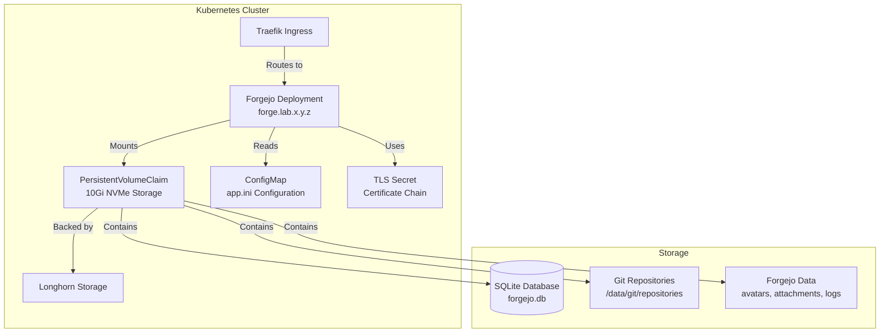

*This is the ninth post in our "K8s Homelab" series. Check out the [previous post](/posts/homelab-longhorn-ftp-backups/) to see how we set up automated, encrypted backups for Longhorn volumes.*

## The Need for Self-Hosted Git Hosting

With the cluster infrastructure in place—MetalLB, Traefik, Longhorn, the LGTM observability stack, and container registries—I had a solid foundation for running services. But I needed a way to host my Git repositories privately, without relying on external services like GitHub or GitLab.

I wanted:

- **Self-hosted Git hosting**: Complete control over my repositories and data
- **Lightweight solution**: Simple deployment without complex database requirements
- **TLS-secured access**: HTTPS access via Traefik ingress
- **Persistent storage**: Repositories and data stored in Longhorn
- **Easy management**: Automated deployment via Ansible

Enter **Forgejo**, a community fork of Gitea that provides a lightweight, self-hosted Git hosting solution perfect for homelab environments.

## What is Forgejo?

Forgejo is a community-driven fork of Gitea, a lightweight Git hosting service written in Go. It provides:

- **Git repository hosting**: Full Git server capabilities with web UI
- **Issue tracking**: Built-in issue and pull request management
- **Wiki and documentation**: Repository wikis and documentation pages
- **User management**: Multi-user support with access control
- **Webhooks and integrations**: Extensible with webhooks and API access
- **Lightweight**: Low resource requirements, perfect for homelab

Forgejo is designed to be simple to deploy and maintain, making it ideal for personal or small-team use cases.

## Architecture: Forgejo in the Cluster



**Forgejo** runs as a single-replica Deployment with persistent storage for all data.

**Storage** uses Longhorn with NVMe storage class (`lg-nvme-raw-x3-retain`) for high performance and data retention.

**Configuration** is managed via ConfigMap containing the `app.ini` configuration file.

**TLS** uses self-signed certificates from the homelab CA, providing HTTPS access via Traefik.

## Implementation: Forgejo Ansible Role

Following the established pattern from other roles, I created an Ansible role for Forgejo:

```text
cluster/roles/forge/
├── defaults/main.yaml                    # Default variables
├── tasks/
│   ├── install.yaml                     # Deploy Forgejo
│   ├── configure.yaml                   # Configuration tasks (empty for now)
│   └── uninstall.yaml                   # Cleanup tasks
└── templates/
    ├── forge-deployment.yaml.j2
    ├── forge-service.yaml.j2
    ├── forge-ingress.yaml.j2
    ├── forge-config.yaml.j2
    ├── forge-pvc.yaml.j2
    └── forge-pdb.yaml.j2
```

### Key Variables

```yaml
forge_namespace: forge-system
forge_image: codeberg.org/forgejo/forgejo:13.0.3
forge_service_name: forge
forge_service_port: 3000
forge_replicas: 1
forge_hostname: forge.lab.x.y.z

# Storage configuration
forge_storage_class: lg-nvme-raw-x3-retain
forge_storage_size: 10Gi

# Forgejo configuration
forge_app_name: Forgejo
forge_domain: forge.lab.x.y.z
forge_http_port: 3000
forge_ssh_port: 22
forge_ssh_domain: forge.lab.x.y.z

# Resource limits
forge_resources:
  requests:
    cpu: 100m
    memory: 256Mi
  limits:
    cpu: 1000m
    memory: 1Gi
```

### Database Choice: SQLite vs PostgreSQL

Initially, I planned to use PostgreSQL for the database backend, but after considering the requirements:

- **Single-user homelab**: Only one user accessing the service
- **Low traffic**: Minimal concurrent access
- **Simplicity**: Easier deployment and maintenance
- **Resource efficiency**: Lower resource usage

I decided to use **SQLite** instead. SQLite is perfect for single-user or low-traffic scenarios and eliminates the need for a separate database deployment.

**Configuration** (`forge-config.yaml.j2`):

```yaml
[database]
DB_TYPE = sqlite3
PATH = /data/forgejo/forgejo.db
```

This simplifies the deployment significantly—no separate StatefulSet for PostgreSQL, no database connection strings, and no database backup complexity.

### Deployment Configuration

The Forgejo deployment includes several important configurations:

**File:** `cluster/roles/forge/templates/forge-deployment.yaml.j2`

```yaml
apiVersion: apps/v1
kind: Deployment
metadata:
  name: {{ forge_service_name }}
  namespace: {{ forge_namespace }}
spec:
  replicas: {{ forge_replicas }}
  strategy:
    type: RollingUpdate
    rollingUpdate:
      maxSurge: 0
      maxUnavailable: 1
  template:
    spec:
      initContainers:
      - name: init-permissions
        image: {{ forge_image }}
        command: ['sh', '-c']
        args:
          - |
            chown -R 1000:1000 /data
            chmod -R 755 /data
        volumeMounts:
        - name: data
          mountPath: /data
        securityContext:
          runAsUser: 0
      containers:
      - name: {{ forge_service_name }}
        image: {{ forge_image }}
        ports:
        - containerPort: {{ forge_service_port }}
        volumeMounts:
        - name: data
          mountPath: /data
        - name: config
          mountPath: /data/forgejo/app.ini
          subPath: app.ini
      volumes:
      - name: data
        persistentVolumeClaim:
          claimName: {{ forge_service_name }}-data
      - name: config
        configMap:
          name: {{ forge_service_name }}-config
```

**Key Configuration Points**:

- **Rolling Update Strategy**: `maxSurge: 0` and `maxUnavailable: 1` ensures only one pod exists at a time, preventing multi-attach errors with ReadWriteOnce PVCs
- **Init Container**: Sets correct permissions (1000:1000) for the Forgejo user on the persistent volume
- **ConfigMap Mount**: Mounts `app.ini` as a file (using `subPath`) rather than a directory
- **No Custom Command**: Uses the default entrypoint (`/usr/bin/entrypoint`) which handles s6-svscan setup correctly

### Storage Configuration

Forgejo uses persistent storage for all data:

**File:** `cluster/roles/forge/templates/forge-pvc.yaml.j2`

```yaml
apiVersion: v1
kind: PersistentVolumeClaim
metadata:
  name: {{ forge_service_name }}-data
  namespace: {{ forge_namespace }}
spec:
  accessModes:
    - ReadWriteOnce
  storageClassName: {{ forge_storage_class }}
  resources:
    requests:
      storage: {{ forge_storage_size }}
```

**Storage Class**: `lg-nvme-raw-x3-retain` provides:
- **NVMe storage**: High-performance storage for Git operations
- **3 replicas**: Data redundancy across nodes
- **Retain policy**: Data persists even if PVC is deleted

### TLS Certificates

Forgejo uses TLS certificates from the homelab CA:

**File:** `cluster/roles/forge/tasks/install.yaml`

```yaml
- name: Create forge TLS secret with certificate chain
  kubernetes.core.k8s:
    state: present
    resource_definition:
      apiVersion: v1
      kind: Secret
      metadata:
        name: forge-tls
        namespace: "{{ forge_namespace }}"
      type: kubernetes.io/tls
      stringData:
        tls.crt: "{{ forge_cert_file.content | b64decode }}{{ ca_cert_file.content | b64decode }}"
        tls.key: "{{ forge_key_file.content | b64decode }}"
```

The certificate chain includes both the service certificate and the CA certificate, ensuring browsers can validate the certificate chain.

### Ingress Configuration

Forgejo is exposed via Traefik ingress with TLS:

**File:** `cluster/roles/forge/templates/forge-ingress.yaml.j2`

```yaml
apiVersion: networking.k8s.io/v1
kind: Ingress
metadata:
  name: {{ forge_service_name }}-ingress
  namespace: {{ forge_namespace }}
  annotations:
    traefik.ingress.kubernetes.io/router.entrypoints: websecure
spec:
  ingressClassName: {{ forge_ingress_class }}
  tls:
  - hosts:
    - {{ forge_hostname }}
    secretName: {{ forge_service_name }}-tls
  rules:
  - host: {{ forge_hostname }}
    http:
      paths:
      - path: /
        pathType: Prefix
        backend:
          service:
            name: {{ forge_service_name }}
            port:
              number: {{ forge_service_port }}
```

### PodDisruptionBudget

To allow node drains while tolerating service disruption:

**File:** `cluster/roles/forge/templates/forge-pdb.yaml.j2`

```yaml
apiVersion: policy/v1
kind: PodDisruptionBudget
metadata:
  name: {{ forge_service_name }}-pdb
  namespace: {{ forge_namespace }}
spec:
  maxUnavailable: 1
  selector:
    matchLabels:
      app: {{ forge_service_name }}
```

This allows draining any node at any time, tolerating service disruption for a single-replica application.

## Challenge 1: Multi-Attach Error

**Problem**: After deploying Forgejo, the pod was stuck in `Pending` state with a multi-attach error. The error message indicated that the PVC (ReadWriteOnce) was already attached to another pod.

**Root Cause**: The deployment was using the default rolling update strategy, which allows Kubernetes to create a new pod before terminating the old one during updates. Both pods tried to use the same ReadWriteOnce PVC, causing the multi-attach error.

**Solution**: Configure the rolling update strategy to ensure only one pod exists at a time:

```yaml
strategy:
  type: RollingUpdate
  rollingUpdate:
    maxSurge: 0        # Don't create new pods until old ones are terminated
    maxUnavailable: 1  # Allow one pod to be unavailable during updates
```

This ensures that when updating the deployment, Kubernetes terminates the old pod before creating a new one, preventing both pods from trying to use the same RWO PVC simultaneously.

## Challenge 2: Crash Loop - Missing Entrypoint

**Problem**: After fixing the multi-attach error, the pod entered a crash loop with the error:

```
exec: "/bin/s6-svscan": stat /bin/s6-svscan: no such file or directory
```

**Root Cause**: The deployment specified a custom command `["/bin/s6-svscan", "/etc/s6"]`, but:
1. The path was incorrect (should be `/usr/bin/s6-svscan`)
2. The image's default entrypoint (`/usr/bin/entrypoint`) already handles s6-svscan setup correctly

**Solution**: Remove the custom command and let the container use its default entrypoint:

```yaml
containers:
- name: {{ forge_service_name }}
  image: {{ forge_image }}
  # No command specified - uses default entrypoint
  ports:
  - containerPort: {{ forge_service_port }}
```

The Forgejo image's default entrypoint (`/usr/bin/entrypoint`) properly configures and runs s6-svscan, so no custom command is needed.

## Challenge 3: Certificate Not Recognized

**Problem**: When accessing `https://forge.lab.x.y.z`, the browser showed a security warning, unlike other services (Longhorn, Grafana) which were trusted.

**Root Cause**: The forge certificate was missing **Subject Alternative Names (SAN)** extensions. Modern browsers require SAN extensions in certificates, and the certificate was generated without them.

**Solution**: Regenerate the certificate with SAN extensions:

```bash
cd cluster/secrets/ca

# Regenerate certificate with SAN extensions
openssl x509 -req -in forge.csr \
  -CA ca.crt \
  -CAkey ca.key \
  -CAcreateserial \
  -out forge.crt \
  -days 3650 \
  -extensions v3_req \
  -extfile <(echo -e "[v3_req]\nkeyUsage = keyEncipherment, dataEncipherment\nextendedKeyUsage = serverAuth\nsubjectAltName = @alt_names\n[alt_names]\nDNS.1 = forge.lab.x.y.z")
```

Then update the Kubernetes TLS secret with the new certificate:

```bash
kubectl delete secret forge-tls -n forge-system
kubectl create secret tls forge-tls -n forge-system \
  --cert=<(cat forge.crt ca.crt) \
  --key=forge.key
```

**Key Requirements**:
- **SAN Extensions**: Required for modern browsers to trust certificates
- **Certificate Chain**: TLS secret must include both service certificate and CA certificate
- **Key Usage Extensions**: `keyEncipherment`, `dataEncipherment`, and `serverAuth` are essential

## Challenge 4: Storage Class Creation

**Problem**: The Forgejo pod was stuck in `Pending` state with `ProvisioningFailed` error, stating that the storage class `lg-nvme-raw-x3-retain` was not found.

**Root Cause**: The storage class was defined in the Forgejo role defaults but didn't exist in the cluster. Storage classes are created by the Longhorn role, not individual application roles.

**Solution**: Add the storage class definition to the Longhorn role:

**File:** `cluster/roles/longhorn/defaults/main.yaml`

```yaml
storage_classes:
  # ... existing storage classes ...
  - name: lg-nvme-raw-x3-retain
    reclaimPolicy: Retain
    numberOfReplicas: "3"
    diskSelector: "lg-nvme-raw"
    volumeBindingMode: Immediate
```

Then re-run the Longhorn install/configure playbook to create the storage class:

```bash
make cluster/deploy  # Or specific longhorn role
```

**Key Points**:
- **Storage classes are infrastructure**: Created by storage providers (Longhorn), not applications
- **Retain policy**: Ensures data persists even if PVC is deleted
- **Immediate binding**: Ensures PVC is ready before pod creation

## Challenge 5: Image Tag Resolution

**Problem**: The Forgejo pod was in `ImagePullBackOff` status because the image tag `1.23` for `codeberg.org/forgejo/forgejo` was not found in the registry.

**Root Cause**: The initial image tag was incorrect. Forgejo uses semantic versioning without the `v` prefix (e.g., `13.0.3`, not `v13.0.3` or `1.23`).

**Solution**: Update the image tag to the correct latest stable version:

```yaml
forge_image: codeberg.org/forgejo/forgejo:13.0.3
```

**Best Practice**: Pin to a specific version rather than using `latest` tag for:
- **Reproducibility**: Same version across deployments
- **Stability**: Avoid unexpected breaking changes
- **Security**: Control when to update to new versions

## DNS Configuration

Forgejo is accessible via DNS configured in the router role:

**File:** `network/roles/router/defaults/main.yaml`

```yaml
services:
  - longhorn
  - grafana
  - ntfy
  - ca
  - registry
  - docker-io
  - ghcr-io
  - homeassistant
  - sunshine.gaming
  - forge
```

The router role automatically creates a CNAME record:

```dnsmasq
cname=forge.lab.x.y.z,cluster.lab.x.y.z
```

This resolves to the cluster VIP, which is handled by MetalLB and Traefik.

## Access and Management

### Web Interface

Once deployed, Forgejo is accessible at:

```text
https://forge.lab.x.y.z
```

The first access will show the initial setup page where you can:
1. Configure the database (already configured via `app.ini`)
2. Create the first admin user
3. Configure basic settings

### Git Operations

After setup, you can use Forgejo like any Git hosting service:

```bash
# Clone a repository
git clone https://forge.lab.x.y.z/username/repo.git

# Push to repository
git remote add forge https://forge.lab.x.y.z/username/repo.git
git push forge main
```

### SSH Access

Forgejo also supports SSH access for Git operations:

```bash
# Clone via SSH
git clone git@forge.lab.x.y.z:username/repo.git

# Push via SSH
git remote add forge git@forge.lab.x.y.z:username/repo.git
git push forge main
```

**Note**: SSH access requires configuring SSH keys in Forgejo's user settings.

### Pod Management

```bash
# Check pod status
kubectl get pods -n forge-system

# View logs
kubectl logs -n forge-system -l app=forge

# Check PVC status
kubectl get pvc -n forge-system

# Check ingress
kubectl get ingress -n forge-system
```

## Lessons Learned

### 1. Rolling Update Strategy for RWO Storage

When using ReadWriteOnce PVCs with Deployments, always configure the rolling update strategy with `maxSurge: 0` to prevent multi-attach errors. This ensures only one pod uses the PVC at a time.

### 2. Default Entrypoints are Usually Correct

Container images typically have well-configured default entrypoints. Only override them when necessary, and always verify the correct paths and commands before specifying custom entrypoints.

### 3. SAN Extensions are Required

Modern browsers require Subject Alternative Names (SAN) extensions in TLS certificates. Always generate certificates with SAN extensions, even for internal services.

### 4. SQLite for Single-User Scenarios

For single-user or low-traffic scenarios, SQLite is often sufficient and significantly simpler than PostgreSQL. It eliminates database deployment complexity while providing adequate performance.

### 5. Storage Classes are Infrastructure

Storage classes are created by storage providers (like Longhorn), not by application roles. Application roles should reference existing storage classes, not create them.

### 6. Image Tag Best Practices

Pin to specific version tags rather than using `latest`. This ensures reproducibility and allows controlled updates. Always verify the correct tag format for the registry (some use `v1.2.3`, others use `1.2.3`).

### 7. Init Containers for Permissions

When mounting persistent volumes, use init containers to set correct file permissions before the main container starts. This is especially important when the main container runs as a non-root user.

### 8. Certificate Chain in TLS Secrets

Kubernetes TLS secrets must include the full certificate chain (service certificate + CA certificate) in the `tls.crt` field. Browsers require the complete chain to establish trust.

### 9. ConfigMap SubPath for Files

When mounting a ConfigMap as a file (not a directory), use `subPath` to mount it as a specific file. This prevents the ConfigMap from creating a directory structure.

### 10. PodDisruptionBudget for Single Replicas

For single-replica deployments, use `maxUnavailable: 1` in PodDisruptionBudget to allow node drains while tolerating service disruption. This is more flexible than `minAvailable: 0` for single-replica scenarios.

## What We Achieved

With Forgejo deployed, we now have:

✅ **Self-Hosted Git Hosting**: Complete control over repositories and data  
✅ **Lightweight Deployment**: SQLite backend eliminates database complexity  
✅ **Persistent Storage**: All data stored in Longhorn with 3 replicas  
✅ **TLS-Secured Access**: HTTPS access via Traefik with trusted certificates  
✅ **Automated Deployment**: Fully automated via Ansible  
✅ **Resource Efficient**: Low CPU and memory requirements  
✅ **DNS Integration**: Automatic DNS resolution via router role  
✅ **High Performance**: NVMe storage for fast Git operations  

## Next Steps

With Forgejo running, future enhancements could include:

1. **Backup Automation**: Automated backups of Forgejo data using Velero or similar tools
2. **Monitoring Integration**: Expose Forgejo metrics to Prometheus
3. **Webhook Integration**: Configure webhooks for CI/CD pipelines
4. **SSH Key Management**: Automate SSH key distribution for Git operations
5. **Repository Migration**: Tools for migrating repositories from other Git hosts
6. **User Management**: Integration with LDAP or OAuth for authentication

## Conclusion

Deploying Forgejo in the Kubernetes homelab provides a complete self-hosted Git hosting solution with:

- **Simplicity**: SQLite backend eliminates database complexity
- **Performance**: NVMe storage ensures fast Git operations
- **Security**: TLS-secured access with trusted certificates
- **Reliability**: Persistent storage with data retention
- **Automation**: Fully automated deployment and management

The deployment is production-ready and provides a solid foundation for hosting Git repositories privately in the homelab environment.

---

*Check out the [previous post](/posts/homelab-longhorn-ftp-backups/) to see how we set up automated, encrypted backups for Longhorn volumes, or read the [first post](/posts/homelab-introduction/) for the complete journey from the beginning.*

