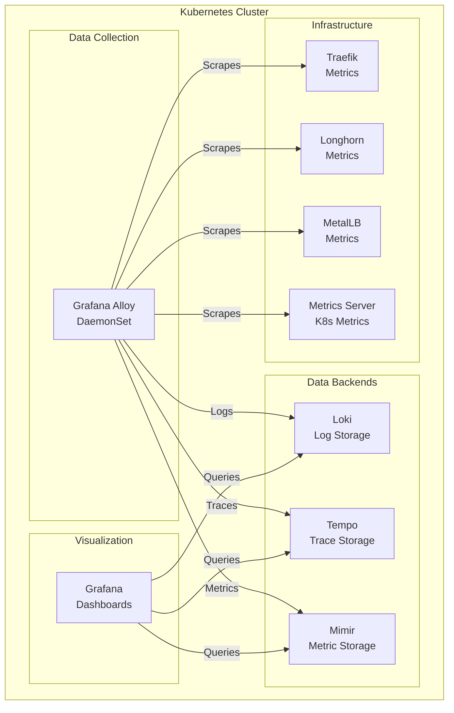

*This is the fifth post in our "K8s Homelab" series. Check out the [previous post](/posts/homelab-foundation-layer/) to see how we deployed MetalLB, Traefik, and Longhorn as the foundation layer.*

## From Infrastructure to Observability

With the cluster infrastructure in place—MetalLB providing load balancing, Traefik handling ingress, and Longhorn offering distributed storage—the cluster was functional but blind. I had no visibility into what was happening inside. Pods could crash, nodes could fail, services could degrade, and I'd have no idea until something broke catastrophically.

It was time to add observability. Not just basic monitoring, but a comprehensive observability stack that would give me insights into logs, metrics, and traces—the three pillars of observability.

## Why LGTM: The Observability Stack Choice

After researching various observability solutions, I settled on the LGTM stack:

- **Loki** - Log aggregation, similar to Prometheus but for logs
- **Grafana** - Visualization and dashboards (the "G" in LGTM)
- **Tempo** - Distributed tracing backend
- **Mimir** - Long-term metrics storage (Prometheus-compatible)

This stack is designed to work together seamlessly, with Grafana as the unified interface for querying logs, metrics, and traces. Plus, it's all open source and integrates perfectly with Kubernetes.

The missing piece was data collection. That's where **Grafana Alloy** comes in—it's the next-generation agent that can collect logs, metrics, and traces and forward them to the LGTM stack. It replaced Grafana Agent and provides a more modern, unified approach to data collection.

## The Architecture: Observability at Scale

The observability architecture follows a clear pattern:



**Grafana Alloy** runs as a DaemonSet on every node, collecting data from various sources:

- Kubernetes pod logs
- Node metrics (kubelet, cAdvisor)
- Service discovery for pods and services
- Infrastructure component metrics (Traefik, Longhorn, MetalLB)

**Data Backends** store the collected data:

- **Loki** stores logs with efficient compression
- **Tempo** stores distributed traces
- **Mimir** stores metrics with long-term retention

**Grafana** provides the unified interface for querying and visualizing all observability data.

## Storage Strategy: Delete vs Retain

One of the key decisions was how to handle storage for different types of data:

- **Logs, Metrics, Traces** (`lg-hdd-raw-x1-delete`): These are time-series data that can be regenerated. If we lose historical data, we can start fresh. Single replica is sufficient for a homelab, and Delete reclaim policy means we don't waste storage on old data.

- **Grafana Dashboards/Configs** (`lg-hdd-raw-x3`): These are configuration data that must persist. Three replicas provide redundancy, and Retain policy ensures we never accidentally lose our dashboards and configurations.

This storage strategy balances cost (single replica for ephemeral data) with reliability (triple replica for critical configs).

## Challenge 1: Enabling Metrics in Existing Roles

Before deploying the LGTM stack, I needed to ensure that existing infrastructure components were exposing metrics. This required modifications to three roles:

### Traefik Metrics

**File:** `cluster/roles/ingress/templates/values.yaml.j2`

I added Prometheus metrics configuration to Traefik:

```yaml
metrics:
  prometheus:
    enabled: true
    port: 8080
    path: /metrics
```

Traefik exposes metrics on port 8080 at `/metrics`, which Grafana Alloy can scrape.

### Longhorn Metrics

Longhorn manager exposes metrics by default on port 9500. I verified this was working and didn't need any changes—the metrics endpoint was already available at `longhorn-manager.longhorn-system.svc.cluster.local:9500`.

### MetalLB Metrics

MetalLB exposes metrics by default on port 7472 for both the controller and speaker components. Again, no changes were needed—the endpoints were already available.

## Challenge 2: Metrics Server Deployment

K3s ships with metrics-server disabled by default. I needed to deploy it separately to expose Kubernetes resource metrics (CPU, memory) for pods and nodes.

**File:** `cluster/roles/metrics-server/defaults/main.yaml`

```yaml
---
# Metrics-server role default variables

metrics_server_namespace: metrics-server-system
metrics_server_version: 0.7.0
```

**File:** `cluster/roles/metrics-server/tasks/main.yaml`

The metrics-server role follows the same pattern as other roles:

1. Add Helm repository
2. Create namespace
3. Template values
4. Deploy via Helm

The key configuration is in `values.yaml.j2`:

```yaml
args:
  - --kubelet-insecure-tls
  - --kubelet-preferred-address-types=InternalIP,ExternalIP,Hostname
```

The `--kubelet-insecure-tls` flag is necessary for K3s, which uses self-signed certificates.

## Challenge 3: LGTM Stack Deployment

The LGTM role is the most complex, deploying five components in sequence:

### Component Configuration

**File:** `cluster/roles/lgtm/defaults/main.yaml`

```yaml
lgtm_namespace: lgtm-system

# Component versions (latest stable as of January 2025)
# These are Helm chart versions, not app versions
loki_version: "6.46.0"
grafana_version: "10.1.4"
tempo_version: "1.24.0"
mimir_version: "6.0.1"
alloy_version: "1.4.0"

# Storage classes
lgtm_data_storage_class: lg-hdd-raw-x1-delete
grafana_storage_class: lg-hdd-raw-x1-delete

# Grafana configuration
grafana_hostname: grafana.lab.x.y.z
grafana_ingress_class: traefik
# Grafana admin password should be set in cluster/secrets/grafana.yaml (git-crypt encrypted)
# This is a fallback default - will be overridden by cluster/secrets/grafana.yaml if it exists
grafana_admin_password: admin

# Mimir multi-tenancy configuration
mimir_org_id: "homelab"

# Storage sizes (conservative for homelab)
loki_storage_size: 50Gi
tempo_storage_size: 50Gi
mimir_storage_size: 50Gi
grafana_storage_size: 10Gi

# Retention periods (data rotation)
loki_retention_period: 168h  # 7 days
tempo_retention_period: 360h  # 15 days
mimir_retention_period: 720h  # 30 days
```

The Grafana admin password is stored in `cluster/secrets/grafana.yaml` (git-crypted for security).

### Deployment Order

The components are deployed in a specific order:

1. **Loki** - Log storage backend
2. **Tempo** - Trace storage backend
3. **Mimir** - Metrics storage backend
4. **Grafana Alloy** - Data collection (needs backends to be ready)
5. **Grafana** - Visualization (needs backends and data sources configured)

We rely on Kubernetes reconciliation—no explicit wait conditions. Components will retry connections automatically until their dependencies are ready.

### Loki Configuration

**File:** `cluster/roles/lgtm/templates/loki-values.yaml.j2`

Loki runs in distributed mode with separate backend and write components. The configuration includes:

```yaml
loki:
  auth_enabled: false
  
  storage:
    bucketNames:
      chunks: chunks
      ruler: ruler
      admin: admin
  
  schemaConfig:
    configs:
      - from: "2024-01-01"
        store: tsdb
        object_store: filesystem
        schema: v13
        index:
          prefix: index_
          period: 24h

gateway:
  enabled: true

storage:
  type: filesystem
  filesystem:
    directory: /loki/chunks

limits_config:
  retention_period: {{ loki_retention_period }}

persistence:
  enabled: true
  storageClassName: {{ lgtm_data_storage_class }}
  size: {{ loki_storage_size }}

# Backend persistence for distributed mode
backend:
  persistence:
    enabled: true
    volumeClaimsEnabled: true
    storageClass: {{ lgtm_data_storage_class }}
    size: {{ loki_storage_size }}

# Write persistence for distributed mode
write:
  persistence:
    enabled: true
    volumeClaimsEnabled: true
    storageClass: {{ lgtm_data_storage_class }}
    size: {{ loki_storage_size }}

resources:
  requests:
    cpu: 100m
    memory: 128Mi
  limits:
    cpu: 500m
    memory: 512Mi
```

Key points:

- **Schema Config**: Required for Loki to define storage schema and index configuration
- **Distributed Mode**: Uses separate backend and write StatefulSets for scalability
- **Persistence**: Both backend and write components need `volumeClaimsEnabled: true` and use `storageClass` (not `storageClassName`) for StatefulSet volumeClaimTemplates
- **Gateway**: Provides a unified entry point for log ingestion

### Tempo Configuration

**File:** `cluster/roles/lgtm/templates/tempo-values.yaml.j2`

```yaml
tempo:
  storage:
    trace:  # Note: 'trace' not 'traces' - this is the correct field name
      backend: local
      local:
        path: /var/tempo/traces
  
  compactor:
    compaction:
      retention: {{ tempo_retention_period }}
  
  resources:
    requests:
      cpu: 100m
      memory: 128Mi
    limits:
      cpu: 500m
      memory: 512Mi

persistence:
  enabled: true
  storageClassName: {{ lgtm_data_storage_class }}
  size: {{ tempo_storage_size }}
```

Tempo runs in single mode with local filesystem storage. For a homelab, this is simpler than distributed mode and perfectly adequate.

**Important**: The storage field is `trace` (singular), not `traces` (plural). This is a common mistake that causes configuration validation errors.

### Mimir Configuration

**File:** `cluster/roles/lgtm/templates/mimir-values.yaml.j2`

Mimir runs in distributed mode with multiple components (distributor, ingester, querier, queryFrontend, compactor, storeGateway). Each component that needs storage requires its own persistence configuration:

```yaml
# Configure Mimir for single mode (1 replica of each component)
distributor:
  replicas: 1

ingester:
  replicas: 1
  persistentVolume:  # Note: 'persistentVolume' not 'persistence'
    enabled: true
    storageClass: {{ lgtm_data_storage_class }}  # Note: 'storageClass' not 'storageClassName'
    size: {{ mimir_storage_size }}

querier:
  replicas: 1

queryFrontend:
  replicas: 1

compactor:
  replicas: 1
  persistentVolume:
    enabled: true
    storageClass: {{ lgtm_data_storage_class }}
    size: {{ mimir_storage_size }}

store_gateway:  # Note: snake_case, not camelCase
  replicas: 1
  persistentVolume:
    enabled: true
    storageClass: {{ lgtm_data_storage_class }}
    size: {{ mimir_storage_size }}

# Disable ruler and alertmanager - using Grafana unified alerting instead
ruler:
  replicas: 0

alertmanager:
  replicas: 0

# Disable MinIO - we use filesystem storage
minio:
  enabled: false

# Disable Kafka - not needed for single mode
kafka:
  enabled: false

# Disable rollout operator - webhooks cause TLS certificate issues
# The rollout operator is mainly for zero-downtime rollouts in distributed mode
rolloutOperator:
  enabled: false

mimir:
  structuredConfig:
    target: all
    # Enable tenant federation to allow querying across multiple tenants
    tenant_federation:
      enabled: true
    blocks_storage:
      backend: filesystem
      filesystem:
        dir: /data/blocks
      tsdb:
        dir: /data/tsdb
    common:
      storage:
        filesystem:
          dir: /data/blocks
    ingest_storage:
      enabled: false
    ingester:
      # Enable Push gRPC method when ingest_storage is disabled
      # This is required for Mimir v3.0.0+
      push_grpc_method_enabled: true
    compactor:
      data_dir: /data/compactor

resources:
  requests:
    cpu: 200m
    memory: 256Mi
  limits:
    cpu: 1000m
    memory: 1Gi
```

Critical configuration points:

- **persistentVolume vs persistence**: Mimir uses `persistentVolume` (not `persistence`) for StatefulSet components
- **storageClass vs storageClassName**: Use `storageClass` (not `storageClassName`) for StatefulSet volumeClaimTemplates
- **store_gateway naming**: Must use snake_case `store_gateway`, not camelCase `storeGateway`
- **Ruler and Alertmanager disabled**: Set to `replicas: 0` since we use Grafana Unified Alerting instead of Mimir's built-in alerting
- **Storage path separation**: All components (blocks_storage, tsdb, compactor) must use different paths under `/data` to avoid conflicts
- **Ingester Push gRPC**: When `ingest_storage.enabled: false`, must set `ingester.push_grpc_method_enabled: true` for Mimir v3.0.0+
- **Rollout operator**: Disabled to avoid webhook TLS certificate issues in homelab environments
- **Multi-tenancy**: Enabled by default, with tenant federation enabled to allow querying across multiple tenants

### Grafana Alloy Configuration

**File:** `cluster/roles/lgtm/templates/alloy-values.yaml.j2`

Grafana Alloy configuration is the most complex, defining comprehensive scraping with multi-tenancy support:

```yaml
alloy:
  configMap:
    create: true
    content: |
      logging {
        level  = "debug"
        format = "logfmt"
      }

      // Prometheus remote write to Mimir
      // Using cluster-specific orgId for multi-tenancy
      prometheus.remote_write "mimir" {
        endpoint {
          url = "http://mimir-distributor:8080/api/v1/push"
          headers = {
            "X-Scope-OrgID" = "{{ mimir_org_id }}",
          }
        }
      }

      // Static service scraping
      prometheus.scrape "traefik" {
        targets = [{
          __address__ = "traefik.traefik-system.svc.cluster.local:8080",
        }]
        forward_to = [prometheus.remote_write.mimir.receiver]
      }

      prometheus.scrape "longhorn" {
        targets = [{
          __address__ = "longhorn-manager.longhorn-system.svc.cluster.local:9500",
        }]
        forward_to = [prometheus.remote_write.mimir.receiver]
      }

      prometheus.scrape "metallb_controller" {
        targets = [{
          __address__ = "metallb-controller.metallb-system.svc.cluster.local:7472",
        }]
        forward_to = [prometheus.remote_write.mimir.receiver]
      }

      // Discover Kubernetes nodes for kubelet scraping
      discovery.kubernetes "kubelet_nodes" {
        role = "node"
      }

      // Relabel to set correct address for kubelet scraping
      // Filter to only scrape the node where this Alloy pod is running
      discovery.relabel "kubelet_local" {
        targets = discovery.kubernetes.kubelet_nodes.targets
        
        // Only keep targets for the node where this pod is running
        rule {
          source_labels = ["__meta_kubernetes_node_name"]
          regex         = env("NODE_NAME")
          action        = "keep"
        }
        
        // Set the scrape address to node IP:10250
        rule {
          source_labels = ["__meta_kubernetes_node_address_InternalIP"]
          target_label  = "__address__"
          replacement   = "${1}:10250"
        }
        
        rule {
          target_label = "__scheme__"
          replacement  = "https"
        }
        
        rule {
          target_label = "__metrics_path__"
          replacement  = "/metrics/cadvisor"
        }
      }

      // Scrape cAdvisor metrics from kubelets (each pod scrapes only its local node)
      prometheus.scrape "kubelet_cadvisor" {
        targets    = discovery.relabel.kubelet_local.output
        forward_to = [prometheus.remote_write.mimir.receiver]
        scrape_interval = "15s"
        scrape_timeout = "10s"
        bearer_token_file = "/var/run/secrets/kubernetes.io/serviceaccount/token"
        scheme = "https"
        tls_config {
          insecure_skip_verify = true
        }
      }

      // Self-monitoring
      prometheus.exporter.self "alloy" {
      }

      prometheus.scrape "alloy" {
        targets    = prometheus.exporter.self.alloy.targets
        forward_to = [prometheus.remote_write.mimir.receiver]
      }

      // Loki log collection
      loki.source.file "kubectl_logs" {
        targets = [
          {
            __path__ = "/var/log/pods/*/*/*.log",
            job      = "kubernetes/pods",
          },
        ]
        forward_to = [loki.write.loki.receiver]
      }

      loki.write "loki" {
        endpoint {
          url = "http://loki-gateway:80/loki/api/v1/push"
          headers = {
            "X-Scope-OrgID" = "{{ mimir_org_id }}",
          }
        }
      }

      // OpenTelemetry traces
      otelcol.receiver.otlp "tempo" {
        grpc {
          endpoint = "0.0.0.0:4317"
        }
        http {
          endpoint = "0.0.0.0:4318"
        }
        output {
          traces = [otelcol.exporter.otlp.tempo.input]
        }
      }

      otelcol.exporter.otlp "tempo" {
        client {
          endpoint = "tempo:4317"
        }
      }

  extraEnv:
    - name: NODE_NAME
      valueFrom:
        fieldRef:
          fieldPath: spec.nodeName
    - name: NODE_IP
      valueFrom:
        fieldRef:
          fieldPath: status.hostIP
```

This configuration:

- **Multi-tenancy**: Sends metrics and logs with `X-Scope-OrgID` header set to `{{ mimir_org_id }}` (defaults to "homelab")
- **Node-local scraping**: Each Alloy pod only scrapes its local node's kubelet to avoid out-of-order samples and reduce network traffic
- **Kubernetes node discovery**: Uses `discovery.kubernetes` to discover nodes, then filters to only the pod's local node using `env("NODE_NAME")`
- **cAdvisor metrics**: Scrapes container metrics from kubelet's `/metrics/cadvisor` endpoint
- **Infrastructure metrics**: Scrapes Traefik, Longhorn, and MetalLB metrics
- **Log collection**: Collects all pod logs from `/var/log/pods`
- **Distributed tracing**: Receives OpenTelemetry traces on ports 4317 (gRPC) and 4318 (HTTP)
- **Self-monitoring**: Monitors Alloy's own metrics

Key improvements:

- **Mimir remote write URL**: Changed from `mimir-gateway:8080/prometheus/api/v1/push` to `mimir-distributor:8080/api/v1/push` (distributor is the correct endpoint for ingestion)
- **Node filtering**: Prevents duplicate metrics and out-of-order sample errors by ensuring each Alloy pod only scrapes its local node
- **Multi-tenancy headers**: All data sent to Mimir and Loki includes the cluster-specific orgId

### Grafana Configuration

**File:** `cluster/roles/lgtm/templates/grafana-values.yaml.j2`

```yaml
admin:
  existingSecret: grafana-admin-secret
  passwordKey: admin-password

persistence:
  enabled: true
  storageClassName: {{ grafana_storage_class }}
  size: {{ grafana_storage_size }}

ingress:
  enabled: true
  ingressClassName: {{ grafana_ingress_class }}
  hosts:
    - {{ grafana_hostname }}
  annotations:
    traefik.ingress.kubernetes.io/router.entrypoints: web

datasources:
  datasources.yaml:
    apiVersion: 1
    datasources:
      - name: Loki
        type: loki
        access: proxy
        url: http://loki-gateway:80
        uid: loki-{{ mimir_org_id }}
        isDefault: true
        editable: true
        jsonData:
          # Add X-Scope-OrgID header for Loki multi-tenancy
          httpHeaderName1: "X-Scope-OrgID"
        secureJsonData:
          # Set the orgId value for this cluster's datasource
          httpHeaderValue1: "{{ mimir_org_id }}"
      - name: Tempo
        type: tempo
        access: proxy
        url: http://tempo:3100
        uid: tempo-{{ mimir_org_id }}
        editable: true
        # Note: Tempo may not support X-Scope-OrgID directly via OTLP
        # But we configure it for consistency with the multi-tenant setup
        jsonData:
          httpHeaderName1: "X-Scope-OrgID"
        secureJsonData:
          httpHeaderValue1: "{{ mimir_org_id }}"
      - name: Mimir
        type: prometheus
        access: proxy
        url: http://mimir-gateway:80/prometheus
        uid: mimir-{{ mimir_org_id }}
        editable: true
        jsonData:
          httpMethod: POST
          # Add X-Scope-OrgID header for Mimir multi-tenancy
          httpHeaderName1: "X-Scope-OrgID"
        secureJsonData:
          # Set the orgId value for this cluster's datasource
          httpHeaderValue1: "{{ mimir_org_id }}"
        version: 1
        withCredentials: false
        isDefault: false

dashboardProviders:
  dashboardproviders.yaml:
    apiVersion: 1
    providers:
      - name: 'default'
        orgId: 1
        folder: ''
        type: file
        disableDeletion: false
        updateIntervalSeconds: 10
        allowUiUpdates: false
        options:
          path: /var/lib/grafana/dashboards

extraConfigmapMounts:
  - name: grafana-dashboards
    mountPath: /var/lib/grafana/dashboards
    configMap: grafana-dashboards
    readOnly: true

resources:
  requests:
    cpu: 100m
    memory: 128Mi
  limits:
    cpu: 500m
    memory: 512Mi
```

Key points:

- **Admin password**: Comes from Kubernetes Secret (created from `cluster/secrets/grafana.yaml`)
- **Storage**: Uses `lg-hdd-raw-x1-delete` storage class for persistence (updated from x3-retain)
- **Ingress**: Configured for `grafana.lab.x.y.z`
- **Multi-tenancy**: All datasources include `X-Scope-OrgID` header with cluster-specific orgId
- **Datasource UIDs**: Include orgId in UID (e.g., `mimir-homelab`, `loki-homelab`) for proper identification
- **Dashboard provisioning**: ConfigMaps can be mounted to automatically provision dashboards
- **Loki default**: Loki is set as the default data source for log queries

## Challenge 4: Storage Class Configuration Issues

One of the most challenging issues during deployment was getting persistent storage correctly configured for StatefulSets. The Helm charts use different structures for different components, and getting the storage class names right was critical.

### Longhorn Storage Class Fix

Longhorn 1.10.0 requires the `dataEngine: "v1"` parameter in StorageClass definitions for CSI storage capacity tracking to work correctly. Without this, Kubernetes cannot see available Longhorn storage, causing pods to remain in `Pending` state with "no persistent volumes available" errors.

**File:** `cluster/roles/longhorn/templates/storage-classes.yaml.j2`

```yaml
parameters:
  numberOfReplicas: "1"
  dataEngine: "v1"  # Required for Longhorn 1.10.0+ CSI capacity tracking
```

### Helm Chart Structure Differences

Different Helm charts use different field names for persistence configuration:

- **Loki**: Uses `backend.persistence.storageClass` and `write.persistence.storageClass` with `volumeClaimsEnabled: true`
- **Mimir**: Uses `component.persistentVolume.storageClass` (note: `persistentVolume`, not `persistence`)
- **Grafana**: Uses `persistence.storageClassName` (standard Deployment)
- **Tempo**: Uses `persistence.storageClassName` (standard StatefulSet)

The key difference is that StatefulSets use `volumeClaimTemplates` which cannot be patched after creation. If the storage class is wrong, you must delete the StatefulSet and its PVCs to recreate them with the correct configuration.

### Mimir Rollout Operator Webhook Issues

The Mimir rollout operator creates webhooks for zero-downtime rollouts, but these webhooks had TLS certificate issues in our homelab setup. The certificates were valid for `rollout-operator.lgtm-system.svc`, but the webhooks referenced `mimir-rollout-operator.lgtm-system.svc`, causing validation failures.

**Solution**: Disable the rollout operator for homelab use:

```yaml
rolloutOperator:
  enabled: false
```

This is safe for single-node deployments where zero-downtime rollouts are less critical.

## Challenge 5: Configuration Validation Errors

Several configuration validation errors required careful attention:

### Tempo Storage Configuration

The Tempo Helm chart expects `storage.trace` (singular), not `storage.traces` (plural). This caused validation errors on startup.

### Mimir Ingester Configuration

Mimir v3.0.0+ requires `ingester.push_grpc_method_enabled: true` when `ingest_storage.enabled: false`. Without this, ingester pods crash with:

```text
error validating config: cannot disable Push gRPC method in ingester, 
while ingest storage (-ingest-storage.enabled) is not enabled
```

### Mimir Storage Path Conflicts

Mimir requires all components to use non-overlapping filesystem paths. The initial configuration used `/var/mimir/data` for multiple components, causing conflicts. The solution is to use separate paths under `/data`:

```yaml
blocks_storage:
  filesystem:
    dir: /data/blocks
  tsdb:
    dir: /data/tsdb
common:
  storage:
    filesystem:
      dir: /data/blocks
ruler_storage:
  filesystem:
    dir: /data/ruler-storage
alertmanager:
  data_dir: /data/alertmanager
compactor:
  data_dir: /data/compactor
ruler:
  rule_path: /data/ruler-rules
```

Each component must have its own unique path to avoid "directory cannot overlap" errors.

### Grafana Datasource URL

The Mimir datasource URL must point to the gateway for queries:

```yaml
url: http://mimir-gateway:80/prometheus  # Not http://mimir:9009
```

However, for ingestion (remote write), Alloy must use the distributor:

```yaml
url = "http://mimir-distributor:8080/api/v1/push"  # Distributor for ingestion
```

The gateway is for queries, the distributor is for ingestion.

## Challenge 6: Kubernetes Reconciliation

One of the key design decisions was to rely on Kubernetes reconciliation instead of explicit wait conditions. This means:

- Components deploy in sequence but don't wait for dependencies
- Kubernetes automatically retries connections
- Grafana retries data source connections until backends are ready
- Alloy retries remote write connections until Mimir is ready

This approach is simpler and more resilient—if a component restarts, it will automatically reconnect.

## Challenge 7: Self-Signed CA Certificates for HTTPS

After deploying the LGTM stack and other services, I wanted to enable HTTPS for all internal services. While Let's Encrypt is the standard solution for public-facing services, it requires public DNS resolution and can be complex to set up with DNS-01 challenges. For a homelab environment, a self-signed Certificate Authority (CA) provides a simpler, more flexible solution.

### Why Self-Signed CA?

**Benefits:**

- **No External Dependencies**: No need for public DNS or external certificate authorities
- **Full Control**: Complete control over certificate validity periods and configurations
- **Internal Network Focus**: Perfect for services only accessible within the home network
- **Simple Setup**: No webhook integrations or DNS API credentials required

**Trade-offs:**

- **Manual Trust**: Users must manually install the CA certificate in their browsers/OS
- **No Public Trust**: Certificates won't be trusted by default (expected for internal services)

### CA Certificate Generation

The first step was creating our own Certificate Authority. All CA files are stored in `cluster/secrets/ca/` and encrypted with `git-crypt`:

**File:** `.gitattributes`

```gitattributes
cluster/secrets/ca/* filter=git-crypt diff=git-crypt
```

**CA Root Certificate Generation:**

```bash
# Generate CA private key
openssl genrsa -out cluster/secrets/ca/ca.key 4096

# Generate CA certificate (valid for 10 years)
openssl req -new -x509 -days 3650 -key cluster/secrets/ca/ca.key \
  -out cluster/secrets/ca/ca.crt \
  -subj "/CN=Home Lab CA/O=Home Lab/C=FR"
```

**Service Certificate Generation:**

For each service (Grafana, Longhorn, ntfy, and the CA service itself), we generate certificates with Subject Alternative Names (SAN) and proper extensions:

```bash
# Example: Grafana certificate
openssl genrsa -out cluster/secrets/ca/grafana.key 2048

# Create certificate signing request
openssl req -new -key cluster/secrets/ca/grafana.key \
  -out cluster/secrets/ca/grafana.csr \
  -subj "/CN=grafana.lab.x.y.z"

# Generate certificate with SAN and extensions
openssl x509 -req -in cluster/secrets/ca/grafana.csr \
  -CA cluster/secrets/ca/ca.crt \
  -CAkey cluster/secrets/ca/ca.key \
  -CAcreateserial \
  -out cluster/secrets/ca/grafana.crt \
  -days 3650 \
  -extensions v3_req \
  -extfile <(echo -e "[v3_req]\nkeyUsage = keyEncipherment, dataEncipherment\nextendedKeyUsage = serverAuth\nsubjectAltName = @alt_names\n[alt_names]\nDNS.1 = grafana.lab.x.y.z")

# Repeat for other services:
# - longhorn.lab.x.y.z
# - ntfy.lab.x.y.z
# - ca.lab.x.y.z
```

**Key Requirements:**

- **Subject Alternative Names (SAN)**: Required for modern browsers to trust certificates
- **Key Usage Extensions**: `keyEncipherment`, `dataEncipherment`, and `serverAuth` are essential
- **Certificate Chain**: Service certificates must include the CA certificate in the chain for browsers to trust them

### Kubernetes TLS Secret Creation

Each service needs a Kubernetes TLS secret containing both the service certificate and the CA certificate (for the full chain). The Ansible role loads the certificates and creates the secrets:

**File:** `cluster/roles/lgtm/tasks/main.yaml`

```yaml
- name: Load Grafana certificate
  slurp:
    src: "{{ playbook_dir }}/../secrets/ca/grafana.crt"
  register: grafana_cert_file

- name: Load CA certificate for chain
  slurp:
    src: "{{ playbook_dir }}/../secrets/ca/ca.crt"
  register: ca_cert_file

- name: Load Grafana private key
  slurp:
    src: "{{ playbook_dir }}/../secrets/ca/grafana.key"
  register: grafana_key_file

- name: Create Grafana TLS secret with certificate chain
  kubernetes.core.k8s:
    state: present
    resource_definition:
      apiVersion: v1
      kind: Secret
      metadata:
        name: grafana-tls
        namespace: "{{ lgtm_namespace }}"
      type: kubernetes.io/tls
      stringData:
        tls.crt: "{{ grafana_cert_file.content | b64decode }}{{ ca_cert_file.content | b64decode }}"
        tls.key: "{{ grafana_key_file.content | b64decode }}"
```

**Critical Point**: The `tls.crt` field must contain the full certificate chain—first the service certificate, then the CA certificate. Browsers require the complete chain to establish trust.

### CA Certificate Distribution Service

To make it easy for users to install the CA certificate, we deployed a lightweight Nginx service that serves the CA certificate and installation instructions:

**File:** `cluster/roles/ca/templates/ca-deployment.yaml.j2`

The CA service includes:

- **Nginx Deployment**: Lightweight static web server
- **HTML Download Page**: Instructions for installing the CA certificate on different platforms (Chrome, Firefox, macOS, Windows)
- **CA Certificate Endpoint**: Direct download link at `/ca.crt`
- **HTTPS Access**: The service itself uses HTTPS with a certificate from our CA

**File:** `cluster/roles/ca/templates/nginx.conf.j2`

```nginx
server {
    listen 80;
    server_name _;

    root /usr/share/nginx/html;
    index index.html;

    # Serve CA certificate file
    location /ca.crt {
        alias /etc/ssl/ca/ca.crt;
        default_type application/x-x509-ca-cert;
        add_header Content-Disposition 'attachment; filename="home-lab-ca.crt"';
    }

    location / {
        try_files $uri $uri/ /index.html;
    }
}
```

The CA service is accessible at `https://ca.lab.x.y.z`, providing a user-friendly way to download and install the root CA certificate.

### Ingress TLS Configuration

All services were updated to use HTTPS with the self-signed certificates:

**Grafana Ingress:**

```yaml
ingress:
  enabled: true
  ingressClassName: traefik
  hosts:
    - grafana.lab.x.y.z
  annotations:
    traefik.ingress.kubernetes.io/router.entrypoints: websecure
  tls:
    - hosts:
        - grafana.lab.x.y.z
      secretName: grafana-tls
```

**Longhorn Ingress (with WebSocket support):**

```yaml
ingress:
  enabled: true
  ingressClassName: traefik
  host: longhorn.lab.x.y.z
  tls: true
  tlsSecretName: longhorn-tls
  annotations:
    traefik.ingress.kubernetes.io/router.entrypoints: websecure
    traefik.ingress.kubernetes.io/websocket: "true"  # Required for Longhorn UI
```

**Important**: Longhorn's UI uses WebSocket connections, which require the `traefik.ingress.kubernetes.io/websocket: "true"` annotation. Without this, WebSocket connections fail with HTTP 200 responses instead of proper WebSocket upgrades (HTTP 101).

### Certificate Chain Validation

One of the most common issues was browsers showing "Potential Security Risk Ahead" warnings even after installing the CA certificate. This was caused by:

1. **Missing Certificate Chain**: The TLS secret only contained the service certificate, not the full chain
2. **Missing SAN Extensions**: Certificates without Subject Alternative Names are rejected by modern browsers
3. **Incorrect Key Usage**: Missing `serverAuth` extension

**Solution**: Ensure all service certificates include:

- SAN extensions with the correct DNS names
- Proper key usage extensions (`keyEncipherment`, `dataEncipherment`, `serverAuth`)
- Full certificate chain in the Kubernetes TLS secret (service cert + CA cert)

### Longhorn Ingress Patching

The Longhorn Helm chart generates its own ingress with a default TLS secret name. We need to patch it after deployment to use our custom TLS secret:

**File:** `cluster/roles/longhorn/tasks/main.yaml`

```yaml
- name: Patch Longhorn ingress to use correct TLS secret and WebSocket support
  kubernetes.core.k8s:
    state: present
    definition:
      apiVersion: networking.k8s.io/v1
      kind: Ingress
      metadata:
        name: longhorn-ingress
        namespace: "{{ longhorn_namespace }}"
        annotations:
          traefik.ingress.kubernetes.io/router.entrypoints: websecure
          traefik.ingress.kubernetes.io/websocket: "true"
      spec:
        tls:
        - hosts:
          - "{{ longhorn_ingress_host }}"
          secretName: longhorn-tls
```

This ensures the Longhorn ingress uses our custom TLS secret and has WebSocket support enabled.

### DNS Configuration

All services are accessible via DNS names configured in the router:

**File:** `network/roles/router/templates/network/dhcp.conf`

```dnsmasq
# Cluster services
cname=longhorn.lab.x.y.z,cluster.lab.x.y.z
cname=grafana.lab.x.y.z,cluster.lab.x.y.z
cname=ntfy.lab.x.y.z,cluster.lab.x.y.z
cname=ca.lab.x.y.z,cluster.lab.x.y.z
```

All services resolve to the cluster VIP (`cluster.lab.x.y.z`), which is handled by MetalLB and Traefik.

### User Experience

After deploying the CA service and installing the root CA certificate:

1. **Visit CA Service**: Navigate to `https://ca.lab.x.y.z`
2. **Download Certificate**: Click the download button to get `home-lab-ca.crt`
3. **Install in Browser/OS**: Follow platform-specific instructions (Chrome, Firefox, macOS, Windows)
4. **Access Services**: All services (`grafana`, `longhorn`, `ntfy`) now load without security warnings

### Security Considerations

- **Private Keys**: All private keys are stored in `cluster/secrets/ca/` and encrypted with `git-crypt`
- **Certificate Validity**: CA certificate is valid for 10 years; service certificates are also valid for 10 years
- **Internal Use Only**: These certificates are only valid for internal network services
- **No Public Trust**: This is expected and acceptable for homelab environments

## Challenge 8: Alert Notifications with ntfy

Having metrics and alerts is only useful if you're notified when something goes wrong. I set up **ntfy** as a self-hosted push notification service to receive alerts from Grafana's Unified Alerting system.

### Why ntfy?

ntfy is a simple, self-hosted push notification service that:

- Has a web interface for testing
- Supports mobile apps (iOS/Android) for receiving notifications
- Works with webhooks (perfect for Grafana integration)
- Is lightweight and easy to deploy
- Requires no external services or API keys

### Deploying ntfy

Created a dedicated Ansible role for ntfy:

**File:** `cluster/roles/ntfy/tasks/main.yaml`

```yaml
- name: Create ntfy namespace
  kubernetes.core.k8s:
    name: "{{ ntfy_namespace }}"
    api_version: v1
    kind: Namespace
    state: present

- name: Create ntfy deployment
  kubernetes.core.k8s:
    state: present
    definition:
      apiVersion: apps/v1
      kind: Deployment
      metadata:
        name: ntfy
        namespace: "{{ ntfy_namespace }}"
      spec:
        replicas: 1
        selector:
          matchLabels:
            app: ntfy
        template:
          metadata:
            labels:
              app: ntfy
          spec:
            containers:
            - name: ntfy
              image: binwiederhier/ntfy:latest
              command: ["ntfy", "serve"]
              ports:
              - containerPort: 80
                name: http
```

**File:** `cluster/roles/ntfy/templates/ntfy-ingress.yaml.j2`

```yaml
apiVersion: networking.k8s.io/v1
kind: Ingress
metadata:
  name: ntfy
  namespace: {{ ntfy_namespace }}
  annotations:
    traefik.ingress.kubernetes.io/router.entrypoints: websecure
spec:
  ingressClassName: {{ ntfy_ingress_class }}
  tls:
  - hosts:
    - {{ ntfy_hostname }}
    secretName: ntfy-tls
  rules:
  - host: {{ ntfy_hostname }}
    http:
      paths:
      - path: /
        pathType: Prefix
        backend:
          service:
            name: ntfy
            port:
              number: 80
```

Like other services, ntfy uses our self-signed CA certificate for HTTPS.

### Configuring Grafana Unified Alerting

Grafana's Unified Alerting system replaced the old alerting mechanisms in Grafana 8.0+. It uses a more flexible architecture with:

- **Alert Rules**: Define the conditions that trigger alerts
- **Contact Points**: Define where to send notifications (webhooks, email, Slack, etc.)
- **Notification Policies**: Define routing rules for alerts to contact points

#### Creating Alert Rules

Created alert rules for CPU and RAM usage:

**File:** `cluster/roles/lgtm/templates/grafana-alert-rules.yaml.j2`

```yaml
apiVersion: 1

groups:
  - name: cpu-ram-usage
    interval: 1m
    orgId: 1
    folder: "Infrastructure"
    rules:
      - uid: high-cpu-usage
        title: High CPU Usage
        condition: cpu_threshold
        data:
          - refId: cpu_usage
            relativeTimeRange:
              from: 300
              to: 0
            datasourceUid: mimir-homelab
            model:
              expr: (sum(rate(container_cpu_usage_seconds_total{id=~"/kubepods/.*"}[5m])) / sum(machine_cpu_cores)) * 100
          - refId: cpu_reduced
            datasourceUid: __expr__
            model:
              expression: cpu_usage
              reducer: last
              type: reduce
          - refId: cpu_threshold
            datasourceUid: __expr__
            model:
              expression: cpu_reduced
              type: threshold
              conditions:
                - evaluator:
                    params: [90]
                    type: gt
        noDataState: NoData
        execErrState: Alerting
        for: 5m
        annotations:
          description: "CPU usage is above 90% for more than 5 minutes. Current value: {{ $values.cpu_usage }}%"
          summary: "High CPU usage detected"
        labels:
          severity: warning
          cluster: "homelab"
```

**Critical Insight**: Alert expressions must follow a specific flow: **Query → Reduce → Threshold**. The `threshold` type requires reduced (single-value) data, not time series data. Without the `reduce` step, alerts will fail with "invalid format of evaluation results: looks like time series data, only reduced data can be alerted on."

#### Configuring Contact Points via API

After experimenting with file-based provisioning, I switched to API-based contact point configuration for greater flexibility and better notification formatting. This approach allows us to use ntfy's JSON message format for rich notifications:

**File:** `cluster/roles/lgtm/tasks/configure.yaml`

```yaml
- name: Create or update ntfy contact point via API
  shell: |
    GRAFANA_POD="{{ grafana_pod_info.resources[0].metadata.name }}"
    GRAFANA_PASSWORD="{{ grafana_secret.resources[0].data['admin-password'] | b64decode }}"
    NAMESPACE="{{ lgtm_namespace }}"
    
    # Check if contact point exists
    EXISTING=$(kubectl exec -n $NAMESPACE "$GRAFANA_POD" -- sh -c "
      curl -s -u admin:\"$GRAFANA_PASSWORD\" \
        http://localhost:3000/api/v1/provisioning/contact-points
    " | grep -o '\"uid\":\"ntfy\"' || echo "")
    
    if [ -n "$EXISTING" ]; then
      # Update existing contact point
      kubectl exec -n $NAMESPACE "$GRAFANA_POD" -- sh -c "
        curl -s -X PUT \
          -H 'Content-Type: application/json' \
          -H 'X-Disable-Provenance: true' \
          -u admin:\"$GRAFANA_PASSWORD\" \
          -d '{
            \"uid\": \"ntfy\",
            \"name\": \"ntfy\",
            \"type\": \"webhook\",
            \"settings\": {
              \"url\": \"http://ntfy.ntfy-system.svc.cluster.local/grafana-alerts\",
              \"httpMethod\": \"POST\",
              \"message\": \"{{ if eq .Status \\\"firing\\\" }}🔥 FIRING{{ else }}✅ RESOLVED{{ end }}: {{ .CommonLabels.alertname }}\\n\\n📊 Cluster: {{ .CommonLabels.cluster }}\\n⚠️ Severity: {{ .CommonLabels.severity }}\\n\\n{{ .CommonAnnotations.description }}\\n\\n🔗 View in Grafana: https://grafana.lab.x.y.z/alerting/list\"
            }
          }' \
          http://localhost:3000/api/v1/provisioning/contact-points/ntfy
      "
    else
      # Create new contact point (same body as update)
    fi
```

This configuration provides:

- **Emojis**: 🔥 for firing alerts, ✅ for resolved alerts
- **Dynamic Content**: Alert status, cluster name, and severity information
- **Rich Formatting**: Multi-line messages with emojis for better readability
- **Direct Links**: Direct links to Grafana's alerting page in the message

#### Configuring Notification Policies via API

File-based provisioning for notification policies proved unreliable. The solution was to configure notification policies via Grafana's API in a separate playbook:

**File:** `cluster/playbooks/configure.yaml`

```yaml
---
- name: Configure Grafana notification policies via API
  hosts: localhost
  gather_facts: false
  vars:
    kubeconfig_path: "{{ playbook_dir }}/../../machines/data/kubeconfig"
  
  tasks:
    - name: Include configure tasks from lgtm role
      ansible.builtin.include_role:
        name: lgtm
        tasks_from: configure
```

**File:** `cluster/roles/lgtm/tasks/configure.yaml`

```yaml
- name: Configure notification policy via kubectl exec
  shell: |
    GRAFANA_POD="{{ grafana_pod_info.resources[0].metadata.name }}"
    GRAFANA_PASSWORD="{{ grafana_secret.resources[0].data['admin-password'] | b64decode }}"
    kubectl exec -n {{ lgtm_namespace }} "$GRAFANA_POD" -- sh -c "
      curl -s -X PUT \
        -H 'Content-Type: application/json' \
        -H 'X-Disable-Provenance: true' \
        -u admin:\"$GRAFANA_PASSWORD\" \
        -d '{
          \"receiver\": \"ntfy\",
          \"group_by\": [\"alertname\", \"cluster\"],
          \"group_wait\": \"10s\",
          \"group_interval\": \"10s\",
          \"repeat_interval\": \"12h\"
        }' \
        http://localhost:3000/api/v1/provisioning/policies
    "
```

The `X-Disable-Provenance: true` header is critical—it allows API-based configuration to work alongside file-based provisioning.

#### Makefile Integration

Added a separate target for configuring notification policies:

**File:** `Makefile`

```makefile
.PHONY: cluster/configure
cluster/configure: machines/kubeconfig
    @echo "⚙️  Configuring Grafana notification policies via API..."
    ansible-playbook -i inventory.yaml cluster/playbooks/configure.yaml
```

Deployment workflow:

```bash
make cluster/deploy       # Deploy infrastructure and Grafana with alert rules
make cluster/configure    # Configure contact points and notification policies via API
```

### Fixing False Positive Alerts

After deployment, both CPU and RAM alerts were firing constantly despite actual usage being only ~15%. The issue was the alert expression structure.

**Root Cause**: Using `threshold` type directly on time series data. Grafana's threshold expressions require reduced (single-value) data, not time series data. The error in Grafana logs:

```text
Error: invalid format of evaluation results for the alert definition cpu_threshold: looks like time series data, only reduced data can be alerted on.
```

**Solution**: Add a `reduce` step between the query and threshold:

1. **Query** (`cpu_usage`): Get metrics from Prometheus/Mimir → time series data
2. **Reduce** (`cpu_reduced`): Convert time series to single value using `last` reducer
3. **Threshold** (`cpu_threshold`): Evaluate if reduced value > 90

This three-step flow ensures alerts only fire when metrics actually exceed thresholds.

### Testing Notifications

With contact points and notification policies configured via API, notifications flow correctly:

```bash
curl -s "https://ntfy.lab.x.y.z/grafana-alerts/json?poll=1&since=5m" --insecure
```

Output shows successful notifications:

```json
{
  "receiver": "ntfy",
  "status": "firing",
  "alerts": [{
    "status": "firing",
    "labels": {
      "alertname": "High CPU Usage",
      "cluster": "homelab",
      "severity": "warning"
    },
    "annotations": {
      "description": "CPU usage is above 90% for more than 5 minutes.",
      "summary": "High CPU usage detected"
    }
  }],
  "title": "Grafana Alert: High CPU Usage",
  "message": "CPU usage is above 90% for more than 5 minutes."
}
```

Notifications are received for both:

- **Firing alerts** (`status: "firing"`) when thresholds are exceeded
- **Resolved alerts** (`status: "resolved"`) when conditions return to normal

### Mobile App Integration

The ntfy mobile app (available for iOS and Android) can subscribe to the `grafana-alerts` topic at `https://ntfy.lab.x.y.z`. This enables push notifications to your phone when alerts fire.

### Key Takeaways

1. **Alert Expression Flow**: Grafana Unified Alerting requires a specific flow: **Query → Reduce → Threshold**. Threshold expressions need reduced data, not time series. Always test alert rules with real data to avoid false positives.

2. **API-Based Contact Points**: API-based provisioning for contact points offers greater flexibility than file-based, especially for complex message formatting (like ntfy's JSON format with emojis, priorities, and clickable links).

3. **Separate Playbooks**: Keep infrastructure deployment (`make cluster/deploy`) separate from configuration (`make cluster/configure`). This separation allows you to reconfigure notification policies without redeploying the entire stack.

4. **X-Disable-Provenance Header**: This header allows API-configured resources to coexist with file-based provisioned resources, enabling a hybrid approach.

5. **ntfy is Simple**: No external services, no API keys, no complex configuration—just a webhook URL and you're done. Perfect for homelab environments.

6. **Rich Notifications**: ntfy's JSON message format supports emojis, priority levels, tags, and clickable links—making alerts more informative and actionable on mobile devices.

7. **Test Alert Rules**: Always verify alert thresholds with actual metrics before deployment. False positive alerts create alert fatigue and undermine the entire monitoring system.

## The Deployment

With all roles created and configured, deployment is straightforward:

```bash
make cluster/deploy
```

This runs the playbook that deploys:

1. MetalLB
2. Traefik (with metrics enabled)
3. Longhorn
4. Metrics Server
5. LGTM Stack (Loki, Tempo, Mimir, Alloy, Grafana)

After deployment, Grafana is accessible at `grafana.lab.x.y.z` with all data sources pre-configured.

**Note**: Ensure Grafana is added to the `cluster_services` list in your inventory and redeploy the router configuration to create the DNS CNAME record:

```yaml
cluster_services:
  - longhorn
  - grafana
```

Then redeploy router configuration:

```bash
make router/deploy
```

## What We Achieved

With the LGTM stack deployed, we now have:

✅ **Comprehensive Log Collection**: All pod logs collected and stored in Loki
✅ **Metrics Collection**: Kubernetes metrics, node metrics, and infrastructure metrics collected and stored in Mimir
✅ **Distributed Tracing**: OpenTelemetry traces collected and stored in Tempo
✅ **Unified Visualization**: Grafana providing a single interface for logs, metrics, and traces
✅ **Infrastructure Monitoring**: Traefik, Longhorn, and MetalLB metrics exposed and scraped
✅ **Kubernetes Metrics**: Metrics server providing resource usage data
✅ **Node Failure Detection**: Alloy can detect node failures and alert via Grafana
✅ **Data Persistence**: Critical configs retained, ephemeral data deletable
✅ **HTTPS for All Services**: Self-signed CA certificates enable secure HTTPS access to Grafana, Longhorn, ntfy, and the CA distribution service
✅ **CA Certificate Distribution**: User-friendly service for downloading and installing the root CA certificate
✅ **Alert Notifications**: Grafana Unified Alerting integrated with ntfy for push notifications to web and mobile
✅ **Self-Hosted Notifications**: ntfy provides notifications without external dependencies or API keys

## The Road Ahead

The observability stack is now complete with metrics, logs, traces, and notifications. The next steps will be:

1. **Dashboard Expansion**: Create custom dashboards for cluster health, node status, and application metrics
2. **Additional Alert Rules**: Expand alerting to cover node failures, pod crashes, disk space, and network issues
3. **Service Monitoring**: Add application-specific monitoring as services are deployed
4. **Trace Instrumentation**: Add OpenTelemetry instrumentation to applications for distributed tracing
5. **Alert Tuning**: Refine alert thresholds and notification policies based on real-world usage

## Lessons Learned

This phase taught me several important lessons:

1. **Storage Strategy Matters**: Different data types need different storage policies—ephemeral data can use single replica with Delete, while configs need triple replica with Retain

2. **Helm Chart Structure Varies**: Different Helm charts use different field names (`persistence` vs `persistentVolume`, `storageClass` vs `storageClassName`). Always check the chart's template files to understand the expected structure.

3. **StatefulSet Limitations**: StatefulSet `volumeClaimTemplates` cannot be patched. If storage configuration is wrong, you must delete the StatefulSet and its PVCs to recreate them correctly.

4. **Longhorn CSI Requirements**: Longhorn 1.10.0+ requires `dataEngine: "v1"` in StorageClass parameters for CSI storage capacity tracking. Without this, Kubernetes cannot see available storage.

5. **Component Naming Conventions**: Some charts use camelCase (`storeGateway`) while templates expect snake_case (`store_gateway`). Always verify the actual template structure.

6. **Version-Specific Configuration**: Newer versions may require additional configuration. For example, Mimir v3.0.0+ requires `push_grpc_method_enabled: true` when ingest storage is disabled.

7. **Webhook Complexity**: Webhooks can cause TLS certificate issues in homelab environments. Disable optional webhooks (like rollout operator) unless specifically needed.

8. **Storage Path Conflicts**: All Mimir components (blocks_storage, tsdb, compactor) must use different filesystem paths under `/data` to avoid "directory cannot overlap" errors. Ruler and Alertmanager are disabled since we use Grafana Unified Alerting.

9. **Metrics Enablement**: Infrastructure components need metrics enabled—don't assume they're on by default

10. **Kubernetes Reconciliation**: Trust Kubernetes reconciliation—explicit waits are often unnecessary

11. **Alloy is Powerful**: Grafana Alloy provides a unified way to collect logs, metrics, and traces—much simpler than separate agents

12. **Pre-configured Data Sources**: Helm provisioning of Grafana data sources saves manual configuration

13. **Security First**: Store sensitive data (like Grafana passwords) in git-crypted files

14. **DNS Configuration**: Adding services to `cluster_services` in inventory automatically creates DNS CNAME records, but router configuration must be redeployed to take effect.

15. **Node-Local Scraping**: Each Alloy pod should only scrape its local node's kubelet to avoid duplicate metrics and out-of-order sample errors.

16. **Mimir Endpoints**: Use `mimir-distributor` for ingestion (remote write) and `mimir-gateway` for queries. The gateway is not the correct endpoint for ingestion.

17. **Grafana Custom Headers**: Grafana datasources support custom HTTP headers via `jsonData.httpHeaderName1` and `secureJsonData.httpHeaderValue1` for multi-tenancy support.

18. **Dashboard Provisioning**: Grafana can automatically provision dashboards from ConfigMaps mounted at `/var/lib/grafana/dashboards` using the `extraConfigmapMounts` feature.

19. **Self-Signed CA for Homelab**: A self-signed Certificate Authority is simpler and more flexible than Let's Encrypt for internal-only services. No external dependencies, full control over validity periods, and perfect for homelab environments.

20. **Certificate Chain is Critical**: Kubernetes TLS secrets must include the full certificate chain (service certificate + CA certificate) in the `tls.crt` field. Browsers require the complete chain to establish trust.

21. **SAN Extensions Required**: Modern browsers reject certificates without Subject Alternative Names (SAN). Always include SAN extensions with the correct DNS names when generating service certificates.

22. **WebSocket Support in Traefik**: Longhorn and other services using WebSocket require the `traefik.ingress.kubernetes.io/websocket: "true"` annotation. Without this, WebSocket connections fail with HTTP 200 instead of proper WebSocket upgrades (HTTP 101).

23. **Longhorn Ingress Patching**: The Longhorn Helm chart generates an ingress with a default TLS secret name. You must patch it after deployment to use your custom TLS secret and add WebSocket annotations.

24. **CA Distribution Service**: Deploying a lightweight Nginx service to distribute the CA certificate makes it easy for users to install the root certificate. Include platform-specific installation instructions for better user experience.

25. **Alert Expression Flow Matters**: Grafana Unified Alerting requires a specific expression flow: Query → Reduce → Threshold. Threshold expressions need reduced (single-value) data, not time series. Using threshold directly on time series results in "invalid format of evaluation results" errors.

26. **API-Based Contact Points for Flexibility**: API-based provisioning for contact points offers greater flexibility than file-based, especially for complex message formatting. Use API when you need dynamic content, conditional logic (like emojis based on status), or rich notification formats.

27. **Separate Infrastructure and Configuration**: Use file-based provisioning for infrastructure (alert rules) and API-based configuration for operational resources (contact points, notification policies). This separation keeps Ansible playbooks focused on infrastructure while allowing operational flexibility.

28. **X-Disable-Provenance Header**: When using API-based Grafana configuration, include the `X-Disable-Provenance: true` header to prevent provenance conflicts and allow API modifications to work seamlessly.

29. **ntfy for Simple Notifications**: ntfy provides a self-hosted notification solution without external dependencies, API keys, or complex configuration. Its JSON message format supports emojis, priority levels, tags, and clickable links—perfect for homelab environments.

30. **Grafana Unified Alerting Architecture**: Understand the three-layer architecture: Alert Rules (conditions), Contact Points (destinations), and Notification Policies (routing). Each layer has different provisioning options and constraints.

31. **Test Alert Rules with Real Data**: Always verify alert thresholds with actual metrics before deployment. False positive alerts create alert fatigue and undermine the entire monitoring system. Test your alert expression flow to ensure it evaluates correctly.

## Conclusion

The LGTM observability stack is now fully deployed with comprehensive monitoring and alerting capabilities. We have:

- **Logs** collected and searchable via Loki
- **Metrics** stored and queryable via Mimir
- **Traces** collected via Tempo (ready for instrumentation)
- **Unified Visualization** through Grafana
- **Alert Rules** for CPU and memory thresholds
- **Push Notifications** via ntfy to web and mobile
- **Secure HTTPS** access to all services

The infrastructure is production-ready and accurately monitoring the cluster's health. Notifications arrive on both desktop and mobile devices when actual issues arise (metrics above 90%), enabling rapid response while avoiding alert fatigue from false positives.

In the next post, we'll explore how to expand this observability stack with custom dashboards, additional alert rules, and application-specific monitoring.

---

*Check out the [previous post](/posts/homelab-foundation-layer/) to see how we built the foundation infrastructure, or read the [first post](/posts/homelab-introduction/) for the complete journey from the beginning.*
