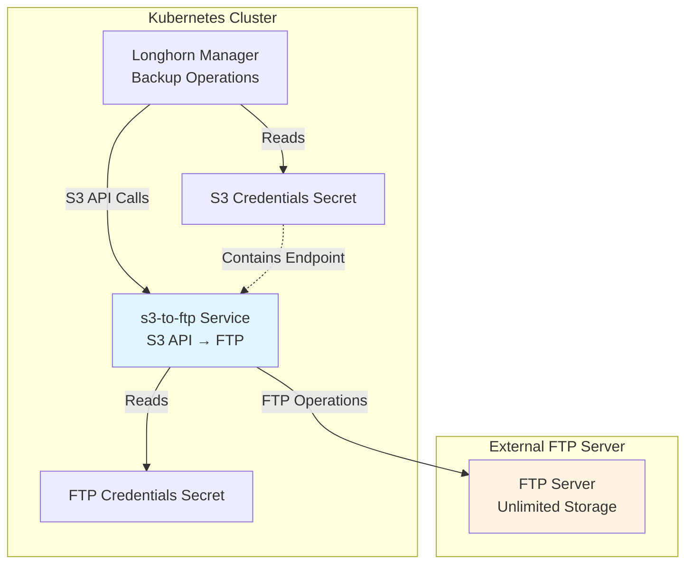

*This is the eighth post in our "K8s Homelab" series. Check out the [previous post](/posts/homelab-pvc-migration-backup/) to see how we migrated PVCs and implemented backup strategies.*

## The Backup Storage Challenge

After optimizing storage usage and implementing manual backup procedures, the next critical step was setting up **automated, off-site backups** for Longhorn volumes. Longhorn supports S3-compatible storage for backups, but I had access to **unlimited FTP storage** instead of traditional S3 services.

The challenge: **How do we leverage unlimited FTP storage for Longhorn backups when Longhorn only supports S3-compatible APIs?**

## The Solution: S3-to-FTP Bridge Service

I developed a custom service called [s3-to-ftp](https://github.com/lerenn/s3-to-ftp) that acts as a translation layer between S3-compatible APIs and FTP storage. This service:

- Exposes an S3-compatible API that Longhorn can use
- Translates S3 operations (PUT, GET, DELETE) to FTP operations
- Supports encryption at rest for secure backups
- Runs as a Kubernetes deployment in the cluster

This post documents how I integrated this service into the Longhorn Ansible role to enable automated, encrypted backups to FTP storage.

## Architecture: S3-to-FTP Integration



**Flow**:
1. Longhorn performs backup operations using S3-compatible API calls
2. s3-to-ftp service receives these calls and translates them to FTP operations
3. Files are stored on the FTP server (optionally encrypted)
4. Longhorn authenticates using S3 credentials that point to the s3-to-ftp service

## Implementation: Integrating s3-to-ftp into Longhorn Role

The integration was added directly to the existing Longhorn Ansible role, following the established patterns from other roles (registries, LGTM stack, etc.).

### Role Structure

The s3-to-ftp integration extends the Longhorn role:

```text
cluster/roles/longhorn/
├── defaults/main.yaml                    # Added s3-to-ftp configuration
├── tasks/
│   ├── install.yaml                      # Added s3-to-ftp deployment tasks
│   └── uninstall.yaml                    # Added cleanup tasks
└── templates/
    ├── s3-to-ftp-deployment.yaml.j2      # New: Deployment template
    └── s3-to-ftp-service.yaml.j2         # New: Service template
```

### Configuration Variables

Added configuration options to `defaults/main.yaml`:

```yaml
# s3-to-ftp service configuration
s3_to_ftp_enabled: true
s3_to_ftp_image: ghcr.io/lerenn/s3-to-ftp:v1.2.1
s3_to_ftp_replicas: 1
s3_to_ftp_service_port: 9000
s3_to_ftp_encryption_enabled: true
s3_to_ftp_resources:
  requests:
    cpu: 100m
    memory: 128Mi
  limits:
    cpu: 500m
    memory: 512Mi
```

**Key Settings**:
- `s3_to_ftp_enabled`: Toggle to enable/disable the service
- `s3_to_ftp_image`: Container image for the service
- `s3_to_ftp_encryption_enabled`: Enable encryption for backups
- `s3_to_ftp_resources`: Resource limits for the service

### Secrets Management

FTP and S3 credentials are stored in `cluster/secrets/longhorn.yaml`:

```yaml
# FTP credentials for s3-to-ftp service
ftp_host: "ftp.example.com"
ftp_port: 21
ftp_user: "your-ftp-username"
ftp_password: "your-ftp-password"
ftp_path: "/Homelab"

# S3 credentials for Longhorn backup target
# These are the credentials Longhorn will use to authenticate with s3-to-ftp
s3_access_key_id: "your-s3-access-key-id"
s3_secret_access_key: "your-s3-secret-key"

# Backup target configuration
backup_bucket_name: "longhorn"
backup_region: "box"

# Encryption key for s3-to-ftp (64 hex characters = 32 bytes)
encryption_key: "your-64-character-hex-encryption-key"
```

**Security Note**: The `longhorn.yaml` file contains sensitive credentials and should be:
- Stored securely (not committed to version control)
- Encrypted at rest
- Access-controlled appropriately

### Deployment Template

The s3-to-ftp deployment template (`s3-to-ftp-deployment.yaml.j2`) creates a Kubernetes Deployment:

```yaml
apiVersion: apps/v1
kind: Deployment
metadata:
  name: s3-to-ftp
  namespace: {{ longhorn_namespace }}
spec:
  replicas: {{ s3_to_ftp_replicas }}
  template:
    spec:
      containers:
      - name: s3-to-ftp
        image: {{ s3_to_ftp_image }}
        ports:
        - containerPort: {{ s3_to_ftp_service_port }}
        env:
        - name: FTP_HOST
          valueFrom:
            secretKeyRef:
              name: s3-to-ftp-ftp-credentials
              key: ftp_host
        - name: FTP_PORT
          valueFrom:
            secretKeyRef:
              name: s3-to-ftp-ftp-credentials
              key: ftp_port
        - name: FTP_USER
          valueFrom:
            secretKeyRef:
              name: s3-to-ftp-ftp-credentials
              key: ftp_user
        - name: FTP_PASSWORD
          valueFrom:
            secretKeyRef:
              name: s3-to-ftp-ftp-credentials
              key: ftp_password
        - name: FTP_ROOT_PATH
          valueFrom:
            secretKeyRef:
              name: s3-to-ftp-ftp-credentials
              key: ftp_path
        - name: S3_ACCESS_KEY
          valueFrom:
            secretKeyRef:
              name: s3-to-ftp-ftp-credentials
              key: s3_access_key
        - name: S3_SECRET_KEY
          valueFrom:
            secretKeyRef:
              name: s3-to-ftp-ftp-credentials
              key: s3_secret_key

        - name: ENCRYPTION_KEY
          valueFrom:
            secretKeyRef:
              name: s3-to-ftp-ftp-credentials
              key: encryption_key

        resources:
          requests:
            cpu: {{ s3_to_ftp_resources.requests.cpu }}
            memory: {{ s3_to_ftp_resources.requests.memory }}
          limits:
            cpu: {{ s3_to_ftp_resources.limits.cpu }}
            memory: {{ s3_to_ftp_resources.limits.memory }}
        livenessProbe:
          httpGet:
            path: /health
            port: {{ s3_to_ftp_service_port }}
          initialDelaySeconds: 30
          periodSeconds: 30
        readinessProbe:
          httpGet:
            path: /health
            port: {{ s3_to_ftp_service_port }}
          initialDelaySeconds: 10
          periodSeconds: 10
```

**Key Features**:
- **Environment Variables**: All configuration comes from Kubernetes secrets
- **Conditional Encryption**: Encryption key is only added if encryption is enabled
- **Health Checks**: Liveness and readiness probes ensure service availability
- **Resource Limits**: Prevents resource exhaustion

### Service Template

The service template (`s3-to-ftp-service.yaml.j2`) exposes the s3-to-ftp service:

```yaml
apiVersion: v1
kind: Service
metadata:
  name: s3-to-ftp
  namespace: {{ longhorn_namespace }}
spec:
  type: ClusterIP
  ports:
  - port: {{ s3_to_ftp_service_port }}
    targetPort: {{ s3_to_ftp_service_port }}
    protocol: TCP
    name: s3-api
  selector:
    app: s3-to-ftp
```

The service uses `ClusterIP` type, making it accessible only within the cluster via Kubernetes DNS: `s3-to-ftp.longhorn-system.svc.cluster.local:9000`

### Installation Tasks

The installation process in `tasks/install.yaml` follows this sequence:

1. **Load Secrets**: Load FTP and S3 credentials from `longhorn.yaml`
2. **Create FTP Credentials Secret**: Create Kubernetes secret with FTP connection details
3. **Create S3 Credentials Secret**: Create secret for Longhorn to authenticate with s3-to-ftp
4. **Deploy s3-to-ftp**: Template and deploy the deployment and service
5. **Wait for Readiness**: Ensure the service is ready before configuring backup target
6. **Configure BackupTarget**: Update Longhorn BackupTarget to use s3-to-ftp

#### Step 1: Load and Resolve Credentials

```yaml
- name: Load Longhorn secrets from cluster/secrets/longhorn.yaml
  include_vars:
    file: "{{ playbook_dir }}/../secrets/longhorn.yaml"
    name: longhorn_secrets
  no_log: true

- name: Resolve FTP credentials from secrets or use defaults
  set_fact:
    ftp_host: "{{ longhorn_secrets.ftp_host | default('') }}"
    ftp_port: "{{ longhorn_secrets.ftp_port | default(21) | string }}"
    ftp_user: "{{ longhorn_secrets.ftp_user | default('') }}"
    ftp_password: "{{ longhorn_secrets.ftp_password | default('') }}"
    ftp_path: "{{ longhorn_secrets.ftp_path | default('') }}"
    encryption_key: "{{ longhorn_secrets.encryption_key | default('') }}"
    s3_access_key_id: "{{ longhorn_secrets.s3_access_key_id | default('') }}"
    s3_secret_access_key: "{{ longhorn_secrets.s3_secret_access_key | default('') }}"
    backup_bucket_name: "{{ longhorn_secrets.backup_bucket_name | default('longhorn-backups') }}"
    backup_region: "{{ longhorn_secrets.backup_region | default('us-east-1') }}"
  when: s3_to_ftp_enabled | bool
```

#### Step 2: Create Kubernetes Secrets

The credentials are stored in Kubernetes secrets for security:

```yaml
- name: Set FTP credentials secret data
  set_fact:
    s3_to_ftp_secret_data:
      ftp_host: "{{ ftp_host }}"
      ftp_port: "{{ ftp_port }}"
      ftp_user: "{{ ftp_user }}"
      ftp_password: "{{ ftp_password }}"
      ftp_path: "{{ ftp_path }}"
  when: s3_to_ftp_enabled | bool

- name: Add S3 credentials to FTP credentials secret data
  set_fact:
    s3_to_ftp_secret_data: "{{ s3_to_ftp_secret_data | combine({'s3_access_key': s3_access_key_id, 's3_secret_key': s3_secret_access_key}) }}"
  when:
    - s3_to_ftp_enabled | bool
    - s3_access_key_id is defined
    - s3_access_key_id | length > 0

- name: Add encryption key to FTP credentials secret data
  set_fact:
    s3_to_ftp_secret_data: "{{ s3_to_ftp_secret_data | combine({'encryption_key': encryption_key}) }}"
  when:
    - s3_to_ftp_enabled | bool
    - s3_to_ftp_encryption_enabled | bool
    - encryption_key is defined
    - encryption_key | length > 0

- name: Create FTP credentials secret for s3-to-ftp
  kubernetes.core.k8s:
    state: present
    resource_definition:
      apiVersion: v1
      kind: Secret
      metadata:
        name: s3-to-ftp-ftp-credentials
        namespace: "{{ longhorn_namespace }}"
      type: Opaque
      stringData: "{{ s3_to_ftp_secret_data }}"
  when: s3_to_ftp_enabled | bool
  no_log: true
```

**Note**: The `no_log: true` flag prevents Ansible from logging sensitive credential values.

#### Step 3: Create S3 Credentials for Longhorn

Longhorn needs S3 credentials that point to the s3-to-ftp service:

```yaml
- name: Create S3 credentials secret for Longhorn backup target
  kubernetes.core.k8s:
    state: present
    resource_definition:
      apiVersion: v1
      kind: Secret
      metadata:
        name: longhorn-backup-s3-credentials
        namespace: "{{ longhorn_namespace }}"
      type: Opaque
      stringData:
        AWS_ACCESS_KEY_ID: "{{ s3_access_key_id }}"
        AWS_SECRET_ACCESS_KEY: "{{ s3_secret_access_key }}"
        AWS_ENDPOINTS: "http://s3-to-ftp.{{ longhorn_namespace }}.svc.cluster.local:{{ s3_to_ftp_service_port }}"
  when: s3_to_ftp_enabled | bool
  no_log: true
```

**Key Point**: The `AWS_ENDPOINTS` field tells Longhorn to use the s3-to-ftp service instead of a real S3 endpoint.

#### Step 4: Deploy s3-to-ftp Service

```yaml
- name: Template s3-to-ftp deployment
  template:
    src: s3-to-ftp-deployment.yaml.j2
    dest: "{{ playbook_dir }}/../data/s3-to-ftp-deployment.yaml"
  when: s3_to_ftp_enabled | bool

- name: Deploy s3-to-ftp deployment
  kubernetes.core.k8s:
    state: present
    src: "{{ playbook_dir }}/../data/s3-to-ftp-deployment.yaml"
  when: s3_to_ftp_enabled | bool

- name: Wait for s3-to-ftp pods to be ready
  kubernetes.core.k8s_info:
    api_version: v1
    kind: Pod
    namespace: "{{ longhorn_namespace }}"
    label_selectors:
      - app=s3-to-ftp
    wait_condition:
      type: Ready
      status: "True"
    wait_timeout: 300
  when: s3_to_ftp_enabled | bool
```

#### Step 5: Configure Longhorn BackupTarget

After the s3-to-ftp service is ready, configure Longhorn's BackupTarget:

```yaml
- name: Set backup target URL and credential secret when s3-to-ftp is enabled
  set_fact:
    backup_target_url: "s3://{{ backup_bucket_name }}@{{ backup_region }}/"
    backup_target_credential_secret: "longhorn-backup-s3-credentials"
  when: s3_to_ftp_enabled | bool

- name: Create or update default BackupTarget
  kubernetes.core.k8s:
    state: present
    resource_definition:
      apiVersion: longhorn.io/v1beta2
      kind: BackupTarget
      metadata:
        name: default
        namespace: "{{ longhorn_namespace }}"
      spec: "{{ backup_target_spec }}"
```

The BackupTarget URL format `s3://bucket@region/` is standard S3 format, but the actual endpoint (configured in the secret) points to s3-to-ftp.

## Encryption: Securing Backups at Rest

One of the key requirements was **encrypting backups at rest** without encrypting the running volumes. Longhorn's native encryption encrypts both volumes and backups, but we needed backups-only encryption.

### How Encryption Works

The s3-to-ftp service supports encryption via the `ENCRYPTION_KEY` environment variable:

- **Encryption Key Format**: 32-byte key, hex-encoded (64 hex characters)
- **Encryption Algorithm**: AES-256-GCM (configurable in s3-to-ftp)
- **Automatic Encryption**: All files uploaded are automatically encrypted before being stored on FTP
- **Automatic Decryption**: Files are automatically decrypted when retrieved

### Enabling Encryption

Encryption is enabled by:

1. **Setting the encryption key** in `cluster/secrets/longhorn.yaml`:
   ```yaml
   encryption_key: "your-64-character-hex-encryption-key"
   ```

2. **Enabling encryption** in `defaults/main.yaml`:
   ```yaml
   s3_to_ftp_encryption_enabled: true
   ```

3. **The deployment template** conditionally adds the `ENCRYPTION_KEY` environment variable:
   ```yaml
   
   - name: ENCRYPTION_KEY
     valueFrom:
       secretKeyRef:
         name: s3-to-ftp-ftp-credentials
         key: encryption_key
   
   ```

### Encryption Key Management

**Important Security Considerations**:

- **Generate a strong key**: Use a cryptographically secure random generator
  ```bash
  # Generate a 32-byte (256-bit) key, hex-encoded
  openssl rand -hex 32
  ```

- **Store securely**: The encryption key should be:
  - Stored in the secrets file (encrypted at rest)
  - Backed up securely (separate from backups)
  - Rotated periodically
  - Never committed to version control

- **Key Loss**: If the encryption key is lost, **encrypted backups cannot be recovered**. Ensure you have a secure backup of the key.

## Uninstall Tasks

The uninstall process (`tasks/uninstall.yaml`) cleans up all s3-to-ftp resources:

```yaml
- name: Delete s3-to-ftp deployment
  kubernetes.core.k8s:
    state: absent
    api_version: apps/v1
    kind: Deployment
    name: s3-to-ftp
    namespace: "{{ longhorn_namespace }}"

- name: Delete s3-to-ftp service
  kubernetes.core.k8s:
    state: absent
    api_version: v1
    kind: Service
    name: s3-to-ftp
    namespace: "{{ longhorn_namespace }}"

- name: Delete s3-to-ftp FTP credentials secret
  kubernetes.core.k8s:
    state: absent
    api_version: v1
    kind: Secret
    name: s3-to-ftp-ftp-credentials
    namespace: "{{ longhorn_namespace }}"

- name: Delete Longhorn backup S3 credentials secret
  kubernetes.core.k8s:
    state: absent
    api_version: v1
    kind: Secret
    name: longhorn-backup-s3-credentials
    namespace: "{{ longhorn_namespace }}"
```

## Challenges and Solutions

### Challenge 1: S3 API Compatibility

**Problem**: Longhorn expects a fully S3-compatible API, but FTP has different semantics.

**Solution**: The s3-to-ftp service implements the core S3 operations (PUT, GET, DELETE, LIST) that Longhorn uses, translating them to FTP operations. The service handles:
- Bucket operations (creating directories on FTP)
- Object operations (file uploads/downloads)
- Metadata handling (stored as separate files or in object names)

### Challenge 2: Secret Management

**Problem**: Multiple credentials needed (FTP, S3, encryption key) with different purposes.

**Solution**: Used a single Kubernetes secret (`s3-to-ftp-ftp-credentials`) for all s3-to-ftp configuration, and a separate secret (`longhorn-backup-s3-credentials`) for Longhorn's S3 authentication. This separation:
- Keeps concerns separated (FTP config vs. S3 auth)
- Allows independent rotation
- Follows Kubernetes best practices

### Challenge 3: Deployment Ordering

**Problem**: Longhorn BackupTarget must be configured after s3-to-ftp is ready.

**Solution**: Added explicit wait tasks:
```yaml
- name: Wait for s3-to-ftp pods to be ready
  kubernetes.core.k8s_info:
    wait_condition:
      type: Ready
      status: "True"
    wait_timeout: 300
```

This ensures the service is available before Longhorn tries to use it.

### Challenge 4: Conditional Encryption

**Problem**: Encryption should be optional and only enabled when a key is provided.

**Solution**: Used Jinja2 conditionals in the deployment template and Ansible conditionals in tasks:
- Template checks if encryption is enabled and key exists
- Tasks only add encryption key to secret if conditions are met
- Service gracefully handles missing encryption key (disables encryption)

### Challenge 5: Service Discovery

**Problem**: Longhorn needs to know where to find the s3-to-ftp service.

**Solution**: Used Kubernetes DNS for service discovery:
- Service name: `s3-to-ftp`
- Namespace: `longhorn-system`
- DNS name: `s3-to-ftp.longhorn-system.svc.cluster.local:9000`
- Configured in `AWS_ENDPOINTS` secret field

## Testing: Verification Steps

To verify the integration is working:

1. **Check s3-to-ftp pod status**:
   ```bash
   kubectl get pods -n longhorn-system -l app=s3-to-ftp
   ```

2. **Check BackupTarget configuration**:
   ```bash
   kubectl get backuptarget default -n longhorn-system -o yaml
   ```

3. **Verify backup creation**:
   - Create a test volume in Longhorn
   - Create a backup via Longhorn UI
   - Check FTP server for backup files

4. **Test encryption** (if enabled):
   - Download a backup file from FTP
   - Verify it's encrypted (should not be readable as plain text)
   - Restore backup in Longhorn (should decrypt automatically)

5. **Check service logs**:
   ```bash
   kubectl logs -n longhorn-system -l app=s3-to-ftp
   ```

## Automated Recurring Backups

With the backup infrastructure in place, the next step was implementing **automated, scheduled backups** with retention policies. Longhorn supports RecurringJobs that automatically create backups or snapshots on a schedule.

### RecurringJob Configuration

Recurring backups are configured in `cluster/roles/longhorn/defaults/main.yaml` using the `recurring_backups` variable:

```yaml
recurring_backups:
  - name: vm-backups
    cron: "0 2 * * 0"  # Weekly on Sunday at 2:00 AM UTC (3:00 AM CET / 4:00 AM CEST)
    task: "backup"
    retain: 3
    concurrency: 1
    pvcs:
      - namespace: homeassistant
        name: homeassistant-system
      - namespace: gaming
        name: gaming-system
      - namespace: gaming
        name: gaming-compat-system
```

### Configuration Fields

Each recurring backup job supports the following fields:

- **`name`** (required): Unique identifier for the job, used as the RecurringJob CRD name
- **`cron`** (required): Cron expression defining when the job runs (5 fields: minute hour day month weekday)
- **`task`** (required): Operation type - `"backup"` for S3 backups or `"snapshot"` for local snapshots
- **`retain`** (optional, default: 7): Number of backups/snapshots to keep. Older backups are automatically deleted
- **`concurrency`** (optional, default: 1): Number of concurrent backup operations allowed
- **`full_backup_interval`** (optional): Controls when full backups are performed vs incremental backups
- **`pvcs`** (required): List of PVCs to back up, each with `namespace` and `name`

### Full vs Incremental Backups

Longhorn supports both full and incremental backups:

- **Incremental backups** (default): Only changed data blocks are backed up, saving storage space
- **Full backups**: All data blocks are backed up regardless of changes, enabling faster restores

The `full_backup_interval` parameter controls this behavior:

- **Not set**: Only incremental backups are performed (most storage efficient)
- **`0`**: Every backup is a full backup (fastest restore, most storage)
- **Positive integer** (e.g., `5`): After every N incremental backups, a full backup is performed

**Example**: With `full_backup_interval: 5`:
1. First backup: Full (base)
2. Backups 2-6: Incremental (depend on backup 1)
3. Backup 7: Full (after 5 incrementals)
4. Backups 8-12: Incremental (depend on backup 7)
5. And so on...

### Retention Policy Considerations

When using `full_backup_interval`, it's important to ensure `retain > full_backup_interval` (strictly greater):

- **Why**: If `retain <= full_backup_interval`, when the oldest full backup is deleted, all incremental backups that depend on it become orphaned
- **What happens**: Longhorn automatically cleans up orphaned incrementals, but you end up with fewer backups than your `retain` setting specifies
- **Example**: With `retain: 4, full_backup_interval: 3`, you might end up with only 2 backups (1 full + 1 incremental) instead of 4

**Good configurations**:
- `retain: 7, full_backup_interval: 5` ✓ (always have full backup + incrementals)
- `retain: 10, full_backup_interval: 7` ✓ (safe margin)

**Problematic configurations**:
- `retain: 4, full_backup_interval: 3` ⚠ (inefficient - orphaned incrementals cleaned up)
- `retain: 3, full_backup_interval: 3` ✗ (may lose full backup entirely)

### Implementation Details

The Ansible role implements recurring backups through several tasks:

1. **Validation**: Comprehensive validation ensures:
   - Configuration structure is correct
   - Required fields are present
   - Cron format is valid (5 fields)
   - Task is "backup" or "snapshot"
   - Job names are unique
   - PVCs exist and have required fields
   - `retain > full_backup_interval` when `full_backup_interval` is set

2. **RecurringJob Creation**: Creates Longhorn RecurringJob CRDs with:
   - Cron schedule
   - Task type (backup/snapshot)
   - Retention count
   - Concurrency limit
   - Full backup interval (if specified)

3. **PVC Labeling**: Labels PVCs with `recurring-job.longhorn.io/<job-name>` to associate them with the recurring job

4. **Cleanup**: Uninstall tasks remove labels from PVCs and optionally delete RecurringJobs

### Example Configuration

Here's a complete example with multiple backup jobs:

```yaml
recurring_backups:
  - name: daily-backup
    cron: "0 2 * * *"      # Daily at 2:00 AM
    task: "backup"
    retain: 7
    concurrency: 1
    full_backup_interval: 5  # Full backup after every 5 incrementals
    pvcs:
      - namespace: gaming
        name: gaming-data
      - namespace: gaming
        name: gaming-system

  - name: weekly-backup
    cron: "0 2 * * 0"      # Weekly on Sunday at 2:00 AM UTC (3:00 AM CET / 4:00 AM CEST)
    task: "backup"
    retain: 4
    concurrency: 1
    # No full_backup_interval - only incrementals (weekly schedule, so first is full)
    pvcs:
      - namespace: homeassistant
        name: homeassistant-system
```

### Verification

To verify recurring backups are working:

1. **Check RecurringJobs**:
   ```bash
   kubectl get recurringjobs -n longhorn-system
   ```

2. **Check PVC labels**:
   ```bash
   kubectl get pvc -n gaming --show-labels
   # Should show: recurring-job.longhorn.io/daily-backup=true
   ```

3. **Monitor backup creation**:
   - Check Longhorn UI for backup history
   - Verify backups appear in FTP storage
   - Confirm retention policy is working (old backups deleted)

4. **Check backup types**:
   - Verify full backups are created at the specified interval
   - Confirm incremental backups are created between full backups

### Backup Failure Behavior

Longhorn handles backup failures in a straightforward manner:

- **No Automatic Retry**: If a scheduled backup fails, Longhorn does NOT automatically retry the failed backup. It waits for the next scheduled run according to the cron schedule.
- **Next Scheduled Run**: After a failure, Longhorn will attempt the backup again only at the next scheduled time. For example, if a weekly backup fails on Sunday at 2 AM UTC, the next attempt will be the following Sunday at 2 AM UTC.
- **Failure Logging**: Backup failures are recorded in Longhorn's logs and metrics, making it important to monitor these for timely detection.

This behavior emphasizes the importance of:
- **Monitoring and Alerting**: Setting up alerts to detect backup failures immediately
- **Manual Intervention**: For critical backups, you may need to manually trigger a backup if a scheduled one fails
- **Backup Frequency**: Consider backup frequency when designing schedules - more frequent backups reduce the impact of a single failure

### Manual Backup Behavior

Manual backups (created through the Longhorn UI or CLI) behave differently from RecurringJob backups:

- **Independent of RecurringJobs**: Manual backups are NOT associated with any RecurringJob, even if they're created for PVCs that have RecurringJob labels.
- **Not Counted in Retention**: Manual backups do NOT count toward the `retain` limit of RecurringJobs. They exist independently.
- **Not Automatically Cleaned Up**: Manual backups are NOT automatically deleted by RecurringJob retention policies. They persist until manually deleted.
- **Use Cases**: Manual backups are useful for:
  - Creating ad-hoc backups before major changes or updates
  - Testing backup and restore procedures
  - Creating one-off backups for specific purposes

**Example**: If you have a RecurringJob with `retain: 7` that creates 7 scheduled backups, and you create 3 manual backups, you'll have 10 total backups (7 scheduled + 3 manual). The manual backups won't be cleaned up when the RecurringJob retention policy runs.

### Troubleshooting RecurringJob Backup Issues

During implementation and testing, we discovered three critical issues that can prevent RecurringJobs from creating backups:

#### Issue 1: Timezone Mismatch

**Problem**: Cron expressions in RecurringJobs use **UTC time** (the cluster timezone), not local time. If you configure a cron expression using local time, the backup will run at the wrong time or not at all.

**Symptoms**:
- RecurringJob shows `executionCount: 1` but no backups are created
- Backups run at unexpected times
- RecurringJob never executes

**Solution**: Always use UTC time for cron expressions. For example:
- Local time 3 AM CET (UTC+1) = `0 2 * * 0` (2 AM UTC)
- Local time 3 AM CEST (UTC+2) = `0 1 * * 0` (1 AM UTC)

**Verification**:
```bash
# Check cluster timezone
kubectl exec -n longhorn-system -l app=longhorn-manager -- date

# Check RecurringJob cron (should be UTC)
kubectl get recurringjob -n longhorn-system vm-backups -o jsonpath='{.spec.cron}'
```

#### Issue 2: Missing Volume CRD Labels

**Problem**: Longhorn requires RecurringJob labels on **Volume CRDs**, not just PVCs. The Ansible role was only labeling PVCs, causing RecurringJobs to find "0 volumes" even when PVCs were correctly labeled.

**Symptoms**:
- RecurringJob logs show: `Found 0 volumes with recurring job <job-name>`
- PVCs have correct labels but backups don't run
- RecurringJob executes but creates no backups

**Solution**: The Ansible role now labels both PVCs and Volume CRDs. Volume CRD names match the PV's `spec.csi.volumeHandle` value.

**Verification**:
```bash
# Check PVC labels
kubectl get pvc -n gaming gaming-system --show-labels

# Check Volume CRD labels (volume name = PV's volumeHandle)
kubectl get volume -n longhorn-system <volume-name> --show-labels
```

**Implementation**: The role now:
1. Gets the PV bound to each PVC
2. Extracts the `volumeHandle` from the PV's CSI spec
3. Labels the Volume CRD with `recurring-job.longhorn.io/<job-name>: enabled`

#### Issue 3: Detached Volumes Blocking Backups

**Problem**: By default, Longhorn's `allow-recurring-job-while-volume-detached` setting is `false`, preventing backups of detached volumes. Many volumes are detached when not actively mounted by pods.

**Symptoms**:
- RecurringJob logs show: `Cannot create job for <volume> volume in state detached`
- Backups fail for volumes that aren't currently attached
- RecurringJob executes but finds "0 volumes" due to filtering

**Solution**: Enable the `allow-recurring-job-while-volume-detached` setting:

```yaml
# In cluster/roles/longhorn/tasks/install.yaml
- name: Enable recurring jobs for detached volumes
  kubernetes.core.k8s:
    state: present
    definition:
      apiVersion: longhorn.io/v1beta2
      kind: Setting
      metadata:
        name: allow-recurring-job-while-volume-detached
        namespace: "{{ longhorn_namespace }}"
      value: "true"
```

**Verification**:
```bash
kubectl get settings.longhorn.io -n longhorn-system allow-recurring-job-while-volume-detached -o jsonpath='{.value}'
# Should output: true
```

#### Diagnostic Checklist

If RecurringJobs aren't creating backups, check:

1. **Timezone**: Verify cron uses UTC time
   ```bash
   kubectl get recurringjob -n longhorn-system <job-name> -o jsonpath='{.spec.cron}'
   ```

2. **Volume Labels**: Ensure Volume CRDs (not just PVCs) have labels
   ```bash
   kubectl get volumes -n longhorn-system -l recurring-job.longhorn.io/<job-name>=enabled
   ```

3. **Detached Volume Setting**: Verify the setting is enabled
   ```bash
   kubectl get settings.longhorn.io -n longhorn-system allow-recurring-job-while-volume-detached
   ```

4. **RecurringJob Execution**: Check if the job is running
   ```bash
   kubectl get recurringjob -n longhorn-system <job-name> -o jsonpath='{.status.executionCount}'
   ```

5. **Longhorn Manager Logs**: Look for errors
   ```bash
   kubectl logs -n longhorn-system -l app=longhorn-manager --tail=100 | grep -i "recurring\|backup"
   ```

#### Fixes Applied

All three issues have been addressed in the Ansible role:

1. **Cron time documentation**: Updated to clarify UTC time requirement
2. **Volume CRD labeling**: Added tasks to label Volume CRDs after PVC labeling
3. **Detached volume setting**: Added task to enable `allow-recurring-job-while-volume-detached`

These fixes ensure RecurringJobs work correctly for both attached and detached volumes, with proper timezone handling and complete labeling.

### Monitoring and Alerting

To ensure timely detection of backup failures, Grafana alerts are configured to monitor Longhorn backup operations:

- **Alert Configuration**: A Grafana alert rule monitors Longhorn backup metrics for failures
- **Notification Channel**: Alerts are sent via ntfy, providing push notifications to web and mobile devices
- **Alert Details**: When a backup failure is detected, the alert includes:
  - Description of the failure
  - Reminder that failed backups are not automatically retried
  - Link to Grafana for further investigation

**Responding to Backup Failure Alerts**:

1. **Check Longhorn UI**: Navigate to the Longhorn UI to view backup history and identify which backup failed
2. **Review Logs**: Check Longhorn manager logs for detailed error messages:
   ```bash
   kubectl logs -n longhorn-system -l app=longhorn-manager --tail=100
   ```
3. **Investigate Root Cause**: Common causes include:
   - Backup target (S3/FTP) connectivity issues
   - Storage space issues
   - Network problems
   - Configuration errors
4. **Manual Backup (if needed)**: For critical data, consider creating a manual backup immediately
5. **Fix and Verify**: After resolving the issue, verify the next scheduled backup succeeds

The alerting system helps ensure that backup failures are detected promptly, allowing for quick remediation before the next scheduled backup runs.

## Lessons Learned

1. **S3 API Translation is Complex**: Implementing a full S3-compatible API requires handling many edge cases. The s3-to-ftp service focuses on the operations Longhorn actually uses.

2. **Secret Management is Critical**: Proper secret management (separate secrets, no logging, secure storage) is essential for production use.

3. **Deployment Ordering Matters**: Services must be ready before dependent components try to use them. Explicit wait conditions prevent race conditions.

4. **Encryption Key Management**: Encryption keys must be:
   - Generated securely
   - Stored securely
   - Backed up separately
   - Rotated periodically

5. **Service Discovery**: Kubernetes DNS makes service discovery simple, but the endpoint format must match what the client expects (S3 clients expect HTTP endpoints).

6. **Conditional Configuration**: Using Jinja2 and Ansible conditionals allows flexible configuration while maintaining idempotency.

7. **Health Checks are Essential**: Liveness and readiness probes ensure the service is available and healthy before use.

8. **Resource Limits**: Setting appropriate resource limits prevents the service from consuming excessive cluster resources.

9. **Timezone Awareness**: Cron expressions in Kubernetes/Longhorn use UTC time (cluster timezone), not local time. Always convert local times to UTC when configuring schedules.

10. **Volume CRD vs PVC Labels**: Longhorn RecurringJobs require labels on Volume CRDs, not just PVCs. The Volume CRD name matches the PV's `spec.csi.volumeHandle` value.

11. **Detached Volume Backups**: By default, Longhorn won't backup detached volumes. Enable `allow-recurring-job-while-volume-detached` to allow backups of volumes that aren't currently mounted.

12. **Systematic Troubleshooting**: When RecurringJobs don't work, check: timezone (UTC), Volume CRD labels, detached volume setting, and Longhorn manager logs for specific error messages.

## What's Next?

With FTP-backed, encrypted backups, automated scheduling, and monitoring/alerting in place, the backup infrastructure is comprehensive. Future enhancements could include:

1. **Backup Verification**: Add automated integrity checks for backups
2. **Multi-Region Backups**: Store backups in multiple FTP locations for redundancy
3. **Backup Encryption Key Rotation**: Implement procedures for rotating encryption keys
4. **Disaster Recovery Testing**: Regularly test full cluster recovery from backups
5. **Backup Performance Optimization**: Tune backup schedules and concurrency based on cluster load
6. **Advanced Alerting**: Add alerts for backup age (warn if no successful backup in X days) or backup size anomalies

## Conclusion

Integrating s3-to-ftp with Longhorn enables automated, encrypted backups to unlimited FTP storage. The key takeaways:

- **S3-to-FTP Bridge**: A custom service translates S3 APIs to FTP operations
- **Seamless Integration**: Longhorn works with the service as if it were a real S3 endpoint
- **Encryption Support**: Backups can be encrypted at rest without encrypting running volumes
- **Automated Scheduling**: RecurringJobs automatically create backups on a schedule with retention policies
- **Full/Incremental Backups**: Configurable backup types balance storage efficiency and restore speed
- **Monitoring and Alerting**: Grafana alerts notify of backup failures via ntfy, ensuring timely detection
- **Ansible Automation**: The entire setup is automated via Ansible, following established patterns
- **Security Best Practices**: Proper secret management and encryption key handling
- **Comprehensive Validation**: Configuration validation ensures backup jobs are correctly configured

The integration provides a production-ready backup solution that leverages unlimited FTP storage while maintaining security through encryption. With automated, scheduled backups, retention policies, and monitoring/alerting in place, the homelab now has robust, comprehensive data protection capabilities with proactive failure detection.

---

*This is the eighth post in our "K8s Homelab" series. With automated, scheduled, encrypted backups and retention policies configured, the homelab now has comprehensive, production-ready data protection. In future posts, we'll cover additional infrastructure components, monitoring enhancements, and automation improvements.*

