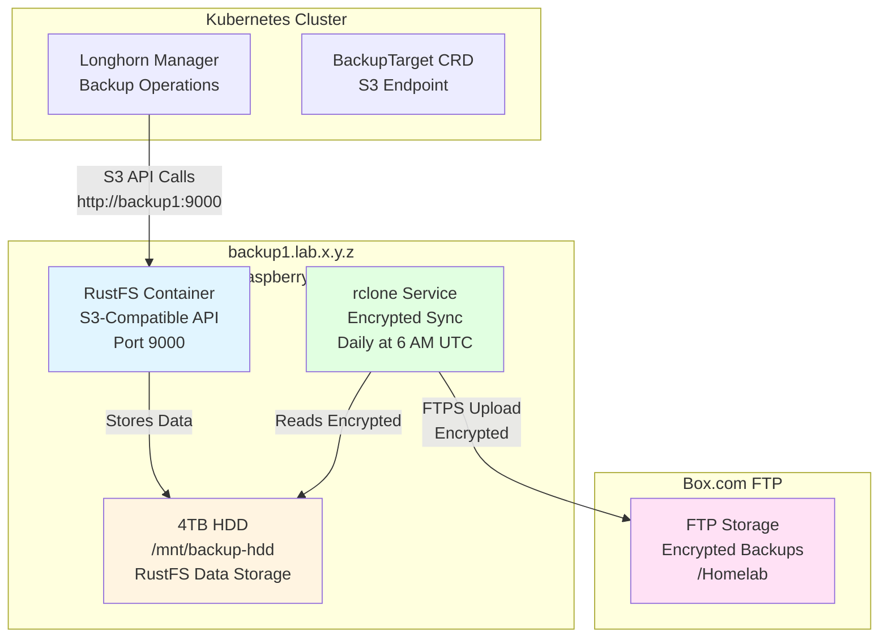

*This is the eighth post in our "K8s Homelab" series. Check out the [previous post](/posts/homelab-pvc-migration-backup/) to see how we migrated PVCs and implemented backup strategies.*

## The Backup Storage Challenge

After optimizing storage usage and implementing manual backup procedures, the next critical step was setting up **automated, off-site backups** for Longhorn volumes. Longhorn supports S3-compatible storage for backups, but I needed a solution that:

1. **Runs on-premises** - A dedicated backup server (Raspberry Pi) with local storage
2. **Provides S3-compatible API** - For seamless Longhorn integration
3. **Encrypts backups** - Secure data at rest and in transit
4. **Syncs to cloud storage** - Off-site backup to Box.com FTP for disaster recovery
5. **Is fully automated** - Infrastructure as Code with Ansible

## The Solution: RustFS + rclone Architecture

I implemented a multi-layered backup solution:

- **RustFS**: S3-compatible object storage running on a Raspberry Pi (backup1)
- **4TB HDD**: Local storage backend for RustFS
- **Longhorn Integration**: Direct S3 API connection to RustFS
- **rclone**: Encrypted sync from HDD to Box.com FTP
- **Ansible Automation**: Complete infrastructure automation

This post documents the complete setup process, architecture, and how all components work together.

## Architecture: Complete Backup Infrastructure



**Data Flow**:
1. Longhorn performs backup operations using S3-compatible API calls to RustFS
2. RustFS stores backup data on the local 4TB HDD
3. rclone syncs encrypted data from the HDD to Box.com FTP daily
4. All data is encrypted using rclone's crypt remote before upload

## Implementation: Ansible Role Structure

The backup infrastructure is implemented as an Ansible role (`machines/roles/backup`) with a dedicated playbook (`machines/playbooks/setup-backup.yaml`).

### Role Structure

```text
machines/roles/backup/
├── defaults/main.yaml              # Configuration variables
├── tasks/
│   ├── main.yaml                   # Orchestrates task execution
│   ├── prerequisites.yaml          # System prerequisites
│   ├── hdd-setup.yaml              # HDD mounting and formatting checks
│   ├── install.yaml                # RustFS and rclone installation
│   └── configure.yaml              # Bucket creation, rclone config, systemd services
└── templates/
    ├── rustfs.service.j2           # RustFS systemd service
    ├── rclone.conf.j2              # rclone configuration
    ├── rclone-sync.service.j2      # rclone sync systemd service
    └── rclone-sync.timer.j2        # rclone sync systemd timer
```

### Configuration Variables

The role uses variables defined in `defaults/main.yaml`:

```yaml
# HDD Configuration
backup_hdd_device: /dev/sda
backup_hdd_partition: "{{ backup_hdd_device }}1"
backup_hdd_mount_point: /mnt/backup-hdd
backup_hdd_filesystem: ext4
backup_hdd_label: backup-hdd

# RustFS Configuration
rustfs_data_dir: /var/lib/rustfs/data
rustfs_logs_dir: /var/lib/rustfs/logs
rustfs_port: 9000
rustfs_console_port: 9001
rustfs_image: rustfs/rustfs:latest
rustfs_admin_user: ""
rustfs_admin_password: ""

# RustFS S3 Configuration
rustfs_bucket_name: longhorn-backups
rustfs_region: fr-home-1
rustfs_s3_access_key: ""
rustfs_s3_secret_key: ""

# rclone Configuration
rclone_encryption_enabled: true
rclone_encryption_key: ""
rclone_box_remote_name: box
rclone_config_dir: /etc/rclone
rclone_sync_schedule: "0 6 * * *"  # Daily at 6 AM UTC
rclone_sync_source: "{{ backup_hdd_mount_point }}/rustfs/data"
rclone_box_ftp_host: ""
rclone_box_ftp_port: 21
rclone_box_ftp_user: ""
rclone_box_ftp_password: ""
rclone_box_ftp_path: "/Homelab"
```

**Key Settings**:
- `backup_hdd_device`: The HDD device path (must be formatted manually before running playbook)
- `rustfs_bucket_name`: S3 bucket name for Longhorn backups
- `rclone_encryption_enabled`: Enable encryption for off-site backups
- `rclone_sync_schedule`: Cron schedule for daily syncs (UTC time)

### Secrets Management

Sensitive credentials are stored in `machines/secrets/backup.yaml`:

```yaml
---
# Secrets for backup role
# This file is encrypted with git-crypt

# RustFS Admin Credentials
rustfs_admin_user: "rustfsadmin"
rustfs_admin_password: "your-secure-password"

# S3 Access Keys (for Longhorn)
s3_access_key: "your-s3-access-key"
s3_secret_key: "your-s3-secret-key"

# rclone Encryption Key
# 32-byte hex-encoded key for encrypting data before syncing to Box.com
# Generate with: openssl rand -hex 32
rclone_encryption_key: "your-64-character-hex-encryption-key"

# Box.com FTP Credentials
box_ftp_host: "ftp.box.com"
box_ftp_port: 21
box_ftp_user: "your-ftp-username"
box_ftp_password: "your-ftp-password"
box_ftp_path: "/Homelab"
```

**Security Note**: The `backup.yaml` file contains sensitive credentials and should be:
- Encrypted with git-crypt (or similar)
- Stored securely (not committed to version control unencrypted)
- Access-controlled appropriately
- Backed up separately from the backups themselves

## Step-by-Step Setup Process

### Step 1: Prerequisites

The playbook handles most prerequisites automatically, but the HDD must be formatted manually first:

```bash
# Format the HDD partition (run on backup1)
sudo mkfs.ext4 -L backup-hdd /dev/sda1
```

**Why manual formatting?** This is a destructive operation that should be done intentionally, not automatically by Ansible.

### Step 2: HDD Setup

The `hdd-setup.yaml` tasks handle:

1. **Verify HDD is formatted**: Checks if the partition has a filesystem
2. **Create mount point**: Creates `/mnt/backup-hdd` directory
3. **Mount HDD**: Mounts the partition temporarily
4. **Add to fstab**: Adds persistent mount entry using UUID
5. **Ensure mounted**: Verifies the HDD is mounted
6. **Create RustFS data directory**: Creates the directory structure on the HDD

```yaml
- name: Check if HDD partition is formatted
  command: blkid {{ backup_hdd_partition }}
  register: hdd_blkid_check
  failed_when: false

- name: Fail if HDD partition is not formatted
  fail:
    msg: |
      HDD partition {{ backup_hdd_partition }} is not formatted.
      Please format it manually before running this playbook
  when: hdd_blkid_check.rc != 0

- name: Add fstab entry for HDD
  lineinfile:
    path: /etc/fstab
    line: "UUID={{ hdd_uuid.stdout }} {{ backup_hdd_mount_point }} {{ backup_hdd_filesystem }} defaults,noatime 0 2"
```

### Step 3: RustFS Installation

RustFS is installed and configured via Docker:

```yaml
- name: Pull RustFS Docker image
  command: docker pull {{ rustfs_image }}

- name: Create RustFS systemd service
  template:
    src: rustfs.service.j2
    dest: /etc/systemd/system/rustfs.service

- name: Start and enable RustFS service
  systemd:
    name: rustfs
    state: started
    enabled: yes
```

The RustFS systemd service template (`rustfs.service.j2`):

```ini
[Unit]
Description=RustFS S3-Compatible Object Storage
After=docker.service
Requires=docker.service

[Service]
Type=simple
ExecStartPre=-/usr/bin/docker stop rustfs
ExecStartPre=-/usr/bin/docker rm rustfs
ExecStart=/usr/bin/docker run --name rustfs \
  --rm \
  -p {{ rustfs_port }}:9000 \
  -p {{ rustfs_console_port }}:9001 \
  -v {{ rustfs_data_dir }}:/data \
  -v {{ rustfs_logs_dir }}:/logs \
  -e RUSTFS_ACCESS_KEY={{ rustfs_admin_user }} \
  -e RUSTFS_SECRET_KEY={{ rustfs_admin_password }} \
  {{ rustfs_image }}
ExecStop=/usr/bin/docker stop rustfs
Restart=always
RestartSec=10

[Install]
WantedBy=multi-user.target
```

**Key Features**:
- Runs as a Docker container
- Exposes S3 API on port 9000
- Exposes console UI on port 9001
- Stores data on the mounted HDD
- Auto-restarts on failure

### Step 4: Bucket Creation

After RustFS is running, the playbook creates the S3 bucket:

```yaml
- name: Create RustFS bucket using AWS CLI
  shell: |
    export AWS_ACCESS_KEY_ID="{{ rustfs_admin_user_actual }}"
    export AWS_SECRET_ACCESS_KEY="{{ rustfs_admin_password_actual }}"
    export AWS_DEFAULT_REGION="{{ rustfs_region }}"
    aws --endpoint-url=http://localhost:{{ rustfs_port }} s3 mb s3://{{ rustfs_bucket_name }} 2>&1 || \
    (aws --endpoint-url=http://localhost:{{ rustfs_port }} s3 ls s3://{{ rustfs_bucket_name }} 2>&1 && echo "Bucket already exists")
  register: bucket_create_result
  changed_when: "'Bucket already exists' not in bucket_create_result.stdout and 'make_bucket' in bucket_create_result.stdout"
```

**Idempotency**: The task checks if the bucket exists before creating it, making the playbook idempotent.

### Step 5: rclone Configuration

rclone is configured to sync encrypted data to Box.com FTP:

```yaml
- name: Obscure rclone encryption key for crypt remote
  command: rclone obscure "{{ rclone_encryption_key }}"
  register: rclone_encryption_key_obscured
  when:
    - rclone_encryption_enabled | default(false) | bool
    - rclone_encryption_key | default('') | length > 0

- name: Configure rclone Box.com remote (FTP)
  template:
    src: rclone.conf.j2
    dest: "{{ rclone_config_dir }}/rclone.conf"
    mode: '0600'
```

The rclone configuration template (`rclone.conf.j2`):

```ini
[{{ rclone_box_remote_name }}]
type = ftp
host = {{ rclone_box_ftp_host }}
user = {{ rclone_box_ftp_user }}
pass = {{ rclone_box_ftp_password_obscured_value }}
port = {{ rclone_box_ftp_port }}
explicit_tls = true


# Encrypted remote using rclone_encryption_key
# This encrypts files using your rclone_encryption_key before uploading to Box.com
# rclone_encryption_key is the ONLY key you need to decrypt the data
[{{ rclone_box_remote_name }}-encrypted]
type = crypt
remote = {{ rclone_box_remote_name }}:{{ rclone_box_ftp_path }}
filename_encryption = standard
password = {{ rclone_encryption_key_obscured_value }}
password2 = {{ rclone_encryption_key_obscured_value }}

```

**Key Features**:
- **FTPS**: Uses explicit TLS (`explicit_tls = true`) as required by Box.com
- **Password Obscuring**: Passwords are obscured (base64-encoded) using `rclone obscure`
- **Encryption**: Uses rclone's `crypt` remote for client-side encryption
- **Filename Encryption**: Encrypts both file contents and filenames

### Step 6: Automated Sync Setup

A systemd timer runs rclone sync daily:

```yaml
- name: Create rclone sync systemd service
  template:
    src: rclone-sync.service.j2
    dest: /etc/systemd/system/rclone-sync.service

- name: Create rclone sync systemd timer
  template:
    src: rclone-sync.timer.j2
    dest: /etc/systemd/system/rclone-sync.timer

- name: Enable and start rclone sync timer
  systemd:
    name: rclone-sync.timer
    enabled: yes
    state: started
```

The rclone sync service (`rclone-sync.service.j2`):

```ini
[Unit]
Description=rclone sync to Box.com
After=network-online.target
Wants=network-online.target

[Service]
Type=oneshot
User=root
ExecStart=/usr/bin/rclone sync \
  --config {{ rclone_config_dir }}/rclone.conf \
  --log-file {{ rustfs_logs_dir }}/rclone-sync.log \
  --log-level INFO \
  --stats 10m \
  --transfers 4 \
  --checkers 8 \
  --progress \
  "{{ rclone_sync_source }}" \
  "{{ rclone_box_remote_name }}-encrypted:{{ rclone_box_ftp_path }}"
StandardOutput=journal
StandardError=journal

[Install]
WantedBy=multi-user.target
```

The timer (`rclone-sync.timer.j2`):

```ini
[Unit]
Description=rclone sync to Box.com (timer)
Requires=rclone-sync.service

[Timer]
OnCalendar={{ rclone_sync_schedule }}
Persistent=true

[Install]
WantedBy=timers.target
```

**Sync Behavior**:
- **Incremental**: Only changed files are synced
- **Encrypted**: All data is encrypted before upload
- **Logged**: Sync operations are logged to `/var/lib/rustfs/logs/rclone-sync.log`
- **Scheduled**: Runs daily at 6 AM UTC by default

## Longhorn Integration

Longhorn is configured to use RustFS as its backup target via the `longhorn` Ansible role.

### BackupTarget Configuration

The Longhorn role creates a BackupTarget CRD pointing to RustFS:

```yaml
# In cluster/roles/longhorn/tasks/install.yaml
- name: Load backup role defaults to get S3 region
  include_vars:
    file: "{{ playbook_dir }}/../../machines/roles/backup/defaults/main.yaml"
    name: backup_defaults

- name: Set S3 backup credentials and region from secrets/defaults
  set_fact:
    s3_backup_access_key: "{{ backup_secrets.rustfs_admin_user | default('') }}"
    s3_backup_secret_key: "{{ backup_secrets.rustfs_admin_password | default('') }}"
    s3_backup_region_actual: "{{ backup_defaults.rustfs_region | default(s3_backup_region) }}"

- name: Create S3 backup target credentials secret
  kubernetes.core.k8s:
    state: present
    resource_definition:
      apiVersion: v1
      kind: Secret
      metadata:
        name: longhorn-backup-s3-credentials
        namespace: "{{ longhorn_namespace }}"
      type: Opaque
      stringData:
        AWS_ACCESS_KEY_ID: "{{ s3_backup_access_key }}"
        AWS_SECRET_ACCESS_KEY: "{{ s3_backup_secret_key }}"
        AWS_ENDPOINTS: "http://{{ s3_backup_host }}:{{ s3_backup_port }}"

- name: Create or update default BackupTarget
  kubernetes.core.k8s:
    state: present
    resource_definition:
      apiVersion: longhorn.io/v1beta2
      kind: BackupTarget
      metadata:
        name: default
        namespace: "{{ longhorn_namespace }}"
      spec:
        type: S3
        bucketName: "{{ s3_backup_bucket }}"
        bucketRegion: "{{ s3_backup_region_actual }}"
        credentialSecret: "longhorn-backup-s3-credentials"
```

**Configuration Variables** (in `cluster/roles/longhorn/defaults/main.yaml`):

```yaml
s3_backup_enabled: true
s3_backup_host: "backup1.lab.x.y.z"
s3_backup_port: 9000
s3_backup_bucket: "longhorn-backups"
s3_backup_region: "fr-home-1"
```

**How It Works**:
1. Longhorn reads the BackupTarget CRD
2. Uses credentials from `longhorn-backup-s3-credentials` secret
3. Connects to RustFS at `http://backup1.lab.x.y.z:9000`
4. Stores backups in the `longhorn-backups` bucket

## Encryption: Securing Backups

The backup solution uses **client-side encryption** via rclone's crypt remote, ensuring that:

1. **Data is encrypted before upload** - Files are encrypted locally before being sent to Box.com
2. **Single encryption key** - Only `rclone_encryption_key` is needed to decrypt backups
3. **Filename encryption** - Both file contents and filenames are encrypted
4. **No dependency on cloud provider** - Encryption is handled by rclone, not Box.com

### How Encryption Works

1. **Longhorn → RustFS**: Backups are stored unencrypted on the local HDD (for performance)
2. **rclone sync**: Reads data from HDD and encrypts it using the crypt remote
3. **Box.com FTP**: Receives encrypted files (cannot read without the key)
4. **Decryption**: Use `rclone_encryption_key` to decrypt files when needed

### Encryption Key Management

**Generate a secure key**:
```bash
# Generate a 32-byte (256-bit) key, hex-encoded
openssl rand -hex 32
```

**Store securely**:
- Store in `machines/secrets/backup.yaml` (encrypted with git-crypt)
- Back up the key separately from backups
- Never commit unencrypted to version control

**Key Loss Warning**: If `rclone_encryption_key` is lost, **encrypted backups cannot be recovered**. Ensure you have a secure backup of the key.

### Decrypting Backups

A helper script (`machines/scripts/download-backup-decrypt.sh`) downloads and decrypts backups:

```bash
# Download and decrypt backups
./machines/scripts/download-backup-decrypt.sh /path/to/restore

# List files without downloading
./machines/scripts/download-backup-decrypt.sh --list
```

The script:
1. Reads FTP credentials and encryption key from `backup.yaml`
2. Creates a temporary rclone configuration
3. Downloads and decrypts files using rclone's crypt remote
4. Saves decrypted files to the specified directory

## RustFS Storage Format

RustFS uses MinIO's XL format for storing objects:

- **Small files**: Stored inline in `xl.meta` files (metadata + data)
- **Large files**: Split into multiple part files with metadata in `xl.meta`
- **Directory structure**: Objects are stored as directories with metadata files

### Extracting Inline Data

For small files stored inline, use the helper script:

```bash
./machines/scripts/extract-rustfs-inline-data.sh path/to/xl.meta [output-file]
```

This extracts the actual file content from RustFS metadata files.

## Testing and Verification

### Verify RustFS is Running

```bash
# Check RustFS container
ssh backup1.lab.x.y.z
docker ps | grep rustfs

# Check RustFS API
curl http://localhost:9000

# Check systemd service
systemctl status rustfs
```

### Verify Bucket Exists

```bash
# List buckets
export AWS_ACCESS_KEY_ID="rustfsadmin"
export AWS_SECRET_ACCESS_KEY="your-password"
export AWS_DEFAULT_REGION="fr-home-1"
aws --endpoint-url=http://localhost:9000 s3 ls

# List objects in bucket
aws --endpoint-url=http://localhost:9000 s3 ls s3://longhorn-backups
```

### Test Backup Creation

1. **Create a test backup in Longhorn UI**:
   - Navigate to Longhorn UI
   - Select a volume
   - Click "Create Backup"
   - Verify backup appears in the backup list

2. **Verify backup on RustFS**:
   ```bash
   aws --endpoint-url=http://backup1.lab.x.y.z:9000 s3 ls s3://longhorn-backups --recursive
   ```

3. **Verify backup on HDD**:
   ```bash
   ssh backup1.lab.x.y.z
   ls -la /mnt/backup-hdd/rustfs/data/longhorn-backups/
   ```

### Verify rclone Sync

```bash
# Check sync timer status
ssh backup1.lab.x.y.z
systemctl status rclone-sync.timer

# Check last sync time
systemctl list-timers rclone-sync.timer

# Manually trigger sync
systemctl start rclone-sync.service

# Check sync logs
tail -f /var/lib/rustfs/logs/rclone-sync.log
```

### Verify Encrypted Backups on Box.com

```bash
# List encrypted files (filenames are encrypted)
rclone --config /etc/rclone/rclone.conf lsf box-encrypted:/Homelab

# Download and decrypt
./machines/scripts/download-backup-decrypt.sh ./restore-test
```

## Challenges and Solutions

### Challenge 1: Box.com FTPS Requirement

**Problem**: Box.com requires FTPS (FTP over TLS), not plain FTP.

**Solution**: Configured rclone with `explicit_tls = true`:

```ini
[box]
type = ftp
host = ftp.box.com
explicit_tls = true
```

### Challenge 2: Password Obscuring

**Problem**: rclone requires passwords in config files to be obscured (base64-encoded).

**Solution**: Use `rclone obscure` command in Ansible:

```yaml
- name: Obscure rclone encryption key for crypt remote
  command: rclone obscure "{{ rclone_encryption_key }}"
  register: rclone_encryption_key_obscured
```

### Challenge 3: Encryption Key Management

**Problem**: Need a single, user-controlled encryption key for all backups.

**Solution**: Use rclone's crypt remote instead of RustFS KMS:
- Single encryption key (`rclone_encryption_key`)
- Client-side encryption (no dependency on cloud provider)
- User controls the key entirely

### Challenge 4: Systemd Service Type

**Problem**: Docker containers need `Type=simple`, not `Type=notify`.

**Solution**: Configured RustFS service with `Type=simple`:

```ini
[Service]
Type=simple
ExecStart=/usr/bin/docker run ...
```

### Challenge 5: Shell Escaping in Environment Variables

**Problem**: Special characters in passwords break systemd service files.

**Solution**: Use Jinja2 `replace` filter to escape `%` characters:

```jinja2
-e 'RUSTFS_SECRET_KEY={{ rustfs_admin_password | replace('%', '%%') }}'
```

## Automated Recurring Backups

With the backup infrastructure in place, Longhorn RecurringJobs automatically create backups on a schedule. See the [previous post](/posts/homelab-pvc-migration-backup/) for details on configuring recurring backups.

**Key Points**:
- RecurringJobs use UTC time (cluster timezone)
- Volume CRDs must be labeled, not just PVCs
- Enable `allow-recurring-job-while-volume-detached` for detached volumes
- Full vs incremental backups are configurable

## Monitoring and Maintenance

### Check Backup Status

```bash
# Longhorn UI: View backup history and status
# Navigate to: http://longhorn.lab.x.y.z

# Check RustFS disk usage
ssh backup1.lab.x.y.z
df -h /mnt/backup-hdd

# Check rclone sync status
systemctl status rclone-sync.timer
journalctl -u rclone-sync.service -n 50
```

### Backup Verification

Regularly verify backups are working:

1. **Check sync logs**: Ensure daily syncs are completing
2. **Test restore**: Periodically restore a backup to verify integrity
3. **Monitor disk usage**: Ensure HDD has sufficient space
4. **Check encryption**: Verify encrypted files on Box.com cannot be read without the key

## Lessons Learned

1. **RustFS is S3-Compatible**: RustFS provides a true S3-compatible API, making Longhorn integration seamless.

2. **Client-Side Encryption**: Using rclone's crypt remote gives full control over encryption without depending on cloud provider features.

3. **HDD Formatting**: Manual HDD formatting prevents accidental data loss during playbook runs.

4. **Password Obscuring**: rclone requires obscured passwords in config files - use `rclone obscure` command.

5. **FTPS vs FTP**: Box.com requires FTPS (`explicit_tls = true`), not plain FTP.

6. **Systemd Timers**: Use systemd timers for scheduled tasks instead of cron for better integration.

7. **Idempotent Playbooks**: Check for existing resources (buckets, mounts) before creating them.

8. **Secret Management**: Use git-crypt or similar to encrypt secrets files in version control.

9. **Single Encryption Key**: Using rclone crypt remote provides a single, user-controlled encryption key.

10. **Testing**: Always test backup and restore procedures before relying on them in production.

## What's Next?

With RustFS, encrypted off-site backups, and automated Longhorn integration in place, the backup infrastructure is comprehensive. Future enhancements could include:

1. **Backup Verification**: Automated integrity checks for backups
2. **Multi-Region Sync**: Sync to multiple cloud providers for redundancy
3. **Backup Encryption Key Rotation**: Implement procedures for rotating encryption keys
4. **Disaster Recovery Testing**: Regularly test full cluster recovery from backups
5. **Backup Performance Optimization**: Tune sync schedules based on cluster load
6. **Monitoring and Alerting**: Add alerts for sync failures or disk space issues
7. **Backup Retention Policies**: Implement automated cleanup of old backups

## Conclusion

The complete backup infrastructure provides:

- **On-Premises S3 Storage**: RustFS running on Raspberry Pi with 4TB HDD
- **Seamless Longhorn Integration**: Direct S3 API connection for automated backups
- **Encrypted Off-Site Storage**: rclone syncs encrypted backups to Box.com FTP daily
- **Full Automation**: Ansible playbooks handle all setup and configuration
- **Single Encryption Key**: User-controlled encryption key for all backups
- **Production Ready**: Robust, tested, and maintainable solution

The integration provides a production-ready backup solution that combines local performance with cloud-based disaster recovery, all secured with client-side encryption. With automated, scheduled backups, encrypted off-site storage, and comprehensive Ansible automation, the homelab now has robust, comprehensive data protection capabilities.

---

*This is the eighth post in our "K8s Homelab" series. With RustFS, encrypted off-site backups, and automated Longhorn integration configured, the homelab now has comprehensive, production-ready data protection. In future posts, we'll cover additional infrastructure components, monitoring enhancements, and automation improvements.*
