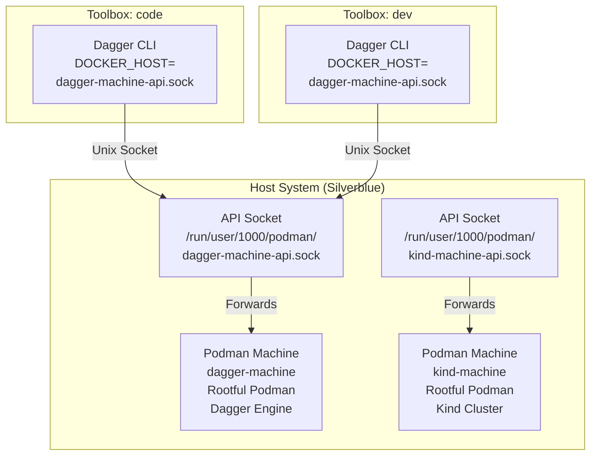

Fedora Silverblue is an immutable operating system that uses toolboxes for development environments. When trying to run Dagger Engine inside a toolbox, you'll quickly encounter a critical issue: Dagger requires rootful Podman access for its CNI networking, but toolboxes run with rootless Podman by default. This post documents the problem and provides a solution using a shared Podman Machine to provide rootful Podman access for Dagger across all your toolboxes.

## Prerequisites: Enable Docker Compatibility

Before setting up Dagger with Podman Machine, you need to install Docker and configure Docker compatibility with Podman in your toolbox. This enables Docker-compatible tools (like Dagger) to work with Podman.

### Install Docker Package

Inside your toolbox, install the Docker package (which provides Docker-compatible CLI tools):

```bash
# Inside toolbox
dnf install docker
```

**Note**: We install the `docker` package for Docker CLI compatibility, but we'll configure it to use Podman's socket instead of a separate Docker daemon.

### Enable Podman Socket

Enable and start the Podman socket service:

```bash
# Enable podman socket to start automatically
systemctl --user enable podman.socket

# Start the podman socket
systemctl --user start podman.socket

# Verify it's running
systemctl --user status podman.socket
```

### Configure Docker to Use Podman

Create a bashrc.d configuration file to enable Docker compatibility with Podman:

```bash
# Inside toolbox, create bashrc.d configuration
mkdir -p ~/.bashrc.d
cat > ~/.bashrc.d/docker-podman.sh <<'EOF'
#!/bin/bash
# Enable Docker in the containers
# Only configure when inside a toolbox to avoid interfering with host shell

# Detect if we're inside a toolbox
if [ -f /run/.toolboxenv ] || [ -n "${TOOLBOX_NAME:-}" ]; then
    export DOCKER_HOST=unix:///run/user/$UID/podman/podman.sock
    export CONTAINER_HOST=unix:///run/user/$UID/podman/podman.sock
    
    # Alias podman to podman-remote when in toolbox
    if command -v podman-remote >/dev/null 2>&1; then
        alias podman='podman-remote'
    fi
fi
EOF

chmod +x ~/.bashrc.d/docker-podman.sh

# Source it in your current shell
source ~/.bashrc.d/docker-podman.sh
```

**Important**: Make sure your `~/.bashrc` sources bashrc.d files (as mentioned in the Dagger setup section below). This ensures Docker environment variables are set in all new shell sessions.

## The Problem: Rootless Podman Limitations

When attempting to run Dagger Engine in a Fedora Silverblue toolbox, the engine container fails to start with the following error:

```
dagger-engine: failed to create engine: failed to create network providers: CNI setup error: 
plugin type="bridge" failed (add): failed to list chains: running [/usr/sbin/iptables -t nat -S --wait]: 
exit status 3: iptables v1.8.11 (legacy): can't initialize iptables table `nat': Table does not exist 
(do you need to insmod?)
Perhaps iptables or your kernel needs to be upgraded.
```

### Why This Happens

Dagger Engine uses CNI (Container Network Interface) for container networking, which requires access to the iptables NAT table in the Linux kernel. This access is only available to rootful container runtimes:

- **Rootful Podman**: Runs as root, has full kernel access, can manipulate iptables
- **Rootless Podman**: Runs as a regular user, uses user namespaces, cannot access iptables NAT table

In Fedora Silverblue toolboxes, Podman runs in rootless mode by default for security and isolation. This prevents Dagger Engine from setting up its required network infrastructure.

### The Error in Detail

The complete error log shows multiple attempts to create the network:

```text
time="2025-12-11T10:49:50Z" level=info msg="auto snapshotter: using overlayfs"
time="2025-12-11T10:49:51Z" level=debug msg="creating engine GRPC server"
time="2025-12-11T10:49:51Z" level=debug msg="creating engine lockfile"
time="2025-12-11T10:49:51Z" level=debug msg="creating engine server"
dnsmasq[37]: started, version  cachesize 150
dnsmasq[37]: warning: interface dagger0 does not currently exist
dagger-engine: failed to create engine: failed to create network providers: CNI setup error: 
plugin type="bridge" failed (add): failed to list chains: running [/usr/sbin/iptables -t nat -S --wait]: 
exit status 3: iptables v1.8.11 (legacy): can't initialize iptables table `nat': Table does not exist
```

The engine attempts to create a bridge network interface (`dagger0`) and configure iptables rules, but fails because rootless Podman cannot access the kernel's NAT table.

## The Solution: Podman Machine

Podman Machine creates a virtual machine running a rootful Podman instance. This provides the kernel-level access Dagger Engine needs while maintaining isolation from the host system.

### What is Podman Machine?

Podman Machine is a feature that creates and manages Linux virtual machines with Podman pre-installed. Each machine:

- Runs as a VM (using QEMU/KVM on Linux)
- Has rootful Podman with full kernel access
- Can be accessed remotely via SSH
- Provides complete isolation from the host

### Why `podman machine` Commands Must Run on the Host

**Important distinction**: While `podman-remote` can forward container operations (like `podman ps`, `podman run`) to the host via API sockets, `podman machine` commands are fundamentally different:

- **Container operations** (`podman ps`, `podman run`, etc.): These are API calls that can be forwarded remotely via `podman-remote` or by setting `CONTAINER_HOST`/`DOCKER_HOST` to point to an API socket.
- **Machine management** (`podman machine start`, `podman machine init`, etc.): These commands must execute locally because they:
  - Launch QEMU virtual machines on the host
  - Manage VM lifecycle (start/stop VMs)
  - Create network bridges and configure networking
  - Set up file sharing between host and VM
  - Require QEMU binaries (`qemu-system-x86_64`), `gvproxy`, and `virtiofsd` to be available in the execution environment

When you run `podman-remote machine start` from a toolbox, it still tries to execute the machine management locally (in the toolbox), which fails because:
1. The toolbox doesn't have QEMU installed
2. The toolbox doesn't have access to the host's VM management infrastructure
3. Even if QEMU were installed in the toolbox, it would try to create VMs inside the toolbox container, not on the host

**Solution**: To run `podman machine` commands from within a toolbox, you need to execute them on the host. Fedora Silverblue provides `flatpak-spawn --host` for this purpose (see the implementation section below for details).

### Architecture: Shared Machine for Dagger

We'll use a single shared Podman Machine dedicated to Dagger, which all toolboxes can connect to. This approach:

- **Resource efficient**: One VM instead of multiple machines
- **Simplifies management**: Single machine to start/stop
- **Shared Dagger engine**: All toolboxes use the same Dagger engine instance
- **Service-specific machines**: Other tools like Kind would get their own dedicated machines

Here's the architecture:



## Implementation: Shared Machine for Dagger

### Step 1: Create Shared Podman Machine on Host

**Important**: These commands must be run on the host system (outside the toolbox), as they create VMs and manage system-level resources.

#### Prerequisite: Install QEMU Tools and gvproxy on Host

Podman Machine requires QEMU tools and the `gvproxy` binary to create and manage virtual machines. On Fedora Silverblue, you need to layer these packages:

```bash
# On host (not in toolbox)
rpm-ostree install qemu-img qemu-kvm qemu-virtiofsd podman-gvproxy

# After installation, reboot to apply the changes
# Or use: rpm-ostree apply-live (if supported on your system)
```

**Note**: 
- The `qemu-img` package provides the `qemu-img` command-line tool needed by Podman Machine to create and manage disk images for virtual machines.
- The `qemu-kvm` package provides `qemu-system-x86_64` and other QEMU system emulators needed to actually run the virtual machines.
- The `qemu-virtiofsd` package provides the `virtiofsd` daemon, which is required for virtiofs (virtual file system) support used by Podman Machine for file sharing between the host and the VM.
- The `podman-gvproxy` package provides the `gvproxy` binary, which is essential for Podman Machine's networking functionality. This must be installed on the host system (not in the toolbox), as `podman machine` commands run on the host.

**Important**: After installing the packages and rebooting, you may need to create a symbolic link so Podman can find `virtiofsd` in your PATH:

```bash
# On host (after reboot)
sudo ln -sf /usr/libexec/virtiofsd /usr/local/bin/virtiofsd
```

This creates a symlink in `/usr/local/bin` (which is in PATH) pointing to the `virtiofsd` binary in `/usr/libexec`. Verify it works:

```bash
which virtiofsd
# Should show: /usr/local/bin/virtiofsd
```

#### Create the Podman Machine

Exit your toolbox and run on the host:

```bash
# Exit toolbox first
exit

# On host: Create shared machine for Dagger
podman machine init dagger-machine

# Set machine to rootful mode BEFORE starting (required for Dagger)
# Settings can only be changed when the VM is stopped
podman machine set --rootful dagger-machine

# Start the machine
podman machine start dagger-machine
```

When you start the machine, you'll see output like:

```
Starting machine "dagger-machine"

Mounting volume... /var/home/lerenn:/var/home/lerenn
API forwarding listening on: /run/user/1000/podman/dagger-machine-api.sock
You can connect Docker API clients by setting DOCKER_HOST using the
following command in your terminal session:

        export DOCKER_HOST='unix:///run/user/1000/podman/dagger-machine-api.sock'

Machine "dagger-machine" started successfully
```

**Note**: If you forget to set rootful mode before starting, you'll need to stop the machine first (`podman machine stop dagger-machine`), then set it to rootful mode, and restart it.

After starting, verify it's running:

```bash
# Verify it's running
podman machine list
```

The output should show your machine:

```
NAME                        VM TYPE     CREATED     LAST UP     CPUS        MEMORY      DISK SIZE
dagger-machine              qemu        2 hours ago 2 hours ago  2           2.147 GB    10.74 GB
```

**Note**: The machine mounts your home directory (`/var/home/lerenn:/var/home/lerenn`) and creates an API forwarding socket at `/run/user/1000/podman/dagger-machine-api.sock` that we'll use to connect from toolboxes.

**Note**: If you also need Kind (Kubernetes in Docker), create a separate machine for it:
```bash
podman machine init --ssh-port 2223 kind-machine
podman machine set --rootful kind-machine
podman machine start kind-machine
# Note the API socket path from the output (e.g., /run/user/1000/podman/kind-machine-api.sock)
```

### Step 2: Set Up Dagger Alias in bashrc.d

Create a configuration file that sets up Dagger to use the Podman Machine. This will work across all your toolboxes:

**Note**: The function below uses `flatpak-spawn --host` to execute `podman machine` commands on the host from within the toolbox. `flatpak-spawn` should be available by default in Fedora Silverblue toolboxes. If it's not available, you can install `host-spawn` as an alternative, or manually start the machine on the host.

```bash
# Inside toolbox, create bashrc.d configuration
mkdir -p ~/.bashrc.d
cat > ~/.bashrc.d/dagger.sh <<'EOF'
#!/bin/bash
# Configure Dagger to use the Podman Machine API socket
# This socket is created when the machine starts and forwards the Docker API
# Note: Dagger uses DOCKER_HOST (not CONTAINER_HOST) to detect the container runtime

# Helper function to execute commands on the host from within a toolbox
# Uses flatpak-spawn --host if available, otherwise falls back to direct execution
_host_exec() {
    # Detect if we're in a toolbox
    if [ -f /run/.toolboxenv ] || [ -n "${TOOLBOX_NAME:-}" ]; then
        # Try flatpak-spawn --host first (available in Fedora Silverblue)
        if command -v flatpak-spawn >/dev/null 2>&1; then
            flatpak-spawn --host "$@"
        # Fallback to host-spawn if available
        elif command -v host-spawn >/dev/null 2>&1; then
            host-spawn "$@"
        else
            echo "Error: Cannot execute commands on host. Install 'flatpak-spawn' or 'host-spawn'." >&2
            return 1
        fi
    else
        # Not in a toolbox, execute directly
        "$@"
    fi
}

# Function to check and start the Podman machine if needed
_dagger_ensure_machine() {
    local machine_name="dagger-machine"
    local api_socket="/run/user/$UID/podman/${machine_name}-api.sock"
    local max_wait_time=10  # Maximum wait time in seconds
    local wait_interval=0.5  # Check interval in seconds
    local max_wait_count=$((max_wait_time * 2))  # Number of iterations (0.5s each)
    
    # Check if the API socket exists (indicates machine is running)
    if [ ! -S "$api_socket" ]; then
        # Machine is not running, try to start it on the host
        echo "Starting Podman machine '$machine_name' on host..."
        if _host_exec timeout 30 podman machine start "$machine_name" 2>/dev/null; then
            # Wait for the socket to appear with timeout
            local wait_count=0
            while [ ! -S "$api_socket" ] && [ $wait_count -lt $max_wait_count ]; do
                sleep $wait_interval
                wait_count=$((wait_count + 1))
            done
            
            if [ -S "$api_socket" ]; then
                echo "Podman machine '$machine_name' started successfully."
            else
                echo "Warning: Podman machine started but socket not found at $api_socket after ${max_wait_time}s"
                echo "Please verify the machine is running on the host: podman machine list"
                return 1
            fi
        else
            echo "Warning: Could not start Podman machine '$machine_name' (timeout or error)."
            echo "Please start it manually on the host: podman machine start $machine_name"
            return 1
        fi
    fi
    return 0
}

# Wrapper function for dagger that ensures machine is running
dagger() {
    # Remove any existing alias first
    unalias dagger 2>/dev/null
    
    # Ensure machine is running
    if ! _dagger_ensure_machine; then
        echo "Error: Cannot proceed without Podman machine running."
        return 1
    fi
    
    # Execute dagger with the correct DOCKER_HOST
    DOCKER_HOST=unix:///run/user/$UID/podman/dagger-machine-api.sock command dagger "$@"
}
EOF

chmod +x ~/.bashrc.d/dagger.sh

# Source it in your current shell
source ~/.bashrc.d/dagger.sh
```

**For Kind** (if you created a kind-machine), create a similar file:

```bash
cat > ~/.bashrc.d/kind.sh <<'EOF'
#!/bin/bash
# Configure Kind to use the Podman Machine API socket for kind-machine
# Note: The socket name will be kind-machine-api.sock if you named your machine "kind-machine"
# Note: Kind also uses DOCKER_HOST to detect the container runtime

# Alias kind to use the Podman Machine API socket
alias kind='DOCKER_HOST=unix:///run/user/$UID/podman/kind-machine-api.sock kind'
EOF

chmod +x ~/.bashrc.d/kind.sh
```

**Note**: When you create a kind-machine, make sure to set it to rootful mode before starting and note the API socket path from the startup output:

```bash
# On host: Create and configure kind-machine
podman machine init --ssh-port 2223 kind-machine
podman machine set --rootful kind-machine
podman machine start kind-machine
# Note the API socket path from the output (e.g., /run/user/1000/podman/kind-machine-api.sock)
```

**Important**: To ensure these files (including `docker-podman.sh` from the prerequisites) are automatically sourced in new shell sessions, add this to your `~/.bashrc`:

```bash
# Source bashrc.d files if directory exists
if [ -d ~/.bashrc.d ]; then
    for file in ~/.bashrc.d/*.sh; do
        [ -r "$file" ] && [ -f "$file" ] && source "$file"
    done
    unset file
fi
```

After adding this, either restart your shell or run `source ~/.bashrc` to load the functions, aliases, and environment variables. This will load:
- `docker-podman.sh` - Sets `DOCKER_HOST` and `CONTAINER_HOST` to the rootless Podman socket for Docker compatibility, and aliases `podman` to `podman-remote` (only when inside a toolbox to avoid interfering with the host shell)
- `dagger.sh` - Configures Dagger to use the Podman Machine API socket via `DOCKER_HOST`, and automatically starts the machine if it's not running (overrides the rootless socket)
- `kind.sh` - Configures Kind to use the Podman Machine API socket via `DOCKER_HOST` (if created)

**Important**: Dagger and Kind use `DOCKER_HOST` (not `CONTAINER_HOST`) to detect the container runtime. The `dagger` function overrides the `DOCKER_HOST` set by `docker-podman.sh` to point to the Podman Machine API socket instead of the rootless Podman socket.

### Step 3: Configure Dagger to Use Podman Machine

With the function set up, Dagger will automatically use the Podman Machine and start it if needed. You can test it:

```bash
# Test Dagger connection
dagger version

# The function ensures DOCKER_HOST is set correctly to use the Podman Machine API socket
# and automatically starts the machine if it's not running
```

### Step 4: Verify Dagger Engine Works

Run a simple Dagger command to start the engine:

```bash
# This will trigger engine startup (function automatically uses the Podman Machine API socket and starts the machine if needed)
dagger query

# Check engine logs using the API socket
# Note: podman commands use CONTAINER_HOST (Dagger uses DOCKER_HOST)
# First, find the engine container name (version may vary)
ENGINE_CONTAINER=$(CONTAINER_HOST=unix:///run/user/$UID/podman/dagger-machine-api.sock podman ps -a | grep dagger-engine | awk '{print $1}' | head -1)
CONTAINER_HOST=unix:///run/user/$UID/podman/dagger-machine-api.sock podman logs ${ENGINE_CONTAINER}
```

You should see the engine starting successfully without iptables errors. The logs should show:

```text
time="..." level=info msg="auto snapshotter: using overlayfs"
time="..." level=debug msg="creating engine GRPC server"
time="..." level=debug msg="engine server listening"
```

No more iptables NAT table errors!

## Configuration Details

### Podman Machine Resource Configuration

When creating a machine, you can customize resources:

```bash
# Create machine with custom resources
podman machine init \
  --cpus 4 \
  --memory 4096 \
  --disk-size 20 \
  toolbox-code-machine
```

Default values are usually sufficient, but adjust based on your Dagger workload needs.

### Multiple Machines for Different Services

If you need multiple Podman machines for different services (e.g., Dagger and Kind), configure different SSH ports:

```bash
# Create Dagger machine (default port 2222)
podman machine init dagger-machine
podman machine set --rootful dagger-machine
podman machine start dagger-machine

# Create Kind machine with custom port
podman machine init --ssh-port 2223 kind-machine
podman machine set --rootful kind-machine
podman machine start kind-machine

# Note the API socket paths from the startup output:
# - Dagger: /run/user/1000/podman/dagger-machine-api.sock
# - Kind: /run/user/1000/podman/kind-machine-api.sock

# Then configure aliases in your toolbox bashrc.d files (as shown in Step 2)
# to use these API sockets via DOCKER_HOST
```

Each service gets its own dedicated machine, ensuring isolation and preventing resource conflicts.

## Verification and Testing

### Test Podman Machine Connection

**Note**: Podman commands use `CONTAINER_HOST` (Podman-specific), while Dagger and Kind use `DOCKER_HOST` (Docker-compatible). Both environment variables work with the same API socket.

```bash
# Verify the API socket exists
ls -la /run/user/$UID/podman/dagger-machine-api.sock

# Test podman with the API socket to verify rootful access
# Note: podman uses CONTAINER_HOST (not DOCKER_HOST)
CONTAINER_HOST=unix:///run/user/$UID/podman/dagger-machine-api.sock podman info | grep rootless
# Expected: rootless: false

# List containers (should work)
CONTAINER_HOST=unix:///run/user/$UID/podman/dagger-machine-api.sock podman ps -a
```

### Test Dagger Engine

```bash
# Check Dagger version
dagger version

# Run a simple query (triggers engine startup)
dagger query <<EOF
{
  container {
    from(address: "alpine:latest") {
      exec(args: ["echo", "Hello from Dagger!"]) {
        stdout
      }
    }
  }
}
EOF
```

### Check Engine Logs

```bash
# Find the engine container using the API socket
# Note: podman commands use CONTAINER_HOST (not DOCKER_HOST)
ENGINE_CONTAINER=$(CONTAINER_HOST=unix:///run/user/$UID/podman/dagger-machine-api.sock podman ps -a | grep dagger-engine | awk '{print $1}' | head -1)

# View logs
CONTAINER_HOST=unix:///run/user/$UID/podman/dagger-machine-api.sock podman logs ${ENGINE_CONTAINER}

# Follow logs in real-time
CONTAINER_HOST=unix:///run/user/$UID/podman/dagger-machine-api.sock podman logs -f ${ENGINE_CONTAINER}
```

### Troubleshooting

**Issue: "Cannot connect to Podman" or "Connection refused"**

The Podman machine may not be running, or the API socket may not exist. Check and fix:

```bash
# If in toolbox, use flatpak-spawn --host to run commands on host:
# Check if machine is running
flatpak-spawn --host podman machine list

# Start machine if stopped
flatpak-spawn --host podman machine start dagger-machine

# Or exit toolbox and run on host directly:
exit
podman machine list
podman machine start dagger-machine

# In toolbox: Verify the API socket exists
ls -la /run/user/$UID/podman/dagger-machine-api.sock
```

**Issue: "rootless: true" still showing when using dagger**

Verify the alias is working correctly and the API socket is accessible:

```bash
# Check that the API socket exists
ls -la /run/user/$UID/podman/dagger-machine-api.sock

# Manually test with the API socket
CONTAINER_HOST=unix:///run/user/$UID/podman/dagger-machine-api.sock podman info | grep rootless
# Should show: rootless: false

# Verify the function is set correctly
type dagger
# Should show: dagger is a function

# Test Dagger with the API socket directly
DOCKER_HOST=unix:///run/user/$UID/podman/dagger-machine-api.sock dagger version
```

**Issue: "Cannot execute commands on host" or "flatpak-spawn: command not found"**

The `_dagger_ensure_machine` function needs a way to execute commands on the host. Check and fix:

```bash
# In toolbox: Check if flatpak-spawn is available
command -v flatpak-spawn

# If not available, try host-spawn as an alternative
command -v host-spawn

# If neither is available, install host-spawn in the toolbox:
# (Note: This may not work in all toolbox configurations)
dnf install host-spawn

# Or manually start the machine on the host when needed:
# Exit toolbox and run on host:
exit
podman machine start dagger-machine
```

**Note**: If `flatpak-spawn` is not available in your toolbox, the automatic machine starting will fail. You'll need to manually start the machine on the host before using Dagger. The function will still work for checking if the machine is running and setting up the correct `DOCKER_HOST`.

**Issue: "qemu-system-x86_64: executable file not found" when running `podman machine` from toolbox**

This error occurs because `podman machine` commands try to execute QEMU locally, even when using `podman-remote`. The solution is to use `flatpak-spawn --host` (or `host-spawn`) to execute the command on the host, as shown in the `_host_exec` helper function. If you see this error, it means the function isn't using `_host_exec` properly, or `flatpak-spawn`/`host-spawn` is not available.

## Considerations and Best Practices

### Resource Usage

Each Podman machine is a full virtual machine:

- **CPU**: Default 2 CPUs per machine (configurable)
- **Memory**: Default 2GB per machine (configurable)
- **Disk**: Default 10GB per machine (configurable, grows as needed)

With a shared machine approach, you only need one VM for Dagger across all toolboxes, making it more resource-efficient than one machine per toolbox. If you add additional services like Kind, each would get its own machine.

### Port Management

By default, each Podman machine uses SSH port 2222. If running multiple machines for different services:

- Configure different ports during machine creation (e.g., `--ssh-port 2223` for Kind)
- Document which port belongs to which service
- Update bashrc.d aliases to use the correct API socket path

### Persistence Across Reboots

Podman machines persist their state, but don't auto-start by default:

```bash
# Check machine status after reboot
podman machine list

# Start machines as needed
podman machine start dagger-machine
# If you have a kind-machine:
podman machine start kind-machine

# Optional: Create systemd service to auto-start machines
# (requires root access on host)
```

### Security Considerations

- **Rootful access**: Podman machines run with root privileges inside the VM
- **Network isolation**: Machines are isolated from the host network
- **API socket access**: The API sockets are Unix domain sockets, accessible only to the user who created the machine
- **Resource limits**: Consider setting resource limits to prevent one machine from consuming all host resources

### When to Use This Approach

Use Podman Machine when:

- ✅ You need rootful Podman features (like Dagger Engine or Kind)
- ✅ You're on an immutable OS like Fedora Silverblue
- ✅ You can afford the VM overhead
- ✅ You want to share the same rootful environment across multiple toolboxes

Consider alternatives when:

- ❌ You don't need rootful Podman features
- ❌ Resource constraints are severe
- ❌ You're on a traditional Linux distribution with rootful Podman available

## Conclusion

Running Dagger Engine on Fedora Silverblue requires rootful Podman access, which isn't available in rootless toolbox environments. Podman Machine provides an elegant solution by creating a shared VM with rootful Podman that all your toolboxes can connect to.

The shared machine approach offers:

- **Resource efficiency**: One VM serves all toolboxes
- **Simplified management**: Single machine to start/stop
- **Shared Dagger engine**: All toolboxes use the same engine instance
- **Service isolation**: Different services (Dagger, Kind) get their own machines
- **Easy setup**: bashrc.d configuration works across all toolboxes

By following this guide, you can successfully run Dagger Engine in your Fedora Silverblue toolboxes, enabling modern CI/CD workflows while maintaining the security and immutability benefits of Silverblue.

### Next Steps

- Explore Dagger's pipeline capabilities now that your engine is running
- Set up additional Podman machines for other services (e.g., Kind) as needed
- Consider resource monitoring for your Podman machines
- Check out [Dagger documentation](https://docs.dagger.io) for advanced usage
- Customize your bashrc.d scripts for other tools that need rootful Podman

### Related Resources

- [Podman Machine Documentation](https://docs.podman.io/en/latest/markdown/podman-machine.1.html)
- [Dagger Documentation](https://docs.dagger.io)
- [Fedora Toolbox Documentation](https://containertoolbx.org/)
- [Rootless vs Rootful Podman](https://docs.podman.io/en/latest/markdown/podman.1.html#rootless-mode)

